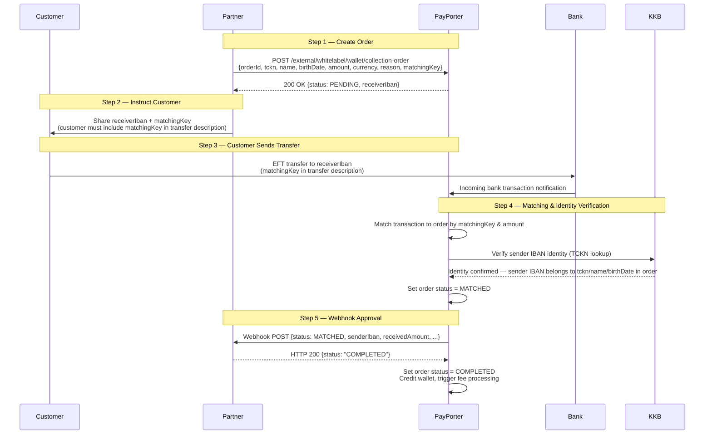
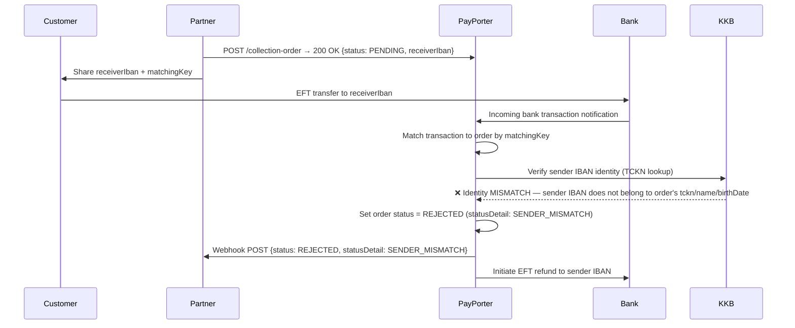
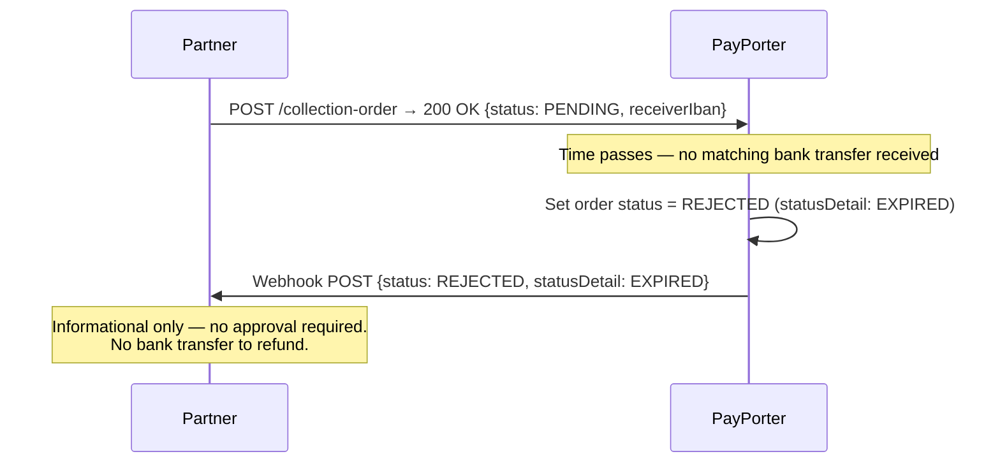
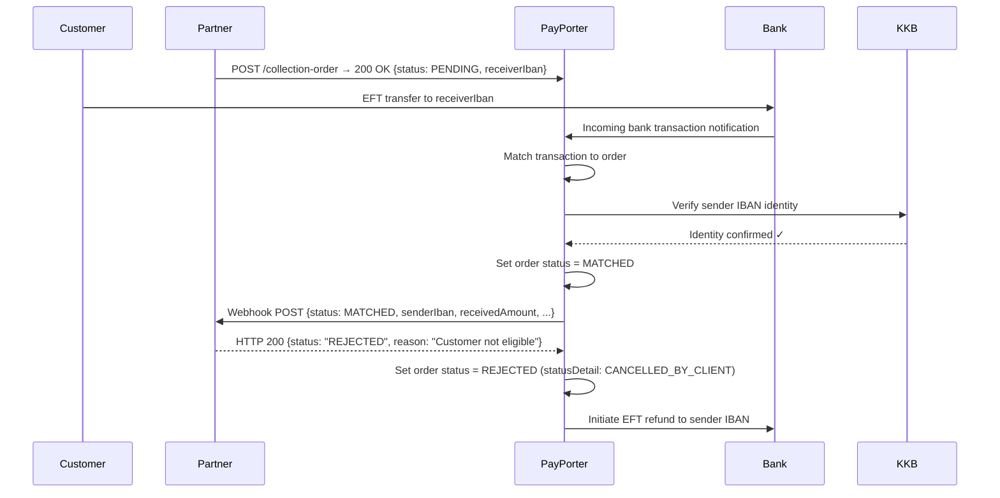

# Flow Diagrams

## Happy Path — Successful Collection

---

## Rejection — Sender Identity Mismatch (KKB)

When the bank transfer arrives but the sender's IBAN does not belong to the customer identity (`tckn`, `name`, `birthDate`) provided in the order, the transfer is automatically rejected and refunded.

---

## Rejection — Order Expired

If no matching bank transfer is received within the order's validity window, the order is automatically expired.

---

## Rejection — Partner Rejects Webhook

When a bank transfer is matched and KKB confirms identity, but the partner returns a non-`COMPLETED` status in the webhook response, the order is rejected and the transfer is refunded.

