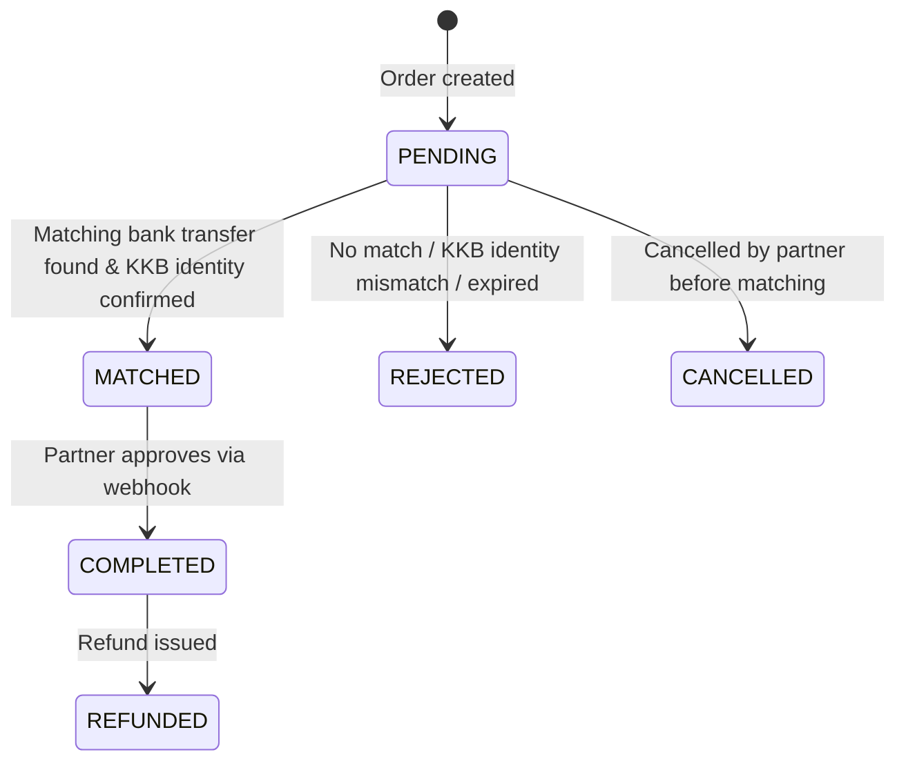

import Tabs from '@theme/Tabs';
import TabItem from '@theme/TabItem';

# Collection Order API

The Collection Order API allows partners to create and manage collection orders — requests to collect a specific amount from a customer via bank transfer (EFT). When the customer sends the matching bank transfer, the system automatically matches it to the order and verifies the sender's identity via KKB (Turkish Credit Bureau) before notifying the partner for approval.

## Version History

| Version | Date | Changes |
| :------ | :--- | :------ |
| 1.0.0 | 2026-06-17 | Initial version. |

---

## Base URL

All API endpoints use the following base URL:

```
https://whitelabelwallet-mig.payporter.com.tr:8590
```

All endpoint paths in this document are relative to this base URL. For example, `POST /external/whitelabel/wallet/collection-order` resolves to `https://whitelabelwallet-mig.payporter.com.tr:8590/external/whitelabel/wallet/collection-order`.

All requests and responses use `Content-Type: application/json`.

---

## Authentication

All API requests require authentication via the `X-Api-Key`, `X-Api-Secret`, `X-Wallet-Id`, and `X-Security-Key` headers.
The security key is constructed from the `walletId` and the RSA public key provided during onboarding.

### API Key Authentication (Server-to-Server)

Include these headers in every request:

| Header | Type | Required | Length | Description | Example |
| :--- | :--- | :--- | :--- | :--- | :--- |
| `X-Api-Key` | String | Yes | 36 | Provided API key. | `a208c005-17a2-441a-b3e9-58b6e0d6c082` |
| `X-Api-Secret` | String | Yes | 36 | Provided API secret. | `3208c005-17a6-441a-b3e9-58b6e0d6c082` |
| `X-Wallet-Id` | String | Yes | 50 | Target wallet identifier. | `1234567890` |
| `X-Security-Key` | String | Yes | - | Encrypted secure data token. | Base64 string |

### Authentication Errors

| HTTP Status | Condition | Description |
|-------------|-----------|-------------|
| `401 Unauthorized` | Invalid `X-Api-Key` or `X-Api-Secret` | The API credentials are missing, expired, or incorrect. |
| `403 Forbidden` | Invalid `X-Security-Key` for the given `X-Wallet-Id` | The security key could not be decrypted or does not match the target wallet. |

### X-Security-Key Header Generation

You need to have a `walletId` and its corresponding RSA public key stored from the onboarding step to generate the `X-Security-Key` header for authenticated requests.

#### 1. Data Structure

Create a JSON payload with the following fields:

| Field | Type | Required | Length | Description |
| :--- | :--- | :--- | :--- | :--- |
| `walletId` | String | Yes | 50 | The wallet ID |
| `timestamp` | String | Yes | 24 | ISO 8601 format (e.g., `2023-10-27T10:00:00.123Z`) |

**Example:**

```json
{
  "walletId": "16250953",
  "timestamp": "2023-10-27T10:00:00.123Z"
}
```

#### 2. Encryption

Encrypt the JSON string using RSA:

| Parameter | Value |
|-----------|-------|
| Algorithm | RSA |
| Mode | ECB |
| Padding | PKCS1Padding (PKCS#1 v1.5) |
| Key | Wallet's RSA Public Key (X.509 encoded) |

#### 3. Encoding

Base64 encode the encrypted byte array.

#### Reference Implementations

<Tabs>
  <TabItem value="java" label="Java" default>

```java
package commitup.pf;

import com.fasterxml.jackson.annotation.JsonFormat;
import com.fasterxml.jackson.core.JsonProcessingException;
import com.fasterxml.jackson.databind.ObjectMapper;
import java.security.KeyFactory;
import java.security.PublicKey;
import java.security.spec.X509EncodedKeySpec;
import java.util.Base64;
import java.util.Date;
import javax.crypto.Cipher;

class WalletSecureDataTest {
    record WhitelabelSecureData(
            String walletId,
            @JsonFormat(shape = JsonFormat.Shape.STRING,
                        pattern = "yyyy-MM-dd'T'HH:mm:ss.SSS'Z'")
            Date timestamp) {
    }

    public String generateSecureDataJson(String walletId)
            throws JsonProcessingException {
        var secureData = new WhitelabelSecureData(walletId, new Date());
        var om = new ObjectMapper();
        return om.writeValueAsString(secureData);
    }

    public String encryptSecureDataJson(
            String secureDataJson, String publicKeyString)
            throws JsonProcessingException {
        try {
            byte[] publicKeyBytes =
                Base64.getDecoder().decode(publicKeyString);
            X509EncodedKeySpec keySpec =
                new X509EncodedKeySpec(publicKeyBytes);
            KeyFactory keyFactory = KeyFactory.getInstance("RSA");
            PublicKey publicKey = keyFactory.generatePublic(keySpec);

            Cipher cipher = Cipher.getInstance("RSA/ECB/PKCS1Padding");
            cipher.init(Cipher.ENCRYPT_MODE, publicKey);

            byte[] encrypted =
                cipher.doFinal(secureDataJson.getBytes());
            return Base64.getEncoder().encodeToString(encrypted);
        } catch (Exception e) {
            throw new IllegalArgumentException(e);
        }
    }
}
```

  </TabItem>
  <TabItem value="go" label="Go">

```go
package main

import (
    "crypto/rand"
    "crypto/rsa"
    "crypto/x509"
    "encoding/base64"
    "encoding/json"
    "fmt"
    "time"
)

type WhitelabelSecureData struct {
    WalletId  string `json:"walletId"`
    Timestamp string `json:"timestamp"`
}

func generateSecureDataJSON(walletId string) (string, error) {
    timestamp := time.Now().UTC().Format(
        "2006-01-02T15:04:05.000Z")
    secureData := WhitelabelSecureData{
        WalletId:  walletId,
        Timestamp: timestamp,
    }
    b, err := json.Marshal(secureData)
    if err != nil {
        return "", err
    }
    return string(b), nil
}

// RSA/ECB/PKCS1Padding == Go: rsa.EncryptPKCS1v15
func encryptSecureDataJSON(
    secureDataJSON string, publicKeyBase64 string,
) (string, error) {
    pubDer, err := base64.StdEncoding.DecodeString(
        publicKeyBase64)
    if err != nil {
        return "", fmt.Errorf(
            "invalid public key base64: %w", err)
    }
    pubAny, err := x509.ParsePKIXPublicKey(pubDer)
    if err != nil {
        return "", fmt.Errorf(
            "invalid public key DER (PKIX): %w", err)
    }
    pub, ok := pubAny.(*rsa.PublicKey)
    if !ok {
        return "", fmt.Errorf("public key is not RSA")
    }
    encrypted, err := rsa.EncryptPKCS1v15(
        rand.Reader, pub, []byte(secureDataJSON))
    if err != nil {
        return "", fmt.Errorf(
            "rsa encrypt failed: %w", err)
    }
    return base64.StdEncoding.EncodeToString(encrypted), nil
}
```

  </TabItem>
  <TabItem value="php" label="PHP">

```php
<?php

function generateSecureDataJson(string $walletId): string
{
    $secureData = [
        "walletId" => $walletId,
        "timestamp" => (new DateTimeImmutable(
            "now", new DateTimeZone("UTC")
        ))->format("Y-m-d\TH:i:s.v\Z"),
    ];
    $json = json_encode(
        $secureData, JSON_UNESCAPED_SLASHES);
    if ($json === false) {
        throw new RuntimeException(
            "json_encode failed: " . json_last_error_msg());
    }
    return $json;
}

/**
 * RSA/ECB/PKCS1Padding == OpenSSL: OPENSSL_PKCS1_PADDING
 * $publicKeyBase64: X.509 SubjectPublicKeyInfo (DER)
 */
function encryptSecureDataJson(
    string $secureDataJson, string $publicKeyBase64
): string {
    $der = base64_decode($publicKeyBase64, true);
    if ($der === false) {
        throw new InvalidArgumentException(
            "Invalid publicKeyBase64");
    }
    $pem = "-----BEGIN PUBLIC KEY-----\n"
        . chunk_split(base64_encode($der), 64, "\n")
        . "-----END PUBLIC KEY-----\n";
    $pubKey = openssl_pkey_get_public($pem);
    if ($pubKey === false) {
        throw new RuntimeException(
            "openssl_pkey_get_public failed");
    }
    $encrypted = "";
    $ok = openssl_public_encrypt(
        $secureDataJson, $encrypted,
        $pubKey, OPENSSL_PKCS1_PADDING);
    if (!$ok) {
        throw new RuntimeException(
            "openssl_public_encrypt failed");
    }
    return base64_encode($encrypted);
}
```

  </TabItem>
</Tabs>

---

## Error Response Format

All errors share the same JSON envelope:

| HTTP Status | Category | When |
|-------------|----------|------|
| `406 Not Acceptable` | Validation | Missing or invalid request fields |
| `5XX Server Error` | System | Unexpected internal failure |

```json
{
  "status": "error",
  "code": "<ERROR_CODE>",
  "message": "<Human-readable description>"
}
```

---

## Amount Format

| Rule | Detail |
|------|--------|
| Currency | TRY (Turkish Lira) |
| Type | `Number` (decimal) |
| Examples | `100.00`, `84.50`, `0.01` |
| Sign | Always positive. |

:::note
All amounts are denominated in TRY. No FX conversion is applied.
:::

---

## Order Status State Machine

An order moves through the following statuses during its lifecycle:



| Status | Type | Description |
|--------|------|-------------|
| `PENDING` | Intermediate | Order created. Awaiting a matching bank transfer. |
| `MATCHED` | Intermediate | Incoming bank transfer matched and sender identity verified via KKB. Awaiting partner approval via webhook. |
| `COMPLETED` | **Final** | Partner approved the match. Funds settled to wallet. |
| `REJECTED` | **Final** | Order failed — no match within time window, KKB identity mismatch, amount mismatch, or invalid reference. Transfer is automatically refunded to sender when applicable. |
| `CANCELLED` | **Final** | Order cancelled by the partner before any bank transfer was matched. |
| `REFUNDED` | **Final** | Funds returned after a completed order. |

:::note Finality
`COMPLETED`, `REJECTED`, `CANCELLED`, and `REFUNDED` are terminal states. Once reached, the status will not change.
:::
