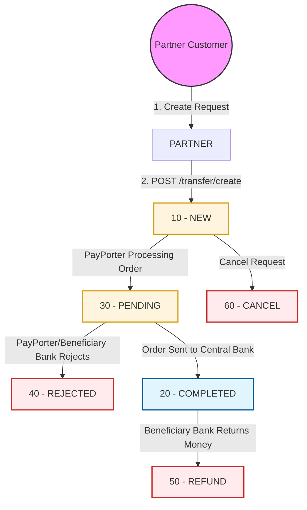

# EFT Status Flow

Understanding the lifecycle of an EFT transfer is crucial for proper integration. This page details the various statuses an EFT request can go through and how to track them.

## Status Lifecycle Flow

The following diagram illustrates the transitions between different EFT statuses:

:::info
**Red Blocks** represent Final Statuses (Rejected, Cancelled, Refunded). Although **COMPLETED** is a successful state, a **REFUND** can still occur later if the beneficiary bank returns the funds.
:::

## EFT Status Codes

| Status Code | Status Name | Description |
| :--- | :--- | :--- |
| **10** | `NEW` | Transfer successfully created in PayPorter system. |
| **20** | `COMPLETED` | Transfer successfully sent to the receiver bank. |
| **30** | `PENDING` | Transfer is waiting for process or in queue. |
| **40** | `REJECTED` | Transfer is rejected by PayPorter or the beneficiary bank. |
| **50** | `REFUND` | Transfer is refunded by the receiver bank. |
| **60** | `CANCEL` | Transfer is successfully cancelled before processing. |

## Tracking Transfers

To track the status of an EFT transfer, you should periodically query the transaction's status until it reaches a **Final Status** (COMPLETED, REJECTED, REFUND, or CANCEL).

### Status Check Methods

There are two primary methods to check the status of a transfer:

1.  **List Query**: Use the `POST /eft-api/V2/transfer/get-transfer-list` endpoint with an order date range to retrieve a list of all your orders.
2.  **Specific Query**: Query the status of a specific transfer using:
    *   `GET /eft-api/V2/transfer/check-status-by-ext-firm-id/{extFirmRefId}`
    *   `GET /eft-api/V2/transfer/check-status-by-transfer-order-ref/{transferOrderRefId}`

:::warning Rate Limiter
Please note that if you choose to query the status of each transfer individually, there is a rate limiter in place to prevent more than **60 queries per minute**.
:::

### Best Practices

*   **Use Webhooks (Recommended)**: For the most efficient and instant updates, we strongly recommend using our [Webhook system](./webhooks). It eliminates the need for polling and ensures you are notified the moment a status change occurs.
*   **Stop Querying**: Once a transfer reaches a final status, stop querying its status (unless you are using list-based methods).
*   **Refund Monitoring**: Since a **REFUND** can occur at any time after a transfer is **COMPLETED**, it is recommended to call the "Get Refund List" endpoint multiple times a day.
*   **Efficient Querying**: Use the "Get Refund List" endpoint with the `SYSDATE` (today) parameter to efficiently retrieve today's returned transactions.
