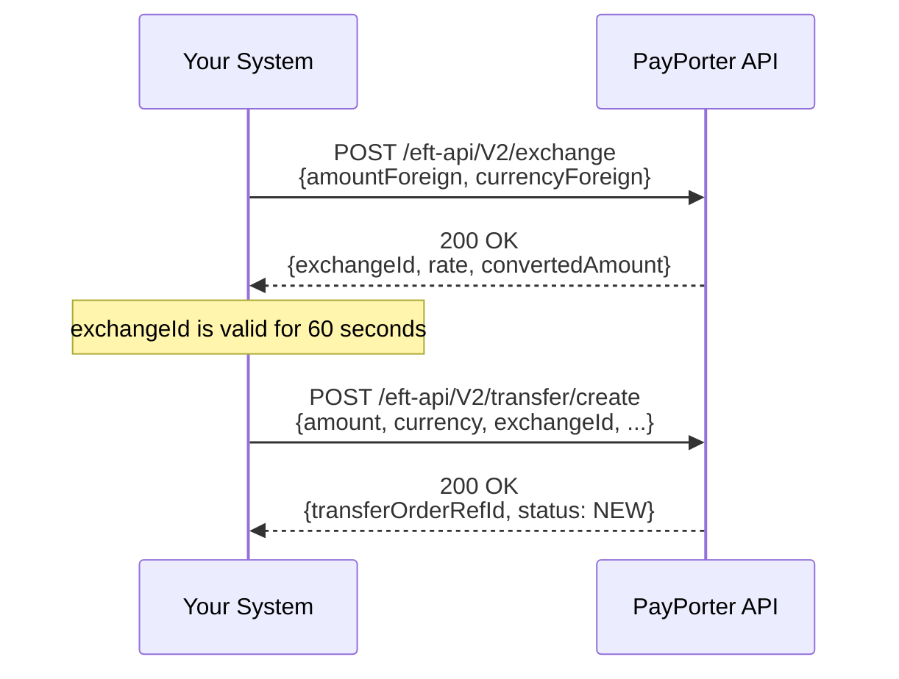

import Tabs from '@theme/Tabs';
import TabItem from '@theme/TabItem';
import ApiEndpoint from '@site/src/components/ApiEndpoint';
import ApiResponseSelector from '@site/src/components/ApiResponseSelector';

# Exchange

Use this endpoint to perform currency conversion between foreign currencies and TRY. This is useful when sending funds in a different currency than your operating account.

<ApiEndpoint method="POST" url="/eft-api/V2/exchange" />

## Overview

The exchange service allows you to:
- Convert foreign currency (USD, EUR, GBP) to TRY.
- Convert TRY to foreign currency (USD, EUR, GBP).
- Obtain a valid `exchangeId` required for initiating a multi-currency EFT transfer.

### Multi-Currency Transfer Flow



:::important Expiry Time
The generated `exchangeId` is valid for **1 minute**. If you do not initiate the transfer within this timeframe, you must request a new `exchangeId`.
:::

---

## Request Format

<Tabs>
  <TabItem value="table" label="Parameters" default>

| Parameter | Required | Type | Description |
| :--- | :--- | :--- | :--- |
| amountForeign | No | number | The foreign currency amount. |
| currencyForeign | Yes | string | The foreign currency code (e.g., `USD`, `EUR`). |
| amountTRY | No | number | The TRY amount. |
| commercial | No | boolean | Set to `true` for commercial transactions. |

  </TabItem>
  <TabItem value="example" label="Example Request">

```json
{
  "amountForeign": 100,
  "currencyForeign": "USD",
  "amountTRY": null,
  "commercial": false
}
```

  </TabItem>
  <TabItem value="curl" label="cURL">

```shell
curl -X POST https://online-mig.payporter.com.tr:8586/online/eft-api/V2/exchange \
    -H "Authorization: Bearer YOUR_ACCESS_TOKEN" \
    -H "Content-Type: application/json" \
    -d '{ "amountForeign": 100, "currencyForeign": "USD", "amountTRY": null, "commercial": false }'
```

  </TabItem>
</Tabs>

---

## Response

<Tabs>
  <TabItem value="table" label="Response Parameters" default>

| Parameter | Type | Description |
| :--- | :--- | :--- |
| exchangeId | string | Unique ID for the exchange session. Valid for 60 seconds. |
| rate | number | The exchange rate applied to the transaction. |
| convertedAmount | number | The resulting amount after conversion. |

  </TabItem>
  <TabItem value="example" label="Example Response">

<ApiResponseSelector>

```json status="200" title="Success"
{
  "header": {
    "success": true,
    "code": "1",
    "message": "OPERATION_DONE_SUCCESSFUL",
    "messageCode": "OPERATION_DONE_SUCCESSFUL"
  },
  "responseObject": {
    "exchangeId": "EX-88234-9912",
    "rate": 31.45,
    "amountForeign": 100,
    "currencyForeign": "USD",
    "amountTRY": 3145,
    "validUntil": "2026-03-09T17:45:00.000Z"
  }
}
```

</ApiResponseSelector>

  </TabItem>
</Tabs>
