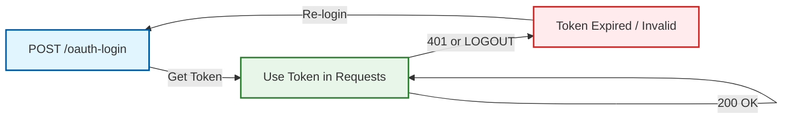

# Introduction

This API serves as the primary gateway to facilitate money transfers through the PayPorter platform.
The Money Transfer API is organized according to [REST](https://en.wikipedia.org/wiki/Representational_state_transfer) principles.

**Base URL:**
```
https://online-mig.payporter.com.tr:8586/online
```

[Download our Postman Collection here](https://apilist.payporter.com.tr:81/online/doc/payporter-postman.json)

## General API Information

### Access Token
All endpoints require a Bearer token in the Authorization header. You can get the token by calling the `/login` endpoint with your credentials. You should keep this token until it expires. When the token expires, you will need to generate a new one. 



:::caution **Important**
Please do not call login before each request. Otherwise, you will get an `HTTP 429 Too Many Requests` response.
:::

### Response and Errors
- **Success:** If a request is successful, you will get an `HTTP 200 OK` response.
- **Client Errors:** If a request fails due to invalid parameters or structure, you will get an `HTTP 4XX` response.
- **Business Errors:** For business errors, you will get an `HTTP 406` response with the `success` field set to `false` in the response body. The `messageCode` field will be filled with an error code. You need to check the `messageCode` which is unique.
- **Server Errors:** An `HTTP 500 Internal Server Error` response means there is a problem with the server. Please check your transfer or payment status before retrying the request.

If you receive `LOGOUT` in the `messageCode` field from any endpoint, you should call the login endpoint again to get a new token. You may receive an `HTTP 401 Unauthorized` or `HTTP 406` response for `LOGOUT`.

### Response Structure
In this API, the response structure strongly adheres to this format:
```json
{
  "body": {
    "responseObject": { 
      // ... 
    },
    "restHeader": {
      "code": "string",
      "message": "string",
      "success": true,
      "messageCode": "string"
    }
  }
}
```

:::danger **Important**
`code` is a legacy field and not unique. Please use `messageCode` instead.
:::

### Rate Limiter
This API has a rate limiter. If you exceed limits, you will get an `HTTP 429 Too Many Requests` response.
