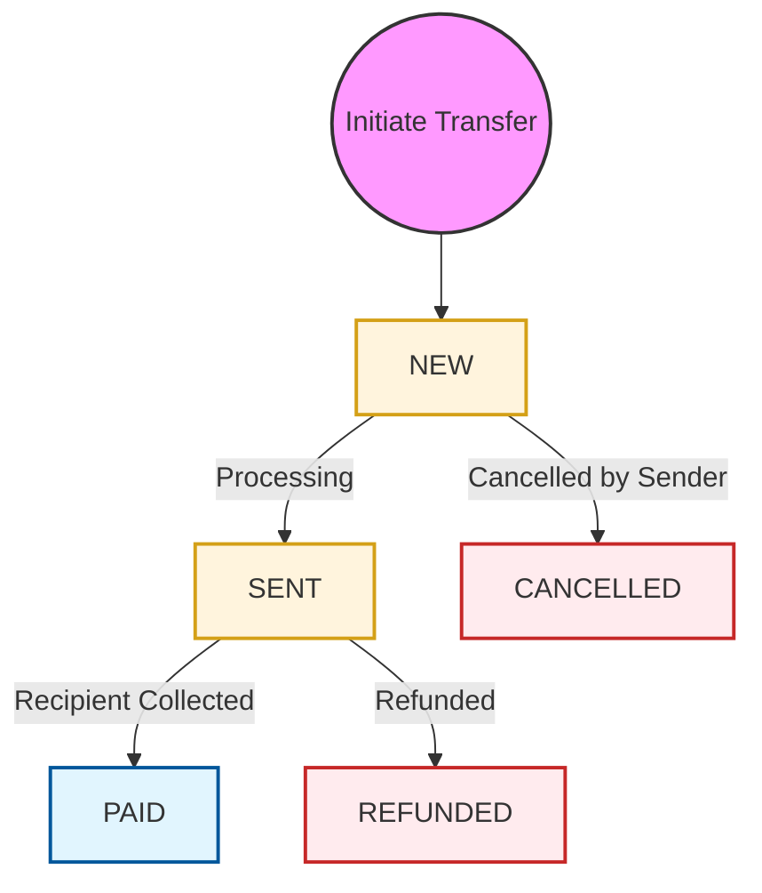

# Money Transfer API

The Money Transfer service allows you to send funds to individuals worldwide through various payout methods, including cash pick-up (to name), bank accounts, electronic wallets, and cards.

## Transfer Process

All money transfers follow a mandatory **Two-Step Verification** process to ensure accuracy and compliance.

### 1. Validation Step
First, you must call the specific validation endpoint for your transfer type:
- `POST /mt-api/V2/moneysend/to-name/validate`
- `POST /mt-api/V2/moneysend/to-account/validate`
- `POST /mt-api/V2/moneysend/to-wallet/validate`
- `POST /mt-api/V2/moneysend/to-card/validate`

**Result**: If successful, the API returns an `operation-id` in the response header.

### 2. Confirmation Step
Use the `operation-id` from the validation step to finalize the transfer.
- `POST /mt-api/V2/moneysend/confirm` (Header: `operation-id: {id}`)

---

## Transfer Types

- **[To Name (Cash Pick Up)](./to-name/validate)**: Send money that can be collected in cash from PayPorter offices or partner locations.
- **[To Account](./to-account/validate)**: Direct transfer to an IBAN (non Turkish).
- **[To Wallet](./to-wallet/validate)**: Send funds to a recipient's electronic wallet.
- **[To Card](./to-card/validate)**: Transfer directly to a debit or credit card (non Turkish).

---

## Status Lifecycle

The following diagram illustrates the lifecycle of a money transfer:

## Transfer Statuses

| ID | Status | Description |
| :--- | :--- | :--- |
| 0 | **NEW** | Transfer request successfully received and validated. |
| 1 | **SENT** | Transfer has been sent to the paying partner or system. |
| 2 | **PAID** | Funds have been successfully collected/received by the recipient. |
| 3 | **CANCELLED** | Transfer was cancelled before it was processed. |
| 4 | **REFUNDED** | Transfer was returned, and funds were credited back to the sender. |
