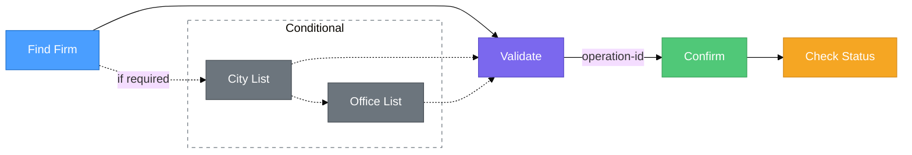

# Transfer to Name Flow

This guide explains the complete flow for sending a **Cash Pick-Up** transfer where the recipient collects cash from a remittance firm office.

---

## Flow Diagram

> The main flow goes **Find Firm → Validate → Confirm → Check Status**. City and office lookups are only needed when the selected firm requires them.

---

## Steps

### 1. Find Firm (Required)

Call the **[Find Firm](./find-firm)** endpoint with the destination country code. This returns the list of available remittance firms and tells you:

- **`toExternalFirmCode`** — the firm code to use in validation.
- **`currency`** / **`payoutCurrency`** — supported sending and payout currencies.
- **`cityMandatory`** — whether you need to select a city (and potentially an office).

If `cityMandatory` is `true`, call **[City List](./find-city)** to get cities. If `officeMandatory` is also `true`, call **[Office List](./find-office)** to get pickup locations within that city. Office selection is only applicable when city is mandatory.

### 2. Validate Transfer

Submit all collected data (firm, city/office IDs if required, sender/receiver info, amount) to **[Validate](./validate)**. On success, an `operation-id` is returned in the **response header**.

### 3. Confirm Transfer

Pass the `operation-id` to the **[Confirm](./confirm)** endpoint to finalize the transaction. The transfer status moves to **NEW**.

### 4. Check Status

Use the **[Transfer Details](../transfer-details)** endpoint with the `processReferenceNo` to track the transfer through its lifecycle (NEW → SENT → PAID).
