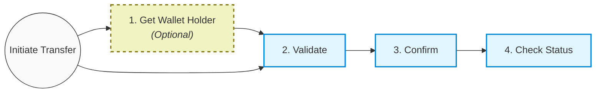

# Transfer to Wallet Overview

The "To Wallet" money transfer flow allows you to seamlessly send funds to a recipient's electronic wallet.

Wallets are uniquely identified by a `walletId`. Different wallets belong to specific countries, which is important when directing payments.

### Prerequisites: Wallet List

Before initiating any "To Wallet" transfer, you **must** fetch the comprehensive list of wallets using the **[Wallet List](./wallet-list)** endpoint and store them locally on your own platform. You will supply the static `walletId` from your local database during validation.

---

## Integration Flow

### Core Steps

1. **[Get Wallet Holder Name](./get-holder)** *(Optional)*
   For some integrations (mostly Turkish wallets), you can call the `/holder-name` endpoint passing the recipient's phone number to retrieve a masked version of their name before sending the money.

2. **[Validate Request](./validate)**
   Provide the static `toWalletId` alongside the transfer details (amount, sender, receiver, etc.) to securely validate the transfer data. The API will respond with an `operation-id`.

3. **[Confirm Transfer](./confirm)**
   Pass the `operation-id` from validation to finalize the transaction. Store the returning `processReferenceNo`.

4. **[Check Status](../transfer-details)**
   Query the **Transfer Details** API by `processReferenceNo` to monitor the transaction's lifecycle.
