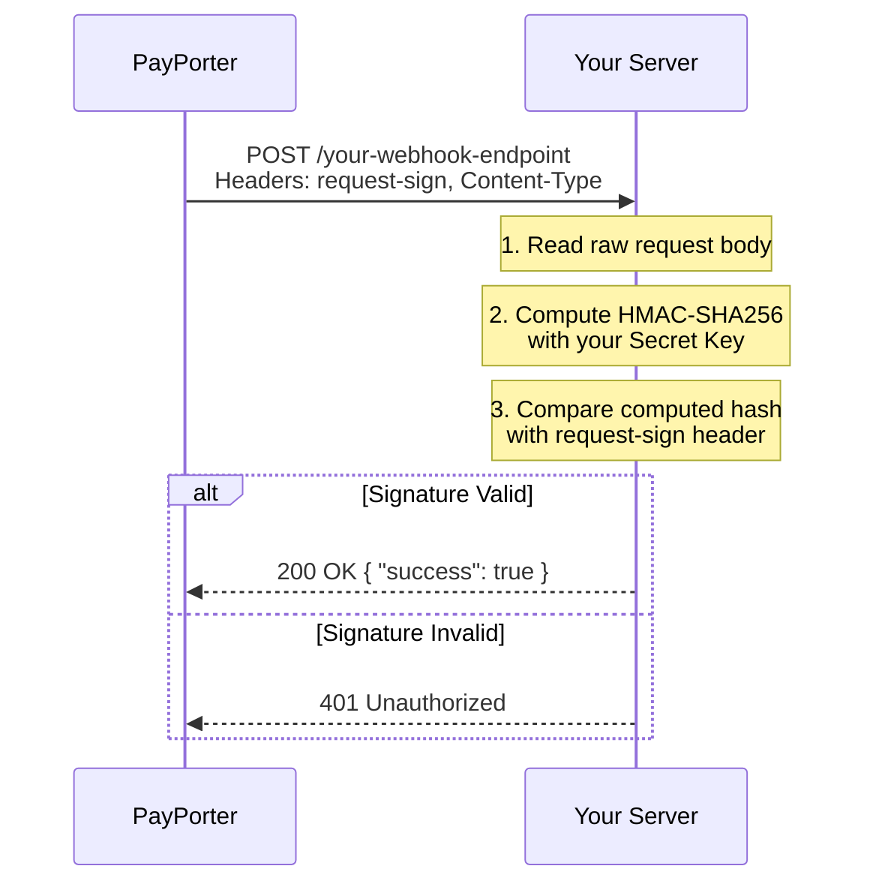

import Tabs from '@theme/Tabs';
import TabItem from '@theme/TabItem';
import ApiEndpoint from '@site/src/components/ApiEndpoint';
import ApiResponseSelector from '@site/src/components/ApiResponseSelector';

# Webhooks

Webhooks allow you to receive real-time notifications about status changes in your Money Transfers. Instead of polling our API, we will "push" information to your server as soon as an event occurs.

## Workflow



1.  **Endpoint**: You must provide a publicly accessible HTTPS endpoint (e.g., `https://your-domain.com/payporter/money-transfer-api/notify-status`).
2.  **Notification**: When a transfer status changes (only `2` (PAID) and `4` (REFUNDED) events will be notified), PayPorter sends a `POST` request to your endpoint.
3.  **Verification**: You should verify the signature included in the request headers to ensure the notification is authentic.
4.  **Acknowledgment**: Your server should return a `200 OK` status with `success: true` to acknowledge receipt.

:::danger Idempotency
Webhook needs to be **idempotent**. PayPorter may notify the same status multiple times in some cases (timeout, system error).
:::

---

## Secure Implementation

To ensure the security and integrity of the notifications, every webhook request includes a digital signature.

### Hashing Algorithm
We use the **HmacSHA256** algorithm. The output format for the hashed value is **hexadecimal (hex)**.

### Secret Key
PayPorter will provide you with a **Secret Value** during the integration phase. This secret must be kept secure on your server and should never be shared or exposed in client-side code.

### Verification Process
To verify the request:
1.  Concatenate the entire request body as a string.
2.  Hash this string using the **HmacSHA256** algorithm with your provided **Secret Value**.
3.  Compare the resulting hex string with the value provided in the `request-sign` header.

### Verification Code Examples

<Tabs>
  <TabItem value="nodejs" label="Node.js" default>

```javascript
const crypto = require('crypto');
const express = require('express');
const app = express();

// Use raw body for HMAC verification
app.use('/webhook', express.raw({ type: 'application/json' }));

app.post('/webhook', (req, res) => {
  const SECRET_KEY = process.env.PAYPORTER_SECRET_KEY;
  const receivedSign = req.headers['request-sign'];
  const rawBody = req.body.toString('utf-8');

  const computedSign = crypto
    .createHmac('sha256', SECRET_KEY)
    .update(rawBody)
    .digest('hex');

  if (computedSign !== receivedSign) {
    return res.status(401).json({ success: false, errorCode: 'INVALID_SIGNATURE' });
  }

  const payload = JSON.parse(rawBody);
  console.log('Verified webhook for Txn:', payload.apiAgentTxnRefNo, 'Status:', payload.status);

  res.status(200).json({ success: true });
});
```

  </TabItem>
  <TabItem value="python" label="Python">

```python
import hmac
import hashlib
import json
from flask import Flask, request, jsonify

app = Flask(__name__)
SECRET_KEY = "your_secret_key"

@app.route("/webhook", methods=["POST"])
def webhook():
    received_sign = request.headers.get("request-sign")
    raw_body = request.get_data(as_text=True)

    computed_sign = hmac.new(
        SECRET_KEY.encode("utf-8"),
        raw_body.encode("utf-8"),
        hashlib.sha256
    ).hexdigest()

    if not hmac.compare_digest(computed_sign, received_sign):
        return jsonify({"success": False, "errorCode": "INVALID_SIGNATURE"}), 401

    payload = json.loads(raw_body)
    print(f"Verified webhook for Txn: {payload.get('apiAgentTxnRefNo')} Status: {payload.get('status')}")

    return jsonify({"success": True}), 200
```

  </TabItem>
  <TabItem value="java" label="Java">

```java
import javax.crypto.Mac;
import javax.crypto.spec.SecretKeySpec;
import java.nio.charset.StandardCharsets;

public class WebhookVerifier {

    private static final String SECRET_KEY = "your_secret_key";

    public static boolean verifySignature(String rawBody, String receivedSign) 
            throws Exception {
        Mac mac = Mac.getInstance("HmacSHA256");
        SecretKeySpec secretKeySpec = new SecretKeySpec(
            SECRET_KEY.getBytes(StandardCharsets.UTF_8), "HmacSHA256"
        );
        mac.init(secretKeySpec);

        byte[] hash = mac.doFinal(rawBody.getBytes(StandardCharsets.UTF_8));

        StringBuilder hexString = new StringBuilder();
        for (byte b : hash) {
            hexString.append(String.format("%02x", b));
        }

        return hexString.toString().equals(receivedSign);
    }
}
```

  </TabItem>
</Tabs>

---

## Request Details

The webhook payload is sent as a `POST` request.

### Headers
| Header | Description | Required |
| :--- | :--- | :--- |
| Content-Type | `application/json` | Yes |
| request-sign | The HMAC-SHA256 signature of the payload (hex format). | Yes |

### Parameters
<Tabs>
  <TabItem value="table" label="Request Parameters" default>

| Parameter | Type | Description | Example |
| :--- | :--- | :--- | :--- |
| apiAgentTxnRefNo | string | Integration transaction reference number | `TXN-987654321` |
| senderExtFirmRefId | string | Sender external firm reference id | `P2P_1212121` |
| transferOrderRefId | number | Money transfer order reference id | `47000000000` |
| status | number | Status of the money transfer (Only `2`: PAID and `4`: REFUNDED will be notified) | `2` |
| messageCode | string | Reject/refund reason code | `MT_REFUNDED` |
| messageDescription | string | Extra description if it exists | `Refund applied successfully` |

  </TabItem>
  <TabItem value="payload" label="Example Payload">

```json
{
  "apiAgentTxnRefNo": "TXN-987654321",
  "senderExtFirmRefId": "P2P_1212121",
  "transferOrderRefId": 47000000000,
  "status": 2,
  "messageCode": "OPERATION_DONE_SUCCESSFUL",
  "messageDescription": "Success"
}
```

  </TabItem>
</Tabs>

---

## Response Expectations

Your server must return an appropriate HTTP status code and a JSON response.

<Tabs>
  <TabItem value="table" label="Response Parameters" default>

| Parameter | Type | Description | Example |
| :--- | :--- | :--- | :--- |
| success | boolean | Notification processing status | `true` |
| errorCode | string | Error code if notification failed | `SENDER_REF_NOT_FOUND` |

  </TabItem>
  <TabItem value="example" label="Example Responses">

<ApiResponseSelector>

```json status="200" title="Success"
{
  "success": true
}
```

```json status="404" title="Not Found"
{
  "success": false,
  "errorCode": "SENDER_REF_NOT_FOUND"
}
```

```json status="400" title="Status Not Valid"
{
  "success": false,
  "errorCode": "STATUS_NOT_VALID"
}
```

</ApiResponseSelector>

  </TabItem>
</Tabs>

### HTTP Status Code Mapping

| Status | Condition |
| :--- | :--- |
| **200** | Everything is OK (`success=true`). |
| **404** | `SENDER_REF_NOT_FOUND` or `ORDER_REF_NOT_FOUND` (`success=false`). |
| **400** | `STATUS_NOT_VALID` (`success=false`). |
| **500** | All other error cases (`success=false`). |
