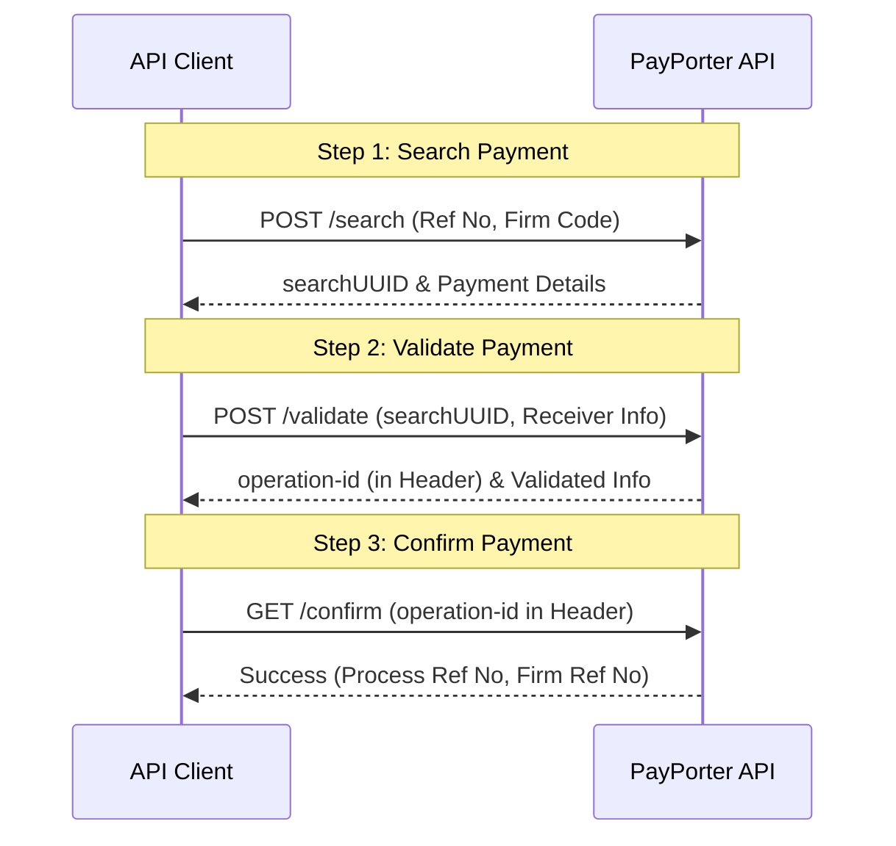

import ApiEndpoint from '@site/src/components/ApiEndpoint';
import Tabs from '@theme/Tabs';
import TabItem from '@theme/TabItem';

# Payments Overview

Payment is the process of paying out an incoming transfer to a receiver using a reference number. This is typically used for cash pickup (Cash Pick Up) transfers.

The payment flow consists of three main steps:
1.  **Search**: Find the payment details using the reference number provided by the sender.
2.  **Validate**: Verify the receiver's information and prepare for payment.
3.  **Confirm**: Finalize the payment.

### Key Points
- A payment is processed using a reference number from an external/remittance firm.
- The `validate` method must be called before `confirm`.
- In the response header of the **Validate** method, you will receive an `operation-id`. This ID is required for the **Confirm** request.
- Use the **Payment Firm List** to get the list of supported firms for collection.

:::info
Payment is an "incoming" operation (payout), whereas common money transfer endpoints are for "outgoing" operations (send).
:::
