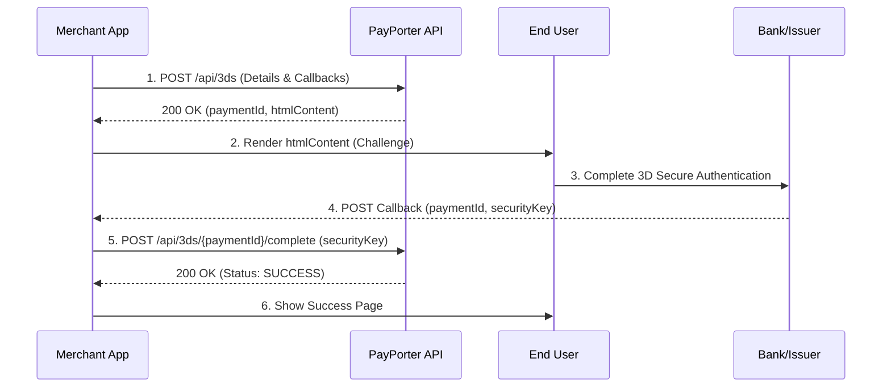

import ApiEndpoint from '@site/src/components/ApiEndpoint';
import ApiResponseSelector from '@site/src/components/ApiResponseSelector';
import Tabs from '@theme/Tabs';
import TabItem from '@theme/TabItem';

# 3D Secure Payment

3D Secure provides an additional layer of security by redirecting the user to their bank's authentication page. This flow involves enrollment, customer authentication, and final completion.

## 1. Initiate 3D Secure Enrollment

Start the 3D Secure process by providing the payment details and callback URLs.

<ApiEndpoint method="POST" url="/api/3ds" />

### Request Parameters

<Tabs>
  <TabItem value="table" label="Parameters" default>

| Parameter | Required | Type | Description |
| :--- | :--- | :--- | :--- |
| orderId | Yes | string | Client's tracking number for the order (e.g., ORD-12345). |
| amount | Yes | number | Transaction amount (e.g., 100.50). |
| currency | Yes | string | ISO currency code (e.g., TRY). |
| installmentCount | No | number | Number of installments (default: 1). Check available options via the **Installment Options API** before setting this. |
| interestPaidByCustomer | No | boolean | Whether interest is paid by the customer. |
| cardHolderName | Yes | string | Name of the card holder. |
| pan | Yes | string | Full card number (16 digits). |
| expiryMonth | Yes | string | Expiry month (MM format, e.g., 04). |
| expiryYear | Yes | string | Expiry year (YY format, e.g., 28). |
| cvv | Yes | string | CVV/CVC code (3 or 4 digits). |
| successUrl | Yes | string | Destination URL after successful bank authentication. |
| failureUrl | Yes | string | Destination URL after failed bank authentication. |
| requestIp | Yes | string | IP address of the customer. |
| requestPort | Yes | number | Port number of the customer request. |
| customerId | No | string | Optional unique identifier for the customer. |

  </TabItem>
  <TabItem value="example" label="Example Request">

```json
{
  "orderId": "ORD-12345",
  "amount": 100.50,
  "currency": "TRY",
  "installmentCount": 3,
  "interestPaidByCustomer": true,
  "cardHolderName": "John Doe",
  "pan": "5421190122090656",
  "expiryMonth": "04",
  "expiryYear": "28",
  "cvv": "916",
  "successUrl": "https://example.com/3ds/success",
  "failureUrl": "https://example.com/3ds/failure",
  "requestIp": "192.168.1.1",
  "requestPort": 8080,
  "customerId": "CUST-12345"
}
```

  </TabItem>
</Tabs>

### Response

<Tabs>
  <TabItem value="fields" label="Response Fields" default>

| Field | Type | Description |
| :--- | :--- | :--- |
| paymentId | string | Unique identifier for the payment (UUID). |
| success | boolean | Indicates if the enrollment was successful. |
| resultCode | string | Result code from the enrollment (e.g., SUCCESS). |
| resultMessage | string | Descriptive result message. |
| htmlContent | string | HTML content to be presented to the end user for 3D Secure authentication. |

  </TabItem>
  <TabItem value="example" label="Example Response">

<ApiResponseSelector>

```json status="200" title="Success"
{
  "paymentId": "123e4567-e89b-12d3-a456-426614174000",
  "success": true,
  "resultCode": "SUCCESS",
  "resultMessage": "Successful",
  "htmlContent": "<form action=\"https://3ds.example.com\" method=\"POST\">...</form>"
}
```

</ApiResponseSelector>

  </TabItem>
</Tabs>

## 2. Present 3D Secure Authentication

Present the returned `htmlContent` to the end user. This typically involves rendering it in an iframe or redirecting the user to complete the 3D Secure authentication on the bank's page.

## 3. Handle 3D Secure Callback

After the authentication process, the payment provider will call the provided callback URLs (`successUrl` or `failureUrl`) with relevant parameters posted as form data.

### Callback Form Data Parameters

| Field | Description | Example |
| :--- | :--- | :--- |
| paymentId | Unique identifier for the payment. | 123e4567-e89b-12d3-a456-426614174000 |
| securityKey | Security key received from the 3D Secure authentication process. | 3DS_AUTH_KEY_123456 |

## 4. Complete 3D Secure Payment

Finalize the transaction using the security key received in the callback.

<ApiEndpoint method="POST" url="/api/3ds/{paymentId}/complete" />

### Path Parameters

| Parameter | Type | Description |
| :--- | :--- | :--- |
| paymentId | string | The UUID received in the callback. |

### Request Parameters

```json
{
  "securityKey": "3DS_AUTH_KEY_123456"
}
```

### Response

Returns an `ApiPaymentResponse` object with completed payment details (identical to the **Direct Payment** response).

---

## 3D Secure Payment Flow



1.  **Initiate Enrollment**: Call the `/api/3ds` endpoint with payment details and callback URLs.
2.  **Display Challenge**: Present the returned `htmlContent` to the user.
3.  **Authentication**: The user completes the bank's 3D Secure process.
4.  **Receive Callback**: The provider sends a POST request to your callback URL with the `paymentId` and `securityKey`.
5.  **Finalize**: Extract the parameters and call the `/api/3ds/{paymentId}/complete` endpoint.
6.  **Verify Status**: Consider the payment successful only if the response `status` is `SUCCESS`.

---

## Installment Options

Retrieve available installment plans for a specific card before processing a payment.

<ApiEndpoint method="POST" url="/api/installment-options" />

### Request Body

<Tabs>
  <TabItem value="table" label="Parameters" default>

| Parameter | Required | Type | Description |
| :--- | :--- | :--- | :--- |
| amount | Yes | number | Total transaction amount (e.g., 1000.00). |
| currency | Yes | string | ISO currency code (e.g., TRY). |
| pan | Yes | string | First 6 digits (BIN) or full card number. |
| maxInstallmentCount | No | number | Maximum number of installments to retrieve (default: 12). |
| interestPaidByCustomer | No | boolean | Whether interest is paid by the customer. |

  </TabItem>
  <TabItem value="example" label="Example Request">

```json
{
  "amount": 1000.00,
  "currency": "TRY",
  "pan": "5421190122090656",
  "maxInstallmentCount": 12,
  "interestPaidByCustomer": true
}
```

  </TabItem>
</Tabs>

### Response

<Tabs>
  <TabItem value="fields" label="Response Fields" default>

| Field | Type | Description |
| :--- | :--- | :--- |
| installmentCount | number | Number of installments. |
| installmentAmount | number | Amount per installment month. |
| currency | string | ISO currency code. |
| interestAmount | number | Total interest generated (added to principal). |
| totalAmount | number | Total amount to be paid (Principal + Interest). |

  </TabItem>
  <TabItem value="example" label="Example Response">

<ApiResponseSelector>

```json status="200" title="Success"
{
  "options": [
    {
      "installmentCount": 2,
      "installmentAmount": 510.00,
      "currency": "TRY",
      "interestAmount": 20.00,
      "totalAmount": 1020.00
    },
    {
      "installmentCount": 3,
      "installmentAmount": 345.00,
      "currency": "TRY",
      "interestAmount": 35.00,
      "totalAmount": 1035.00
    }
  ]
}
```

</ApiResponseSelector>

  </TabItem>
</Tabs>
