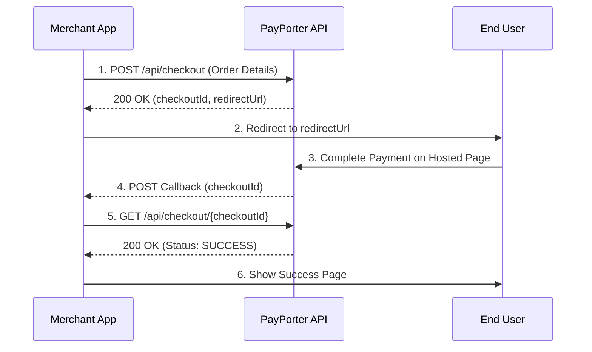

import ApiEndpoint from '@site/src/components/ApiEndpoint';
import ApiResponseSelector from '@site/src/components/ApiResponseSelector';
import Tabs from '@theme/Tabs';
import TabItem from '@theme/TabItem';

# Checkout

Create a secure checkout link to process payments on a hosted page. This reduces your PCI compliance burden as PayPorter handles the card data.

## 1. Create Checkout Link

Generate a unique checkout URL to redirect your customer.

<ApiEndpoint method="POST" url="/api/checkout" />

### Request Parameters

<Tabs>
  <TabItem value="table" label="Parameters" default>

| Parameter | Required | Type | Description |
| :--- | :--- | :--- | :--- |
| orderId | Yes | string | Client's tracking number for the order (e.g., ORD-12345). |
| amount | Yes | number | Transaction amount (e.g., 100.50). |
| currency | Yes | string | ISO currency code (e.g., TRY). |
| description | No | string | Short summary of the purchase. |
| callback | Yes | string | URL called after payment processing. |
| customerId | No | string | Optional unique identifier for the customer. |
| maxInstallmentCount | No | number | Maximum installments allowed (default: 1). |
| interestPaidByCustomer | No | boolean | Whether interest is paid by the customer (default: false). |

  </TabItem>
  <TabItem value="example" label="Example Request">

```json
{
  "orderId": "ORD-12345",
  "amount": 100.50,
  "currency": "TRY",
  "description": "Product purchase",
  "callback": "https://example.com/payment-callback",
  "maxInstallmentCount": 6,
  "interestPaidByCustomer": true
}
```

  </TabItem>
</Tabs>

### Response

<Tabs>
  <TabItem value="fields" label="Response Fields" default>

| Field | Type | Description |
| :--- | :--- | :--- |
| checkoutId | string | Unique identifier for the checkout (UUID). |
| redirectUrl | string | URL to redirect the user to finish the payment. |

  </TabItem>
  <TabItem value="example" label="Example Response">

<ApiResponseSelector>

```json status="200" title="Success"
{
  "checkoutId": "123e4567-e89b-12d3-a456-426614174000",
  "redirectUrl": "https://api.example.com/checkout-link/123e4567-e89b-12d3-a456-426614174000"
}
```

</ApiResponseSelector>

  </TabItem>
</Tabs>

## 2. Redirect User

After receiving the `redirectUrl`, redirect the user to complete their payment securely on the PayPorter hosted page.

## 3. Callback Processing

Once the payment is processed (success or failure), PayPorter will POST to your `callback` URL with the `checkoutId` as form data.

## 4. Get Checkout Status

Retrieve the final status of the transaction using the `checkoutId`.

<ApiEndpoint method="GET" url="/api/checkout/{checkoutId}" />

### Path Parameters

| Parameter | Type | Description |
| :--- | :--- | :--- |
| checkoutId | string | The UUID received in the callback. |

### Response

Returns an `ApiPaymentResponse` object with payment details (identical to the **Direct Payment** response).

---

## Checkout Flow



1.  **Generate Link**: Call the `/api/checkout` endpoint.
2.  **Redirect**: Send the user to the `redirectUrl`.
3.  **Wait**: Listen for a POST request on your `callback` URL.
4.  **Extract**: Pull the `checkoutId` from the callback form data.
5.  **Verify**: Call the `/api/checkout/{checkoutId}` endpoint to get the final status.
6.  **Confirm**: Only treat the payment as successful if the status is `SUCCESS`.

---

## Example Implementation

```javascript
// 1. Create checkout link
const createCheckout = async (orderDetails) => {
  const response = await fetch('https://api.example.com/api/checkout', {
    method: 'POST',
    headers: {
      'Content-Type': 'application/json',
      'X-API-KEY': 'your_api_key_here',
      'X-API-SECRET': 'your_api_secret_here'
    },
    body: JSON.stringify(orderDetails)
  });
  const data = await response.json();
  return data.redirectUrl;
};

// 2. Callback handler (Express example)
app.post('/payment-callback', async (req, res) => {
  const checkoutId = req.body.checkoutId;
  const checkoutStatus = await getCheckoutStatus(checkoutId);
  
  if (checkoutStatus.status === 'SUCCESS') {
    // Process successful payment
    console.log('Payment successful');
  } else {
    // Handle failed payment
    console.log('Payment failed');
  }
  
  res.sendStatus(200);
});

// 3. Get checkout status
const getCheckoutStatus = async (checkoutId) => {
  const response = await fetch(`https://api.example.com/api/checkout/${checkoutId}`, {
    method: 'GET',
    headers: {
      'X-API-KEY': 'your_api_key_here',
      'X-API-SECRET': 'your_api_secret_here'
    }
  });
  return await response.json();
};
```
