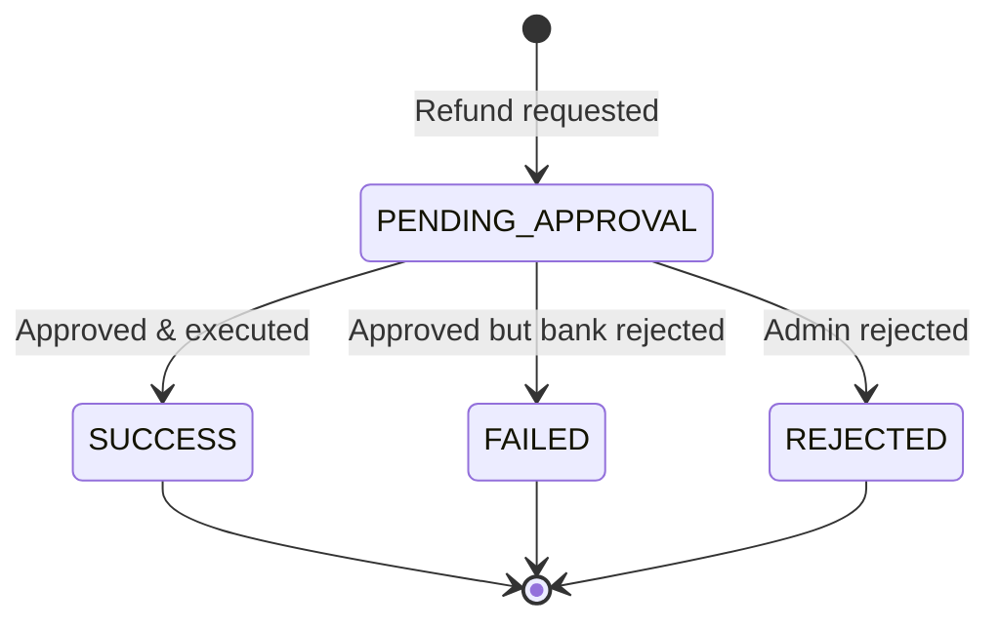

import ApiEndpoint from '@site/src/components/ApiEndpoint';
import ApiResponseSelector from '@site/src/components/ApiResponseSelector';
import Tabs from '@theme/Tabs';
import TabItem from '@theme/TabItem';

# Refund Payment

Request a refund for a previously completed payment. Refund requests do not execute immediately — they are placed into an approval queue and processed after administrative approval.

<ApiEndpoint method="POST" url="/api/payment/{paymentId}/refund" />

### Path Parameters

| Parameter | Type | Description |
| :--- | :--- | :--- |
| paymentId | string | UUID of the original payment to refund. |

### Request Parameters

<Tabs>
  <TabItem value="table" label="Parameters" default>

| Parameter | Required | Type | Description |
| :--- | :--- | :--- | :--- |
| amount | Yes | number | Refund amount. Must be less than or equal to the remaining refundable amount (e.g., 50.00). |
| currency | Yes | string | Currency code (e.g., TRY). |

  </TabItem>
  <TabItem value="example" label="Example Request">

```json
{
  "amount": 50.00,
  "currency": "TRY"
}
```

  </TabItem>
</Tabs>

## Response

Returns an `ApiPaymentResponse` with `status: PENDING_APPROVAL`. The response includes a new `paymentId` for the refund transaction.

<Tabs>
  <TabItem value="fields" label="Response Fields" default>

| Field | Type | Description |
| :--- | :--- | :--- |
| paymentId | string | Unique identifier for the refund transaction (UUID). Use this ID to query refund status. |
| parentPaymentId | string | UUID of the original payment being refunded. |
| orderId | string | Client's tracking number for the order. |
| amount | number | Refund amount. |
| installmentCount | number | Number of installments. |
| currency | string | Currency code. |
| merchantCommission | number | Commission charged to the merchant. |
| status | string | Payment status (`PENDING_APPROVAL`). |
| transactionType | string | Transaction type (`REFUND`). |
| paymentDate | string | Date and time (ISO format, e.g., 2023-05-01T14:30:00Z). |
| cardHolderName | string | Name of the card holder. |
| pan | string | Masked Primary Account Number (e.g., 411111******1111). |
| domInt | string | Domestic or International transaction (DOM/INT). |
| cardScheme | string | Card scheme (e.g., VISA, MASTERCARD). |
| cardType | string | Type of card (e.g., CREDIT, DEBIT). |
| loyaltyCode | string | Loyalty program code (if applicable). |
| externalTransactionId | string | Transaction ID from the payment provider. |
| authCode | string | Authorization code from the payment provider. |
| resultCode | string | Result code from the payment provider. |
| resultMessage | string | Result message from the payment provider. |
| customerId | string | Unique identifier for the customer (if provided). |

  </TabItem>
  <TabItem value="example" label="Example Response">

<ApiResponseSelector>

```json status="200" title="Pending Approval"
{
  "paymentId": "abc12345-d678-90ef-ghij-klmnopqrstuv",
  "parentPaymentId": "123e4567-e89b-12d3-a456-426614174000",
  "orderId": "ORD-12345",
  "amount": 50.00,
  "installmentCount": 1,
  "currency": "TRY",
  "merchantCommission": 1.25,
  "status": "PENDING_APPROVAL",
  "transactionType": "REFUND",
  "paymentDate": "2023-05-02T10:00:00Z",
  "cardHolderName": "John Doe",
  "pan": "411111******1111",
  "domInt": "DOM",
  "cardScheme": "VISA",
  "cardType": "CREDIT",
  "externalTransactionId": "EXT123456789",
  "authCode": "AUTH987654",
  "resultCode": "PENDING_APPROVAL",
  "resultMessage": "Refund request queued for approval",
  "customerId": "CUST-12345"
}
```

</ApiResponseSelector>

  </TabItem>
</Tabs>

---

## Important Notes

:::warning Refunds are not instant
Refund requests are **not processed immediately**. They enter an approval queue and require administrative review before execution.
:::

- Only payments in `SUCCESS` or `CAPTURED` status can be refunded.
- **Partial refunds** are supported — you can refund less than the original amount.
- **Multiple partial refunds** are allowed as long as the total does not exceed the original payment amount (including pending refund requests).
- Once approved or rejected, a **webhook notification** will be sent.
- Use `GET /api/payment/{refundPaymentId}` to poll the refund status.

---

## Refund Lifecycle



1. Send refund request → response status: `PENDING_APPROVAL`
2. Administrative review and approval/rejection
3. On approval: refund is executed at the bank → final status: `SUCCESS` or `FAILED`
4. On rejection: final status: `REJECTED`
5. Webhook notification sent with final status

---

## Example

```javascript
const requestRefund = async (paymentId, amount, currency) => {
  const response = await fetch(`https://api.example.com/api/payment/${paymentId}/refund`, {
    method: 'POST',
    headers: {
      'Content-Type': 'application/json',
      'X-API-KEY': 'your_api_key_here',
      'X-API-SECRET': 'your_api_secret_here'
    },
    body: JSON.stringify({ amount, currency })
  });

  const result = await response.json();
  // result.status === 'PENDING_APPROVAL'
  // result.paymentId → refund transaction ID (use to query refund status)
  return result;
};

// Query refund status
const checkRefundStatus = async (refundPaymentId) => {
  const response = await fetch(`https://api.example.com/api/payment/${refundPaymentId}`, {
    method: 'GET',
    headers: {
      'X-API-KEY': 'your_api_key_here',
      'X-API-SECRET': 'your_api_secret_here'
    }
  });
  const result = await response.json();
  // result.status: PENDING_APPROVAL | SUCCESS | FAILED | REJECTED
  return result;
};
```
