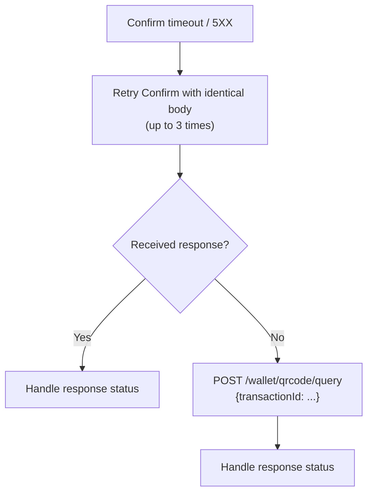

# Confirm Retry & Fallback Strategy

If the Confirm call returns an HTTP `5XX` error or times out, the result is unknown. The partner must retry the Confirm request with **identical values**. The [Confirm Idempotency](./safety-model#confirm-idempotency) mechanism guarantees that no duplicate financial transaction will be created.

| Attempt | Delay | Action |
|---------|-------|--------|
| 1st retry | 1 second | Retry Confirm with identical body |
| 2nd retry | 5 seconds | Retry Confirm with identical body |
| 3rd retry | 15 seconds | Retry Confirm with identical body |
| After 3 retries | — | Fall back to Query |

## Response Handling

Regardless of the source (Confirm retry or Query fallback), the following statuses are handled the same way:

| Status | Meaning | Partner Action |
|--------|---------|----------------|
| `IN_PROGRESS` | Confirm was accepted; authorization is pending | Wait for the webhook. |
| `COMPLETED` | Transaction succeeded | **Finalize.** For PAYMENT: debit stands. For REFUND: credit the customer. |
| `FAILED` | Transaction failed | **Reverse.** For PAYMENT: reverse the debit. For REFUND: do not credit. |

### Confirm Retry — Additional Responses

| Response | Meaning | Partner Action |
|----------|---------|----------------|
| HTTP `406` / `409` | Confirm was rejected synchronously — no webhook will follow | Reverse the debit for PAYMENT; no action needed for REFUND. |
| HTTP `5XX` / timeout | Result still unknown | Continue retrying (up to 3 times), then fall back to Query. |

### Query Fallback — Additional Responses

| Response | Meaning | Partner Action |
|----------|---------|----------------|
| `QR_CODE_TRANSACTION_NOT_FOUND` | Transaction could not be found | Reverse the debit for PAYMENT; no action needed for REFUND. |
