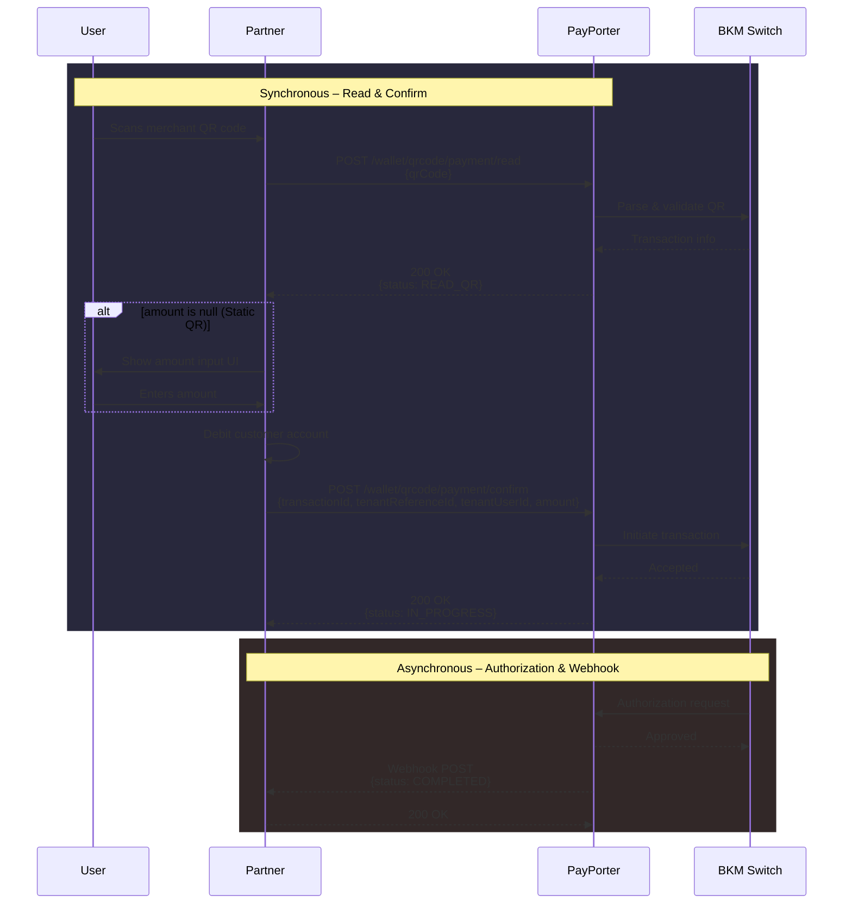
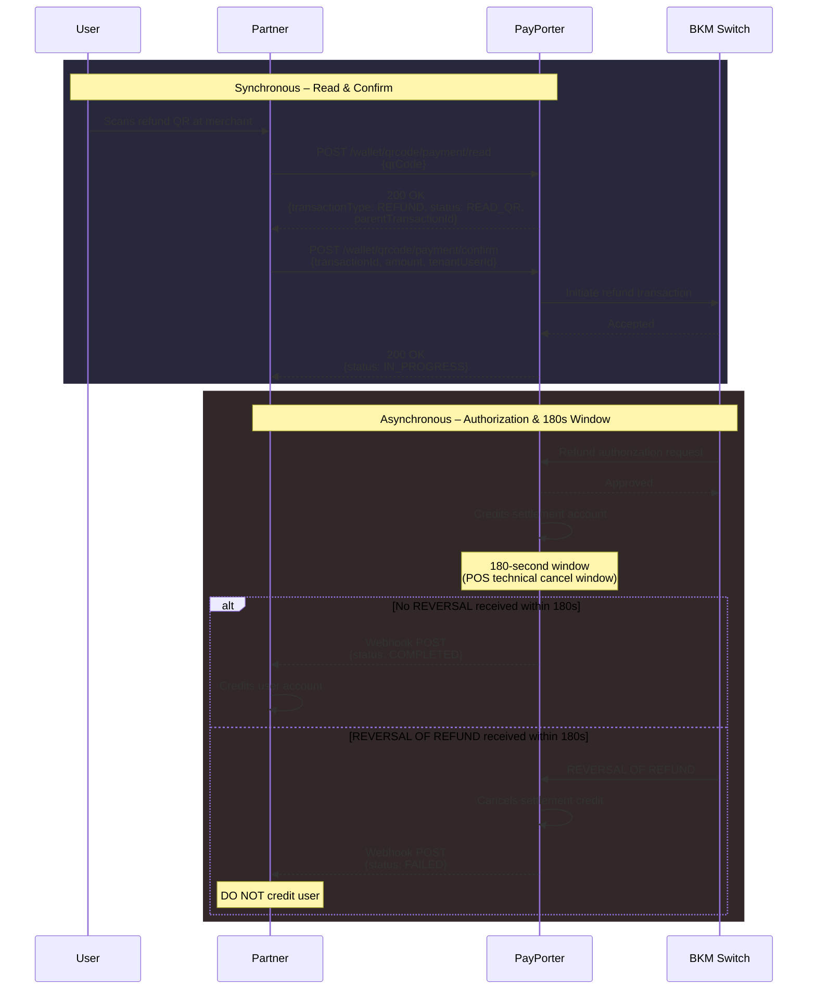
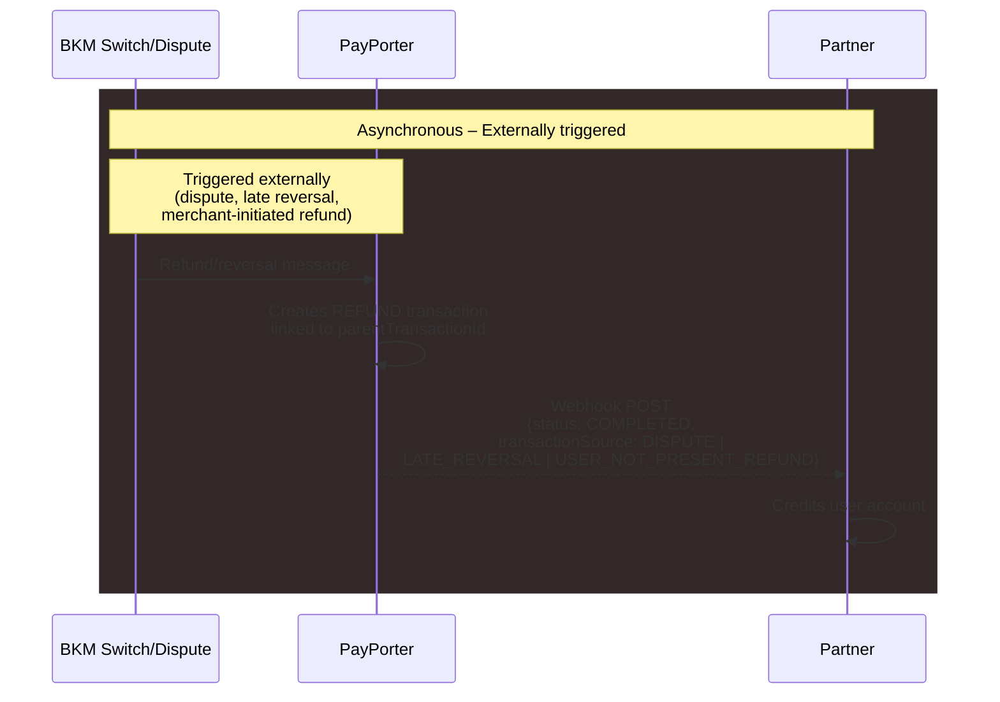

# Flow Diagrams

## Payment Flow (Dynamic QR)

```mermaid
sequenceDiagram
    participant User
    participant Partner
    participant PayPorter
    participant BKM_Switch as BKM Switch

    rect rgb(40, 40, 60)
    Note over User, PayPorter: Synchronous – Read & Confirm
    User->>Partner: Scans merchant QR code
    Partner->>PayPorter: POST /wallet/qrcode/payment/read<br/>{qrCode}
    PayPorter->>BKM_Switch: Parse & validate QR
    BKM_Switch-->>PayPorter: Transaction info
    PayPorter-->>Partner: 200 OK<br/>{status: READ_QR}

    alt amount is null (Static QR)
        Partner->>User: Show amount input UI
        User->>Partner: Enters amount
    end

    Partner->>Partner: Debit customer account
    Partner->>PayPorter: POST /wallet/qrcode/payment/confirm<br/>{transactionId, tenantReferenceId, tenantUserId, amount}
    PayPorter->>BKM_Switch: Initiate transaction
    BKM_Switch-->>PayPorter: Accepted
    PayPorter-->>Partner: 200 OK<br/>{status: IN_PROGRESS}
    end

    rect rgb(50, 40, 40)
    Note over Partner, BKM_Switch: Asynchronous – Authorization & Webhook
    BKM_Switch->>PayPorter: Authorization request
    PayPorter-->>BKM_Switch: Approved
    PayPorter-->>Partner: Webhook POST<br/>{status: COMPLETED}
    Partner-->>PayPorter: 200 OK
    end
```

---

## Refund Flow (QR Scan – 180s Window)

```mermaid
sequenceDiagram
    participant User
    participant Partner
    participant PayPorter
    participant BKM_Switch as BKM Switch

    rect rgb(40, 40, 60)
    Note over User, PayPorter: Synchronous – Read & Confirm
    User->>Partner: Scans refund QR at merchant
    Partner->>PayPorter: POST /wallet/qrcode/payment/read<br/>{qrCode}
    PayPorter-->>Partner: 200 OK<br/>{transactionType: REFUND, status: READ_QR,<br/>parentTransactionId}

    Partner->>PayPorter: POST /wallet/qrcode/payment/confirm<br/>{transactionId, amount, tenantUserId}
    PayPorter->>BKM_Switch: Initiate refund transaction
    BKM_Switch-->>PayPorter: Accepted
    PayPorter-->>Partner: 200 OK<br/>{status: IN_PROGRESS}
    end

    rect rgb(50, 40, 40)
    Note over Partner, BKM_Switch: Asynchronous – Authorization & 180s Window
    BKM_Switch->>PayPorter: Refund authorization request
    PayPorter-->>BKM_Switch: Approved
    PayPorter->>PayPorter: Credits settlement account

    Note over PayPorter: 180-second window<br/>(POS technical cancel window)

    alt No REVERSAL received within 180s
        PayPorter-->>Partner: Webhook POST<br/>{status: COMPLETED}
        Partner->>Partner: Credits user account
    else REVERSAL OF REFUND received within 180s
        BKM_Switch->>PayPorter: REVERSAL OF REFUND
        PayPorter->>PayPorter: Cancels settlement credit
        PayPorter-->>Partner: Webhook POST<br/>{status: FAILED}
        Note over Partner: DO NOT credit user
    end
    end
```

---

## Late Reversal / Dispute / User-Not-Present Refund Flow

```mermaid
sequenceDiagram
    participant BKM_Switch as BKM Switch/Dispute
    participant PayPorter
    participant Partner

    rect rgb(50, 40, 40)
    Note over BKM_Switch, Partner: Asynchronous – Externally triggered
    Note over BKM_Switch, PayPorter: Triggered externally<br/>(dispute, late reversal,<br/>merchant-initiated refund)

    BKM_Switch->>PayPorter: Refund/reversal message
    PayPorter->>PayPorter: Creates REFUND transaction<br/>linked to parentTransactionId

    PayPorter-->>Partner: Webhook POST<br/>{status: COMPLETED,<br/>transactionSource: DISPUTE |<br/>LATE_REVERSAL | USER_NOT_PRESENT_REFUND}
    Partner->>Partner: Credits user account
    end
```
