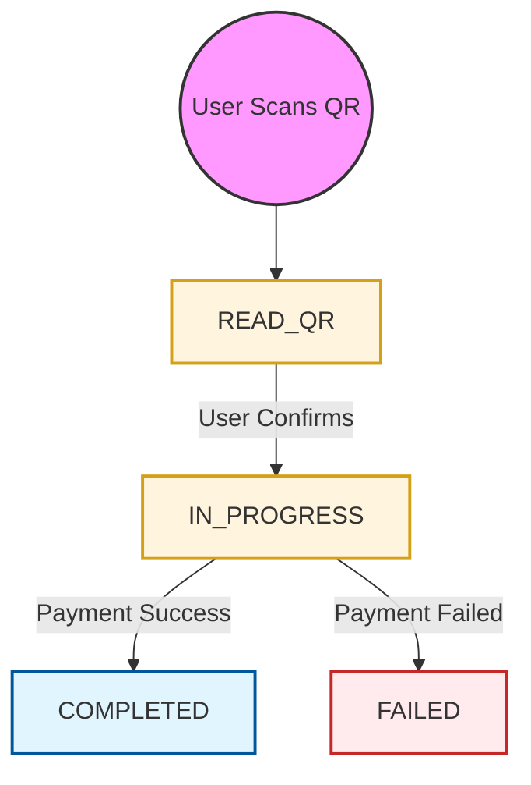

# QR Payment API

The QR Payment service allows users to perform payments and refunds by scanning QR codes. This service is designed for retail and POS environments, providing a seamless and secure payment experience.

## Payment Flow

The following steps outline the standard QR payment process:

1.  **Read QR**: The user scans a merchant's QR code. The raw QR string is sent to the `/read` endpoint.
2.  **Display Details**: The API returns transaction details (merchant name, amount, etc.) to the user's app.
3.  **Confirm Payment**: The user confirms the transaction (and optionally enters an amount if not fixed). The `/confirm` endpoint is called.
4.  **Asynchronous Processing**: PayPorter processes the transaction. The final result is pushed to the partner via a **Webhook**.

## QR Code Transaction Types

| Code | Description |
| :--- | :--- |
| **PAYMENT** | Standard purchase payment initiated by QR scan. |
| **REFUND** | Refund against an original PAYMENT transaction. |

## Status Lifecycle

The following diagram illustrates the lifecycle of a QR transaction:

## QR Code Statuses

| Status Name | Description |
| :--- | :--- |
| **READ_QR** | Payment information API was called; QR data successfully received. |
| **IN_PROGRESS** | QR code confirmed; transaction is awaiting fund transfer result. |
| **FAILED** | Transaction failed; no funds were moved. |
| **COMPLETED** | Transaction successfully completed. |

:::info Final Status
A transaction is considered final once it reaches the **COMPLETED** or **FAILED** status. Partners should rely on webhooks to receive these status updates.
:::
