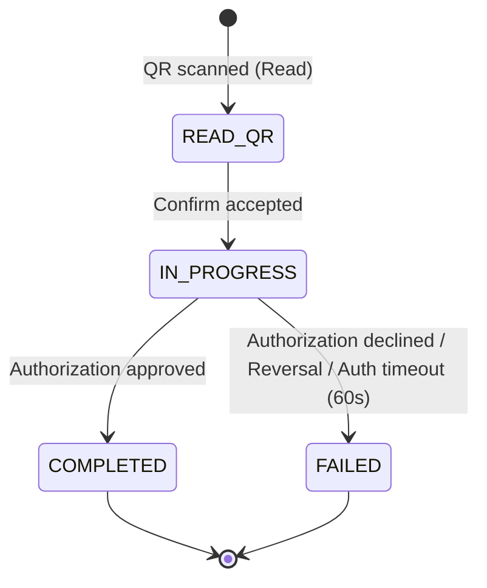

# Payment Object & Domain Models

## Payment Object

The Payment Object is the common response model returned by Read, Confirm, Query, and Webhook endpoints.

| Field | Type | Presence | Length | Description |
| :--- | :--- | :--- | :--- | :--- |
| `transactionId` | String | Always | 11 | Unique transaction identifier (11-digit numeric). |
| `tenantReferenceId` | String | After Confirm | 100 | Partner's unique reference ID. `null` before Confirm. For refund transactions, this field is optional and may be `null`. |
| `tenantUserId` | String | After Confirm | 50 | The tenant's user identifier. `null` before Confirm. Always present after Confirm. |
| `parentTransactionId` | String | Refund only | 11 | Original payment transaction ID. Only present for REFUND transactions. |
| `transactionType` | String | Always | 10 | `PAYMENT` or `REFUND`. See [Transaction Types](#transaction-types). |
| `transactionSource` | String | Always | 30 | Source of the transaction. See [Transaction Source Types](#transaction-source-types). |
| `status` | String | Always | 20 | Transaction status. See [Statuses & State Machine](#statuses--state-machine). |
| `amount` | String | Conditional | 12 | Transaction amount (pattern `999999999.99`). `null` for static QR at Read phase; present in all other contexts. |
| `currency` | String | Always | 3 | Currency code (e.g., `TRY`). |
| `qrGenerationDate` | String | Always | 24 | QR generation timestamp (ISO 8601, e.g. `2024-05-15T14:30:00Z`). |
| `qrExpireDate` | String | Always | 24 | QR expiration timestamp (ISO 8601). |
| `merchantId` | String | Always | 20 | Merchant's unique BKM identifier. |
| `merchantName` | String | Always | 100 | Merchant name. |
| `merchantCity` | String | Always | 50 | Merchant city. |
| `mcc` | String | Always | 4 | Merchant Category Code. |
| `countryCode` | String | Always | 2 | Country code (ISO 3166-1 alpha-2). |
| `acquirerId` | String | Always | 20 | Acquirer identifier (BKM acquirer ID). |
| `terminalType` | String | Always | 30 | Terminal type. See [Terminal Types](#terminal-types). |
| `terminalId` | String | Always | 50 | Terminal identifier. |
| `failureReason` | String | Conditional | 30 | Present only when `status` is `FAILED`. Indicates the reason for failure. See [Failure Reasons](#failure-reasons). |

---

## Transaction Types

| Code           | Description |
|----------------|-------------|
| `PAYMENT`      | Standard payment transaction |
| `REFUND`       | Return of funds to customer |

---

## Statuses & State Machine

| Code        | Type | Description |
|-------------|------|-------------|
| `READ_QR`     | Intermediate | QR code has been read; transaction is awaiting Confirm. |
| `IN_PROGRESS` | Intermediate | Confirm accepted; awaiting asynchronous authorization result. |
| `COMPLETED`   | **Final** | Transaction completed successfully. |
| `FAILED`      | **Final** | Transaction failed (authorization declined, reversal received, or authorization timeout). |

:::note Finality guarantee
`COMPLETED` and `FAILED` are **irreversible terminal states**. Once a transaction reaches either status, it will never change. Refunds or reversals of a completed payment are represented as separate `REFUND` transactions linked via `parentTransactionId`.
:::

### State Transitions

- A transaction can only move forward; backward transitions are not possible.
- `Query` and `Reconciliation` use the same status definitions.

---

## Transaction Source Types

| Code                     | Description                                          |
|--------------------------|------------------------------------------------------|
| `MERCHANT_QR_SCAN`       | User scanned merchant QR code (online transaction)   |
| `DISPUTE`                | User's complaint succeeded                           |
| `LATE_REVERSAL`          | Technical reversal                                   |
| `USER_NOT_PRESENT_REFUND`| Merchant reversed while customer is not present      |

---

## Failure Reasons

When a transaction reaches `FAILED` status, the `failureReason` field indicates why. This field is present in Query responses, Webhook deliveries, and (on idempotent retries) Confirm responses.

### Confirm-time failures (pre-authorization)

These occur synchronously when the Confirm call is processed, before any card authorization is attempted.

| Code | Description |
|------|-------------|
| `QR_CODE_EXPIRED` | The QR code's TTL elapsed before or during the Confirm call. |
| `QR_CODE_USED` | The QR code was already consumed by a previous successful transaction. |
| `QR_CODE_TRANSACTION_ERROR` | An internal processing error occurred during Confirm (BKM Switch side). |

### Post-authorization failures (async)

These occur after Confirm returns `IN_PROGRESS` and are delivered via webhook.

| Code | Description |
|------|-------------|
| `AUTH_TIMEOUT` | No card authorization was received within 60 seconds after Confirm. |
| `INSUFFICIENT_BALANCE` | Card authorization was declined due to insufficient funds. |
| `PAYMENT_FAILED` | Generic payment failure — the decline reason is not otherwise classified. |

:::note Auth timeout vs. refund delay
The 60-second authorization timeout and the 180-second refund delay (POS cancel window) are independent mechanisms. Auth timeout applies to **both** payment and refund transactions — if no card authorization arrives within 60 seconds after Confirm, the transaction is failed. The 180-second refund delay is a separate hold applied *after* a successful refund authorization, during which a POS technical cancel can still reverse the refund.
:::

---

## Terminal Types

| Code                       | Description                  |
|----------------------------|------------------------------|
| `POS`                      | Physical POS terminal        |
| `STATIC_QRCODE`            | Static QR code on merchant display |
| `MERCHANT_MOBILE_APP`      | Merchant mobile application  |
| `WEB`                      | Web terminal                 |
| `ATM`                      | ATM terminal                 |
| `PAYMENT_SERVICE_PROVIDER` | Payment service provider     |
