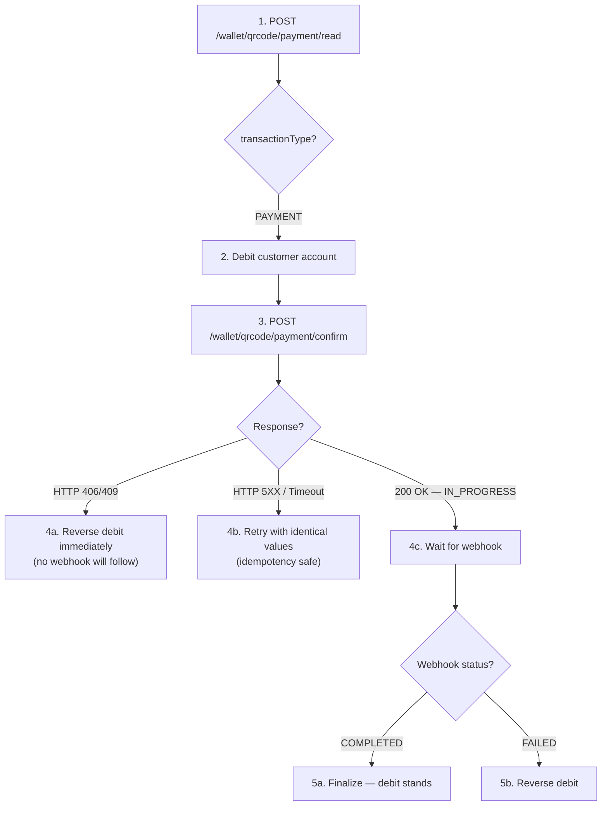
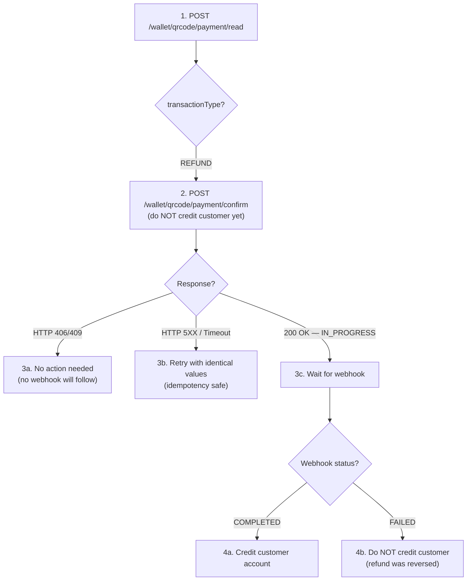
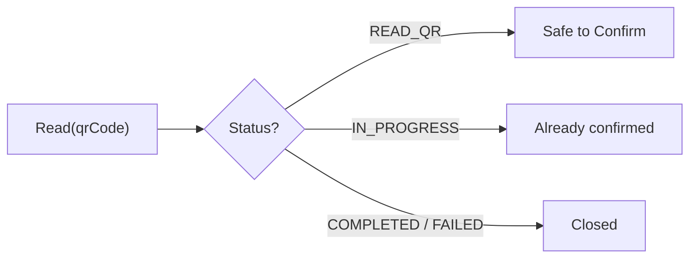
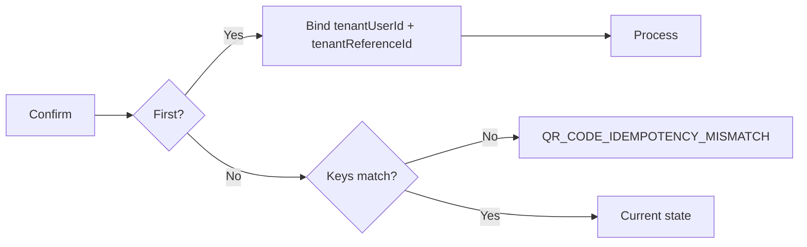

# Partner Fund Safety Model

This section describes when the partner should debit or credit the customer's account relative to the API calls and webhooks. **Getting this wrong means the partner's funds are at risk.**

## Payment: Debit Timing

For **payment** transactions, the partner debits the customer **after** a successful Read and **before** calling Confirm.

**Static QR note:** For static QR codes, each Read returns a **new `transactionId`**. The partner must debit only the amount entered by the user and pass the same amount to Confirm. If the Confirm is rejected (e.g., another Read has already consumed the QR), the partner must reverse the debit.

---

## Refund: Credit Timing

For **refund** transactions, the partner does **NOT** debit or credit the customer before calling Confirm. The partner credits the customer **only after** receiving a `COMPLETED` webhook.

---

## Idempotency, Safe Retries & Deduplication

PayPorter enforces safe retry behavior at every stage to prevent duplicate debits and ensure reliable integrations.

### Read Retry Behaviour

Repeated `Read` calls on the same QR code return the **current state** of the transaction:

| Scenario | `transactionId` across repeated Reads | Behaviour |
|----------|---------------------------------------|----------|
| Payment — dynamic QR (amount in QR) | Same `transactionId` returned | Only one Confirm can succeed |
| Payment — static QR (user enters amount) | New `transactionId` per Read | Multiple Confirms may succeed (each is a distinct transaction) |
| Refund | Same `transactionId` returned | Only one Confirm can succeed |

### Confirm Idempotency

The first successful Confirm binds the transaction to the caller's identity. Subsequent retries are validated against the bound values.

**Idempotency keys** (checked on retry):

| Transaction Type | Key fields |
|-----------------|------------|
| **Payment** | `transactionId` + `tenantUserId` + `tenantReferenceId` |
| **Refund** | `transactionId` + `tenantUserId` |

If any key field does not match the original Confirm, the request is rejected with `QR_CODE_IDEMPOTENCY_MISMATCH`.

**Uniqueness constraint** (checked on first Confirm):

`tenantReferenceId` must be unique across all payment transactions. Reusing a previously consumed `tenantReferenceId` on a *different* transaction returns `TENANT_REFERENCE_ID_ALREADY_USED`. This is independent of idempotency — it prevents duplicate payment references.

| Scenario | Behaviour |
|----------|----------|
| First Confirm | Binds `tenantUserId` and `tenantReferenceId` (if payment) to the transaction. Processes and returns `IN_PROGRESS`. |
| Retry — all key fields match | Returns the **current transaction state** (which may now be `COMPLETED` or `FAILED`). No duplicate financial record is created. |
| Retry — `tenantUserId` differs | Returns `QR_CODE_IDEMPOTENCY_MISMATCH` (HTTP 409) |
| Retry — `tenantReferenceId` differs (payment only) | Returns `QR_CODE_IDEMPOTENCY_MISMATCH` (HTTP 409) |
| New transaction — `tenantReferenceId` already used by another payment | Returns `TENANT_REFERENCE_ID_ALREADY_USED` (HTTP 409) |

### Query Idempotency

Repeated queries with the same identifier always return consistent, up-to-date results.
