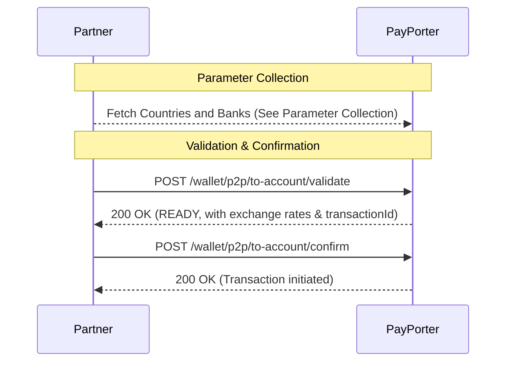

# Account Transfer — Overview

This section explains the end-to-end flow for completing an **Account Transfer** (sending money directly to a bank account). Unlike name transfers, sending money to an account requires selecting a specific bank (`provider`) and providing the `accountNumber` along with it.

## General Flow

> **Prerequisite:** Before validating an account transfer, you must collect the required destination parameters (e.g., country, bank provider). See the [Parameter Collection](./parameter-collection) guide for details on how to fetch these dynamically.

To execute a successful account transfer, follow this standard sequence:



1. **Parameter Collection:** Obtain the necessary bank `provider` ID and destination country code dynamically.
2. **Validate:** Use the collected `provider` and the recipient's `accountNumber` along with their details to call `/wallet/p2p/to-account/validate`.
3. **Confirm:** Finally, confirm the transaction using the `transactionId` provided in the validate step.

## Example Validate Request

Here is a complete example of a validate request payload for an Account Transfer:

```json
{
    "tenantReferenceId": "P2P_ACCOUNT_88992",
    "amount": 100.0,
    "currency": "EUR",
    "destinationCountry": "FRA",
    "provider": "1",
    "accountNumber": "FR7612345678901234567890123",
    "receiver": {
        "firstName": "Elena",
        "lastName": "PETROVA",
        "receiverType": "CUSTOMER",
        "nationality": "FRA",
        "identityNo": "YZ9876543",
        "identityType": "PASSPORT",
        "identityIssueCountry": "FRA",
        "addressCountry": "FRA",
        "province" : "PARIS",
        "address": "15 Rue de Rivoli",
        "zipCode" : "75004"
    },
    "comment": "Consulting service fee.",
    "purpose": "COMMERCE_PAYMENTS",
    "sourceOfIncome": "BUSINESS_INCOME"
}
```
