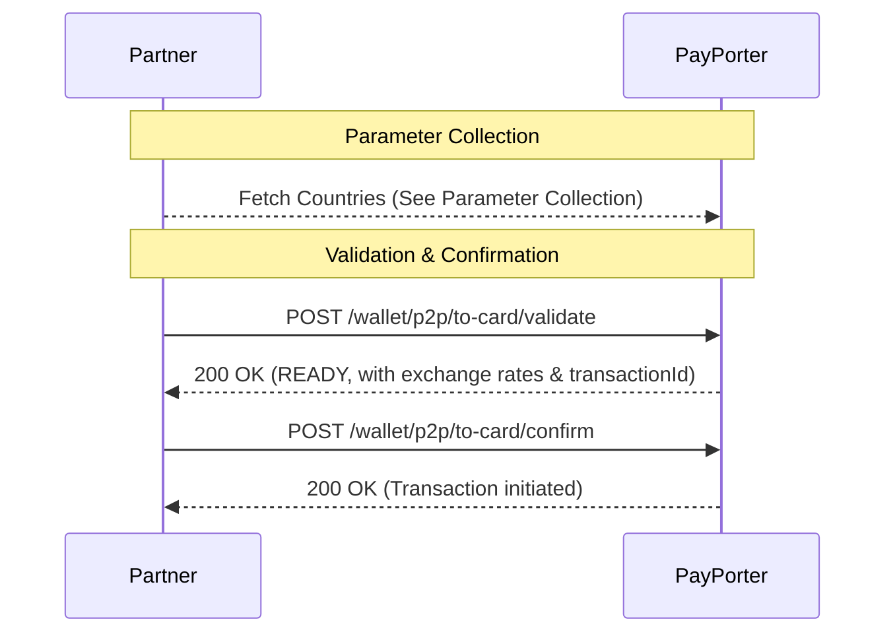

# Card Transfer — Overview

This section explains the end-to-end flow for completing a **Card Transfer** (sending money directly to a debit or credit card). Card transfers require capturing the recipient's card details instead of bank account numbers or pickup locations.

:::note Path segment
The canonical path segment is `to-card`. The older `card` segment is still accepted on validate and confirm for backwards compatibility, but new integrations should use `to-card`.
:::

## General Flow

> **Prerequisite:** Before validating a card transfer, you must fetch the available destination countries. See the [Parameter Collection](./parameter-collection) guide for details. Providers are **not** used for Card transfers.

To execute a successful card transfer, follow this standard sequence:



1. **Parameter Collection:** Obtain the necessary destination country code dynamically.
2. **Validate:** Use the recipient's card details (`cardNumber`, etc.) along with their information to call `/wallet/p2p/to-card/validate`.
3. **[Confirm](./confirm):** Finally, confirm the transaction using the `transactionId` provided in the validate step, then track it with [Query](./query).

## Example Validate Request

Here is a typical payload structure for a Card Transfer:

```json
{
  "tenantReferenceId": "P2P_CARD_74512",
  "amount": 250.0,
  "currency": "USD",
  "destinationCountry": "CAN",
  "cardNumber": "4532109876543210",
  "receiver": {
    "firstName": "Michael",
    "lastName": "CHANG",
    "receiverType": "CUSTOMER"
  },
  "comment": "Birthday gift.",
  "purpose": "GIFT",
  "sourceOfIncome": "SAVINGS"
}
```
