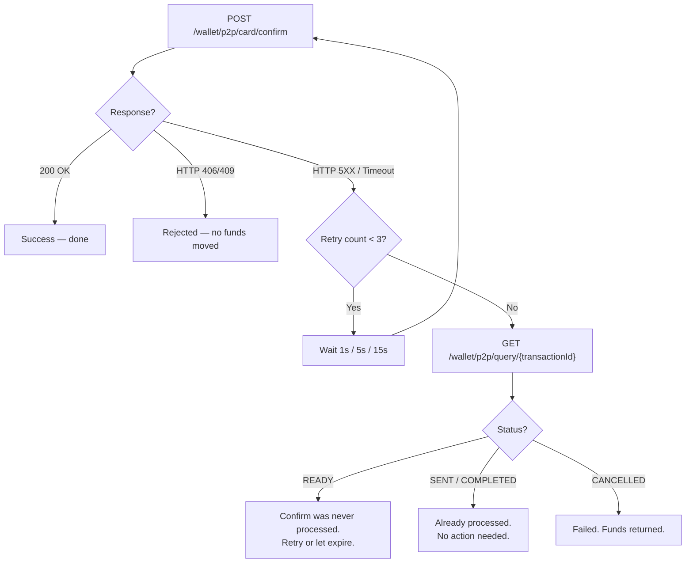

# Confirm Retry & Fallback Strategy

When the Confirm call fails due to a network timeout or HTTP 5XX error, the transaction may or may not have been processed. This section provides the recommended retry strategy.

## Retry Schedule

| Attempt | Delay | Action |
|---|---|---|
| 1 | 1 second | Retry Confirm with **identical** `transactionId` + `tenantReferenceId`. |
| 2 | 5 seconds | Retry Confirm with identical values. |
| 3 | 15 seconds | Retry Confirm with identical values. |
| Fallback | — | Stop retrying Confirm. Query the transaction status instead. |

## Why Retry Is Safe

Confirm is **idempotent** by `transactionId` + `tenantReferenceId`. If the original request was processed, the retry returns the current transaction state without creating a duplicate debit. If the original request was not processed, the retry processes it normally.

:::important
You **must** retry with identical values. Changing the `tenantReferenceId` on a retry will result in an idempotency mismatch error (HTTP 409).
:::

## Fallback to Query

If all 3 retries fail, use the Query endpoint to check the transaction status:

```
GET /wallet/p2p/query/{transactionId}
```

### Query Response Handling

| Status | Meaning | Action |
|---|---|---|
| `READY` | Transaction was validated but confirm was **never processed**. | Safe to retry confirm, or let the transaction expire. |
| `SENT` | Confirm was processed. Transaction submitted to card network. | Funds debited. No further action needed. |
| `COMPLETED` | Transaction settled. | Final. No action needed. |
| `CANCELLED` | Transaction failed or was reversed. | Funds returned to wallet. Investigate if unexpected. |

## Decision Flow



## Error Handling Summary

| Confirm Response | Wallet Debited? | Action |
|---|---|---|
| **200 OK** | Yes (if status transitions to SENT) | Done. Query to track settlement. |
| **HTTP 406** (validation) | No | Fix request. Do not retry with same data. |
| **HTTP 409** (idempotency) | No | Values don't match original confirm. Investigate. |
| **HTTP 5XX / Timeout** | Unknown | Retry with identical values per schedule above. |
