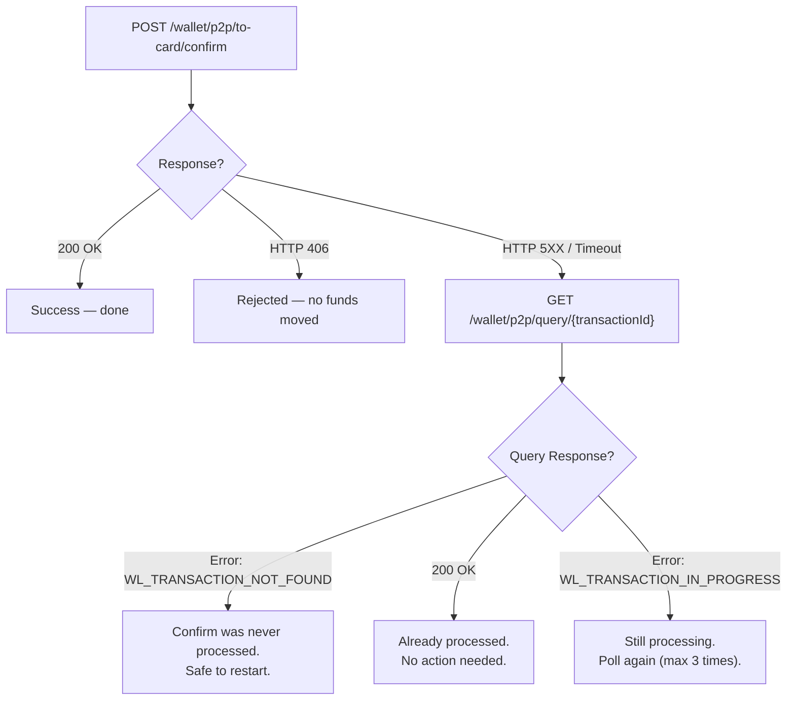

# Confirm Fallback Strategy

When the Confirm call fails due to a network timeout or HTTP 5XX error, the transaction may or may not have been processed.

**Do not retry the Confirm request.** Retry attempts may lead to duplicate processing or unintended side-effects.

## Fallback to Query

If you encounter a timeout or 5XX error on confirm, use the Query endpoint to check the internal transaction status:

```
GET /wallet/p2p/query/{transactionId}
```

### Query Response Handling

When you call the Query endpoint, it will check the internal transaction state and return one of the following:

| Response | Meaning | Action |
|---|---|---|
| **200 OK (Payment Object)** | Confirm was successfully processed. | Funds debited. No further action needed. |
| **Error: `WL_TRANSACTION_IN_PROGRESS`** | Transaction is still processing. | Query again with a 10-second delay (up to 3 times). If it persists, raise an issue. |
| **Error: `WL_TRANSACTION_NOT_FOUND`** | Confirm was never processed, or the transaction failed and funds were returned to the wallet. | Safe to restart the flow or let the transaction expire. |

## Decision Flow



## Error Handling Summary

| Confirm Response | Wallet Debited? | Action |
|---|---|---|
| **200 OK** | Yes (if status transitions to SENT) | Done. Query to track settlement. |
| **HTTP 406** (validation) | No | Fix request. |
| **HTTP 5XX / Timeout** | Unknown | Immediately query using the `transactionId`. |
