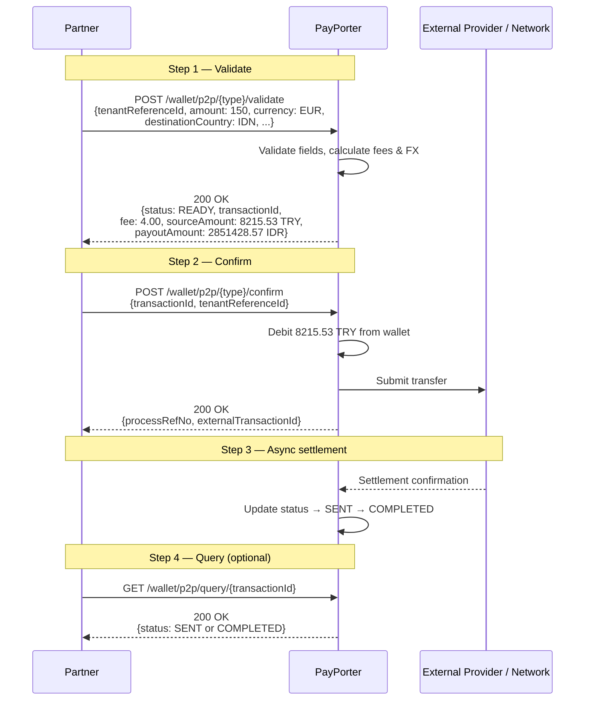
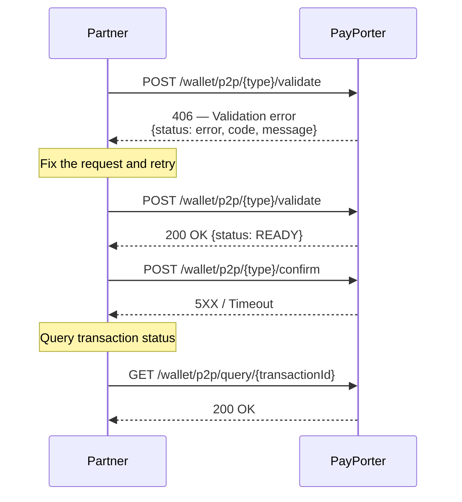

# Flow Diagrams

## Standard Transfer Flow (Name, Account, Card)

```mermaid
sequenceDiagram
    participant Partner
    participant PayPorter
    participant ExternalNetwork as External Provider / Network

    Note over Partner, PayPorter: Step 1 — Validate
    Partner->>PayPorter: POST /wallet/p2p/{type}/validate<br/>{tenantReferenceId, amount: 150, currency: EUR,<br/>destinationCountry: IDN, ...}
    PayPorter->>PayPorter: Validate fields, calculate fees & FX
    PayPorter-->>Partner: 200 OK<br/>{status: READY, transactionId,<br/>fee: 4.00, sourceAmount: 8215.53 TRY,<br/>payoutAmount: 2851428.57 IDR}

    Note over Partner, PayPorter: Step 2 — Confirm
    Partner->>PayPorter: POST /wallet/p2p/{type}/confirm<br/>{transactionId, tenantReferenceId}
    PayPorter->>PayPorter: Debit 8215.53 TRY from wallet
    PayPorter->>ExternalNetwork: Submit transfer
    PayPorter-->>Partner: 200 OK<br/>{processRefNo, externalTransactionId}

    Note over Partner, ExternalNetwork: Step 3 — Async settlement
    ExternalNetwork-->>PayPorter: Settlement confirmation
    PayPorter->>PayPorter: Update status → SENT → COMPLETED

    Note over Partner, PayPorter: Step 4 — Query (optional)
    Partner->>PayPorter: GET /wallet/p2p/query/{transactionId}
    PayPorter-->>Partner: 200 OK<br/>{status: SENT or COMPLETED}
```

---

## Error Flow

```mermaid
sequenceDiagram
    participant Partner
    participant PayPorter

    Partner->>PayPorter: POST /wallet/p2p/{type}/validate
    PayPorter-->>Partner: 406 — Validation error<br/>{status: error, code, message}
    Note over Partner: Fix the request and retry

    Partner->>PayPorter: POST /wallet/p2p/{type}/validate
    PayPorter-->>Partner: 200 OK {status: READY}
    Partner->>PayPorter: POST /wallet/p2p/{type}/confirm
    PayPorter-->>Partner: 5XX / Timeout
    Note over Partner: Query transaction status
    Partner->>PayPorter: GET /wallet/p2p/query/{transactionId}
    PayPorter-->>Partner: 200 OK
```
