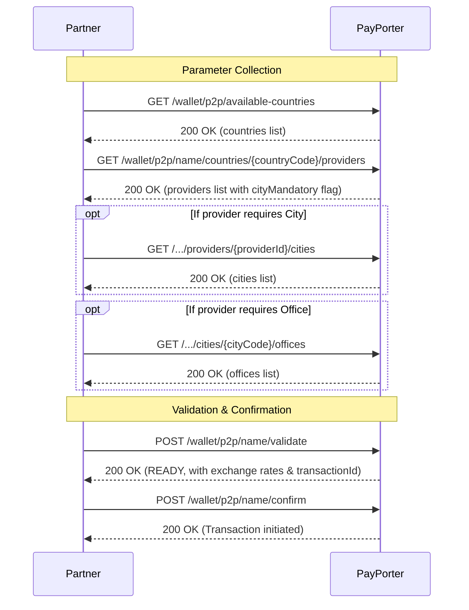

# Name Transfer — Overview

This section explains the end-to-end flow for completing a **Name Transfer** (also known as Cash Pick-up). Unlike card or account transfers, sending money to a person's name requires selecting a specific provider (external firm) and optionally a destination city and office.

## General Flow


:::warning Caching Required
To ensure optimal performance and avoid rate-limiting, **all parameter data (countries, providers, cities, offices) must be cached** on your side. Do not call these endpoints repeatedly for every transaction. We recommend refreshing this cache periodically (e.g., once a day or every few hours).
:::

To execute a successful name transfer, follow this standard sequence:




1. **Available Countries:** First, call the `/wallet/p2p/available-countries` endpoint to get the list of supported destination countries.
2. **Providers:** Once you have a country code, call `/wallet/p2p/name/countries/{countryCode}/providers` to retrieve the list of available providers (external firms) in that country. 
    - Pay attention to the `cityMandatory` and `officeMandatory` flags in the provider object.
3. **Cities (If Mandatory):** If the selected provider requires a city (`cityMandatory = true`), call `/wallet/p2p/name/countries/{countryCode}/providers/{providerId}/cities` to get a valid city ID.
4. **Offices (If Mandatory):** If the provider requires an office (`officeMandatory = true`), use the city ID to call `/wallet/p2p/name/countries/{countryCode}/providers/{providerId}/cities/{cityCode}/offices` to retrieve valid office IDs.
5. **Validate:** Use the collected parameters (`externalFirm`, `city`, `office`) along with the receiver's details to call `/wallet/p2p/name/validate`.
6. **Confirm:** Finally, confirm the transaction using the `transactionId` provided in the validate step.

## Example Validate Request

Here is a complete example of a validate request payload for a Name Transfer, containing the required destination parameters (`externalFirm` and `city`):

```json
{
  "tenantReferenceId": "58e13f41-0dc5-4d69-b5f7-640b3b4f5355",
  "amount": 100.0,
  "currency": "USD",
  "destinationCountry": "RUS",
  "externalFirm": "2",
  "city": "53514",
  "receiver": {
    "firstName": "John",
    "lastName": "DOE",
    "receiverType": "CUSTOMER",
    "nationality": "USA",
    "identityNo": "A123456789",
    "identityType": "PASSPORT",
    "identityIssueCountry": "USA",
    "phoneCountryCode": "TUR",
    "phoneNumber": "5551234567"
  },
  "comment": "Family support.",
  "purpose": "FAMILY",
  "sourceOfIncome": "SALARY"
}
```
