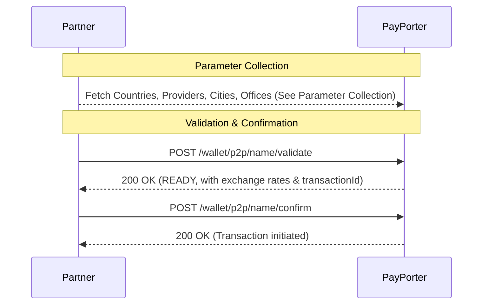

# Name Transfer — Overview

This section explains the end-to-end flow for completing a **Name Transfer** (also known as Cash Pick-up). Unlike card or account transfers, sending money to a person's name requires selecting a specific provider (external firm) and optionally a destination city and office.

## General Flow

> **Prerequisite:** Before validating a name transfer, you must collect the required destination parameters (country, provider, and conditionally city/office). See the [Parameter Collection](./parameter-collection) guide for details on how to fetch these dynamically.

To execute a successful name transfer, follow this standard sequence:



1. **Parameter Collection:** Obtain the necessary `externalFirm`, and if required by the provider, `city` and `office` codes.
2. **Validate:** Use the collected parameters (`externalFirm`, `city`, `office`) along with the receiver's details to call `/wallet/p2p/name/validate`.
3. **Confirm:** Finally, confirm the transaction using the `transactionId` provided in the validate step.

## Example Validate Request

Here is a complete example of a validate request payload for a Name Transfer, containing the required destination parameters (`externalFirm` and `city`):

```json
{
  "tenantReferenceId": "58e13f41-0dc5-4d69-b5f7-640b3b4f5355",
  "amount": 100.0,
  "currency": "USD",
  "destinationCountry": "GBR",
  "externalFirm": "2",
  "city": "53514",
  "receiver": {
    "firstName": "Oliver",
    "lastName": "THOMAS",
    "receiverType": "CUSTOMER",
    "nationality": "GBR",
    "identityNo": "B987654321",
    "identityType": "PASSPORT",
    "identityIssueCountry": "GBR",
    "phoneCountryCode": "TUR",
    "phoneNumber": "5551234567"
  },
  "comment": "Family support.",
  "purpose": "FAMILY",
  "sourceOfIncome": "SALARY"
}
```
