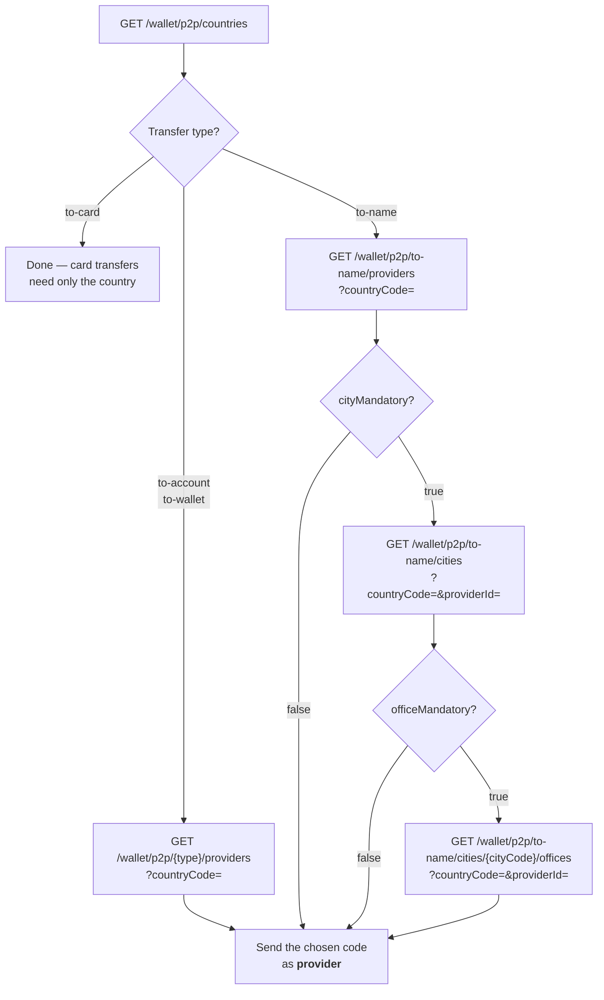

import Tabs from '@theme/Tabs';
import TabItem from '@theme/TabItem';
import ApiEndpoint from '@site/src/components/ApiEndpoint';
import ApiResponseSelector from '@site/src/components/ApiResponseSelector';

# Parameter Collection

Before validating and initiating a transfer, you must collect the necessary parameters dynamically. How many of these calls you need depends on the transfer type, and — for name transfers — on what the chosen provider requires.



:::warning Caching Required
To ensure optimal performance and avoid rate-limiting, **all parameter data (countries, providers, cities, offices) must be cached** on your side. Do not call these endpoints repeatedly for every transaction. We recommend refreshing this cache periodically (e.g., once a day or every few hours).
:::

---

## 1. Get Available Countries

Retrieve a list of all available destination countries for P2P transfers. This is required for **all** transfer types (Name, Account, Card, and Wallet).

<ApiEndpoint method="GET" url="/wallet/p2p/countries" />

### Response

Each country lists the transfer types and receiver types it supports. Use `transferTypes` to decide which `{type}` segments are available for that destination, and `receiverTypes` to decide which values may be sent as `receiver.receiverType`.

```json
{
  "countries": [
    {
      "code": "TUR",
      "name": "Turkey",
      "transferTypes": ["TO_NAME", "TO_ACCOUNT", "TO_CARD", "TO_WALLET"],
      "receiverTypes": ["CUSTOMER", "BUSINESS"]
    }
  ]
}
```

| Field | Type | Description |
| :--- | :--- | :--- |
| `code` | String | ISO 3166-1 alpha-3 country code. |
| `name` | String | Country display name. |
| `transferTypes` | String[] | Transfer types supported for this country. |
| `receiverTypes` | String[] | Receiver types supported for this country (`CUSTOMER`, `BUSINESS`). |

---

## 2. Get Providers

Retrieve a list of available transfer providers for a specific country and transfer type. 

> **Important Usage Note:** Send the returned provider `code` back in the **`provider`** field of the validate request. One field covers every transfer type — what it identifies depends on the type:
> - **Account Transfers:** the destination **Bank**.
> - **Name Transfers:** the **External Firm** (cash pickup location).
> - **Wallet Transfers:** the **Digital Wallet**.
> - **Card Transfers:** providers are **not** used. Card transfers only require the country and the card number.

<ApiEndpoint method="GET" url="/wallet/p2p/{type}/providers" />

### Path Parameters

| Parameter | Type | Description |
| :--- | :--- | :--- |
| `type` | String | The transfer type: `to-name`, `to-account`, `to-card`, or `to-wallet`. |

### Query Parameters

| Parameter | Type | Required | Description |
| :--- | :--- | :--- | :--- |
| `countryCode` | String | Yes | ISO 3166-1 alpha-3 country code. |
| `receiverType` | String | No | Filter by receiver type: `CUSTOMER` or `BUSINESS`. |

**Example:**

```
GET /wallet/p2p/to-name/providers?countryCode=IDN&receiverType=CUSTOMER
```

### Response

Null fields are omitted from the response, so which fields appear depends on the transfer type:

| Transfer type | Returned providers | Fields present |
| :--- | :--- | :--- |
| `to-name` | External firms (cash pickup) | `code`, `name`, `cityMandatory`, `officeMandatory`, `bankMandatory`, `currencies` |
| `to-account` | Banks | `code`, `name`, `currencies` |
| `to-wallet` | Digital wallets | `code`, `name`, `currencies` |
| `to-card` | — | Always an empty list; providers are not used for card transfers. |

For `to-name`, the boolean flags dictate whether you need to fetch further parameters for that provider.

```json
{
  "providers": [
    {
      "code": "100",
      "name": "Provider A",
      "cityMandatory": true,
      "officeMandatory": false,
      "bankMandatory": false,
      "currencies": ["USD", "EUR"]
    }
  ]
}
```

| Field | Type | Description |
| :--- | :--- | :--- |
| `code` | String | Provider ID. Pass it back as `provider` in the validate request. |
| `name` | String | Provider display name. |
| `cityMandatory` | Boolean | `to-name` only. `true` if a `city` code must be supplied for this provider. |
| `officeMandatory` | Boolean | `to-name` only. `true` if an `office` code must be supplied for this provider. |
| `bankMandatory` | Boolean | `to-name` only. `true` if the provider settles through a specific destination bank. |
| `currencies` | String[] | Payout currencies (ISO 4217) supported by this provider. |

---

## 3. Get Cities (If Mandatory)

**Only used for Name transfers.** If the selected provider returned `cityMandatory: true`, you must retrieve the valid cities for that provider and pass the city code in the validate request.

<ApiEndpoint method="GET" url="/wallet/p2p/to-name/cities" />

### Query Parameters

| Parameter | Type | Required | Description |
| :--- | :--- | :--- | :--- |
| `countryCode` | String | Yes | ISO 3166-1 alpha-3 country code. |
| `providerId` | String | Yes | The provider `code` returned by the providers endpoint. |

**Example:**

```
GET /wallet/p2p/to-name/cities?countryCode=IDN&providerId=100
```

### Response

```json
{
  "cities": [
    {
      "id": "34",
      "name": "Istanbul"
    }
  ]
}
```

Pass the `id` value as the `city` field in the validate request.

---

## 4. Get Offices (If Mandatory)

**Only used for Name transfers.** If the selected provider returned `officeMandatory: true`, you must retrieve the valid offices for the selected city and pass the office code in the validate request.

<ApiEndpoint method="GET" url="/wallet/p2p/to-name/cities/{cityCode}/offices" />

### Path Parameters

| Parameter | Type | Description |
| :--- | :--- | :--- |
| `cityCode` | String | The city `id` retrieved from the cities endpoint. |

### Query Parameters

| Parameter | Type | Required | Description |
| :--- | :--- | :--- | :--- |
| `countryCode` | String | Yes | ISO 3166-1 alpha-3 country code. |
| `providerId` | String | Yes | The provider `code` returned by the providers endpoint. |

**Example:**

```
GET /wallet/p2p/to-name/cities/34/offices?countryCode=IDN&providerId=100
```

### Response

```json
{
  "offices": [
    {
      "id": "OFFICE_1",
      "name": "Main Branch"
    }
  ]
}
```

Pass the `id` value as the `office` field in the validate request.
