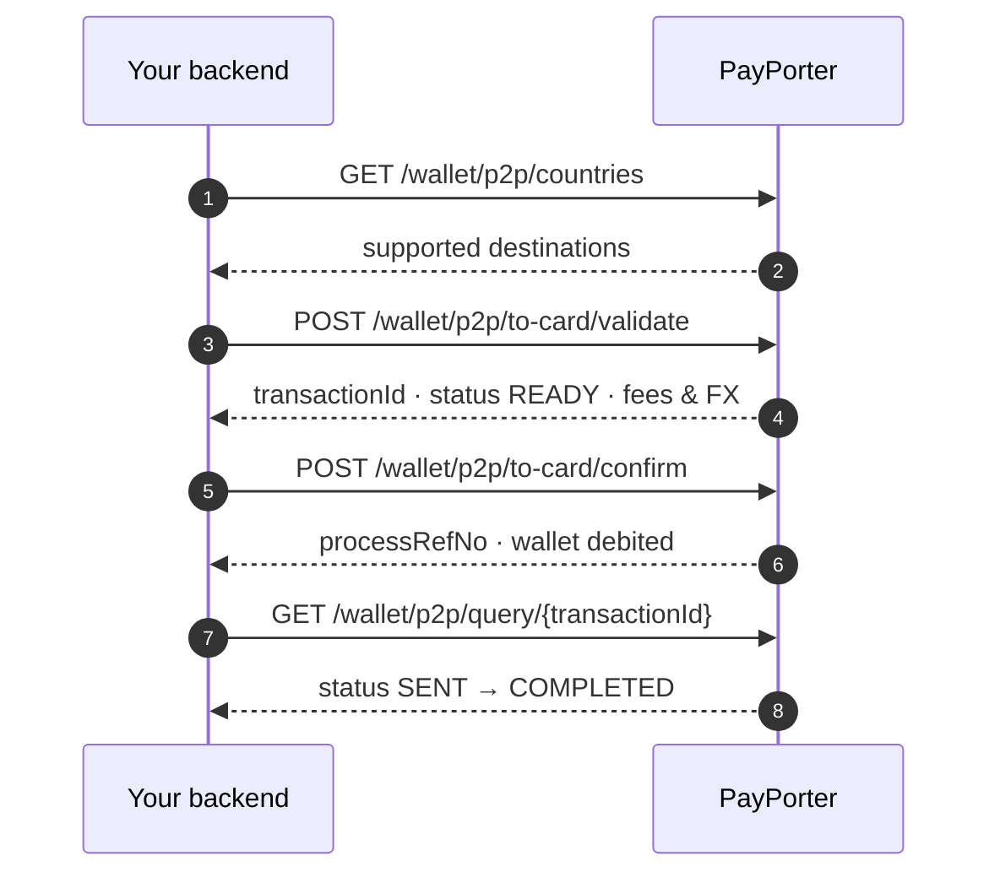

import ApiEndpoint from '@site/src/components/ApiEndpoint';

# Quickstart

Send your first P2P transfer end to end. This walkthrough uses a **card transfer**, the shortest path — it needs no provider lookup. Once it works, [Other Transfer Types](#other-transfer-types) shows the one extra step the other three types require.

Every request below uses the base URL and the four authentication headers described in [the API overview](./intro#base-url). Replace `your_api_key`, `your_api_secret`, and `your_wallet_id` with your own credentials.



---

## 1. Check the destination is supported

<ApiEndpoint method="GET" url="/wallet/p2p/countries" />

```bash
curl -X GET "https://whitelabelwallet-mig.payporter.com.tr:8590/wallet/p2p/countries" \
     -H "Accept: application/json" \
     -H "X-Api-Key: your_api_key" \
     -H "X-Api-Secret: your_api_secret" \
     -H "X-Wallet-Id: your_wallet_id" \
     -H "X-Secure-Data: your_secure_data"
```

Find your destination in the response and confirm `transferTypes` contains `TO_CARD`:

```json
{
  "countries": [
    {
      "code": "KAZ",
      "name": "Kazakhstan",
      "transferTypes": ["TO_NAME", "TO_ACCOUNT", "TO_CARD"],
      "receiverTypes": ["CUSTOMER"]
    }
  ]
}
```

:::tip Cache this
Country, provider, city, and office data changes rarely. Cache it and refresh once a day — do not call these endpoints per transaction. See [Parameter Collection](./parameter-collection).
:::

---

## 2. Validate the transfer

<ApiEndpoint method="POST" url="/wallet/p2p/to-card/validate" />

Validate reserves a `transactionId` and returns the exact fees and exchange rates. **No funds move at this step.**

Pick one amount model — `sendingAmount` + `sendingCurrency` (spend exactly this much) or `amount` + `currency` (deliver exactly this much). This example spends exactly 1000 TRY.

```bash
curl -X POST "https://whitelabelwallet-mig.payporter.com.tr:8590/wallet/p2p/to-card/validate" \
     -H "Content-Type: application/json" \
     -H "Accept: application/json" \
     -H "X-Api-Key: your_api_key" \
     -H "X-Api-Secret: your_api_secret" \
     -H "X-Wallet-Id: your_wallet_id" \
     -H "X-Secure-Data: your_secure_data" \
     -d '{
           "tenantReferenceId": "QUICKSTART-0001",
           "sendingAmount": 1000.00,
           "sendingCurrency": "TRY",
           "destinationCountry": "KAZ",
           "cardNumber": "5409603664869507",
           "receiver": {
             "firstName": "Osman",
             "lastName": "SAVCI",
             "receiverType": "CUSTOMER",
             "nationality": "TUR",
             "phoneCountryCode": "TUR",
             "phoneNumber": "5551234567"
           },
           "purpose": "FAMILY",
           "sourceOfIncome": "SALARY",
           "relationshipWithSender": "CHILD"
         }'
```

```json
{
  "transactionId": "628d9726-4d6b-4822-b62b-146c8bfd25c9",
  "status": "READY",
  "tenantReferenceId": "QUICKSTART-0001",
  "amount": "21.20",
  "currency": "USD",
  "fee": "4.00",
  "feeCurrency": "TRY",
  "total": "1004.00",
  "sourceAmount": "1004.00",
  "sourceCurrency": "TRY",
  "sendingExchangeRate": "47.1698",
  "payoutAmount": "11406.33",
  "payoutCurrency": "KZT",
  "payoutExchangeRate": "538.0343953851959",
  "destinationCountry": "KAZ",
  "cardNumber": "5409603664869507"
}
```

Keep the `transactionId` — step 3 needs it.

:::important Two things to get right
**`tenantReferenceId` must be unique.** Reusing one returns `WL_P2P_TRANSACTION_ALREADY_EXISTS`. Use it as your idempotency key.

**Required receiver fields vary by destination.** Kazakhstan accepts the six fields above; other countries demand identity documents, address, or occupation. A missing field returns a precise code such as `WL_P2P_RECEIVER_BIRTH_DATE_MISSING` — see [Error Codes](./error-codes#mandatory-field-errors).
:::

---

## 3. Confirm

<ApiEndpoint method="POST" url="/wallet/p2p/to-card/confirm" />

This is the step that moves money. The wallet is debited `sourceAmount` atomically.

```bash
curl -X POST "https://whitelabelwallet-mig.payporter.com.tr:8590/wallet/p2p/to-card/confirm" \
     -H "Content-Type: application/json" \
     -H "Accept: application/json" \
     -H "X-Api-Key: your_api_key" \
     -H "X-Api-Secret: your_api_secret" \
     -H "X-Wallet-Id: your_wallet_id" \
     -H "X-Secure-Data: your_secure_data" \
     -d '{
           "tenantReferenceId": "QUICKSTART-0001",
           "transactionId": "628d9726-4d6b-4822-b62b-146c8bfd25c9"
         }'
```

```json
{
  "transactionId": "628d9726-4d6b-4822-b62b-146c8bfd25c9",
  "status": "READY",
  "processRefNo": "47014458428",
  "externalTransactionId": "47014458428",
  "tenantReferenceId": "QUICKSTART-0001",
  "sourceAmount": "1004.00",
  "sourceCurrency": "TRY",
  "payoutAmount": "11406.33",
  "payoutCurrency": "KZT"
}
```

:::warning Never retry a failed confirm
A `200` response may still say `status: READY` — the move to `SENT` happens asynchronously. That is normal.

On a **timeout or 5XX**, do **not** send confirm again. You cannot tell whether the money moved. Call query instead — the full decision tree is in [Confirm Fallback Strategy](./confirm-retry-fallback).
:::

---

## 4. Track it to completion

<ApiEndpoint method="GET" url="/wallet/p2p/query/{transactionId}" />

```bash
curl -X GET "https://whitelabelwallet-mig.payporter.com.tr:8590/wallet/p2p/query/628d9726-4d6b-4822-b62b-146c8bfd25c9" \
     -H "Accept: application/json" \
     -H "X-Api-Key: your_api_key" \
     -H "X-Api-Secret: your_api_secret" \
     -H "X-Wallet-Id: your_wallet_id" \
     -H "X-Secure-Data: your_secure_data"
```

Poll until you reach a terminal status:

| `status` | Meaning | Terminal? |
| :--- | :--- | :--- |
| `SENT` | Submitted to the network, awaiting settlement. | No |
| `COMPLETED` | Settled at the destination. | Yes |
| `CANCELLED` | Failed or reversed. Funds returned to the wallet. | Yes |

While the transaction is still being processed, query returns `406` with `WL_TRANSACTION_IN_PROGRESS` instead of a transaction object. Wait 10 seconds and try again.

There are **no webhooks** for P2P transfers. Query is how you observe state.

---

## 5. Fetch the receipt (optional)

<ApiEndpoint method="GET" url="/wallet/p2p/receipt/{transactionId}" />

```bash
curl -X GET "https://whitelabelwallet-mig.payporter.com.tr:8590/wallet/p2p/receipt/628d9726-4d6b-4822-b62b-146c8bfd25c9" \
     -H "Accept: application/pdf" \
     -H "X-Api-Key: your_api_key" \
     -H "X-Api-Secret: your_api_secret" \
     -H "X-Wallet-Id: your_wallet_id" \
     -H "X-Secure-Data: your_secure_data" \
     --output receipt.pdf
```

---

## Other transfer types

Name, account, and wallet transfers add **one step before validate**: fetch the providers for your destination and pass the chosen one as `provider`.

```
GET /wallet/p2p/{type}/providers?countryCode=KAZ
```

Then include it in the validate body alongside the type's destination field:

| Type | Provider is | Extra validate fields |
| :--- | :--- | :--- |
| `to-name` | Cash pickup firm | `provider`, `city`, and `office` when the provider requires them |
| `to-account` | Bank | `provider`, `accountNumber` |
| `to-wallet` | Digital wallet | `provider`, receiver's `phoneNumber` |
| `to-card` | — not used | `cardNumber` |

For `to-name`, the providers response tells you whether `city` and `office` are mandatory via `cityMandatory` and `officeMandatory`. Full walkthrough: [Parameter Collection](./parameter-collection).

Everything else — confirm, query, receipt, error handling — is identical across all four types.

---

## Next steps

- [Partner Fund Safety Model](./safety-model) — exactly when funds move, and what each failure means
- [Transaction Object](./transaction-object) — every response field and the status state machine
- [Confirm Fallback Strategy](./confirm-retry-fallback) — required reading before you go live
- [Error Codes](./error-codes) — the full catalogue
