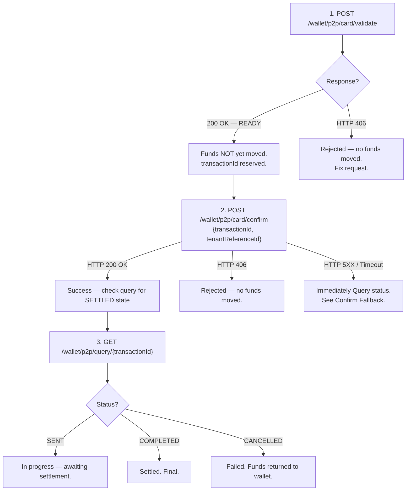

# Partner Fund Safety Model

This section describes the fund safety guarantees for P2P card transfer transactions. **Understanding this model is critical to avoid fund risk.**

## Key Principle

P2P card transfers are **wallet-funded**. PayPorter debits the wallet atomically during the Confirm step. The partner does not need to manage separate fund reservations.

---

## Transaction Safety Flow

---

## When Are Funds Debited?

| Step | Funds Status |
|---|---|
| **Validate** | No funds moved. The `transactionId` and fees are reserved but the wallet balance is not affected. |
| **Confirm — 200 OK** | Wallet debited atomically (amount + fee). The `sourceAmount` (TRY) is deducted. |
| **Confirm — HTTP 4XX** | No funds moved. The wallet balance is unchanged. |
| **Confirm — HTTP 5XX / Timeout** | Unknown. Immediately query the transaction status using the `transactionId`. |

---

## Idempotency Guarantees

### Validate

Each call to validate with a unique `tenantReferenceId` creates a new transaction. Calling validate with a `tenantReferenceId` that was already used returns a `WL_P2P_TRANSACTION_ALREADY_EXISTS` error.

### Confirm

Confirm is executed only once for a given `transactionId`.

If a Confirm request is received for a transaction that has already been processed, the API will return the error:
`WL_P2P_PAYMENT_ALREADY_CREATED`

### Query

Query is always safe to call. It returns the current state of the transaction without side effects.
