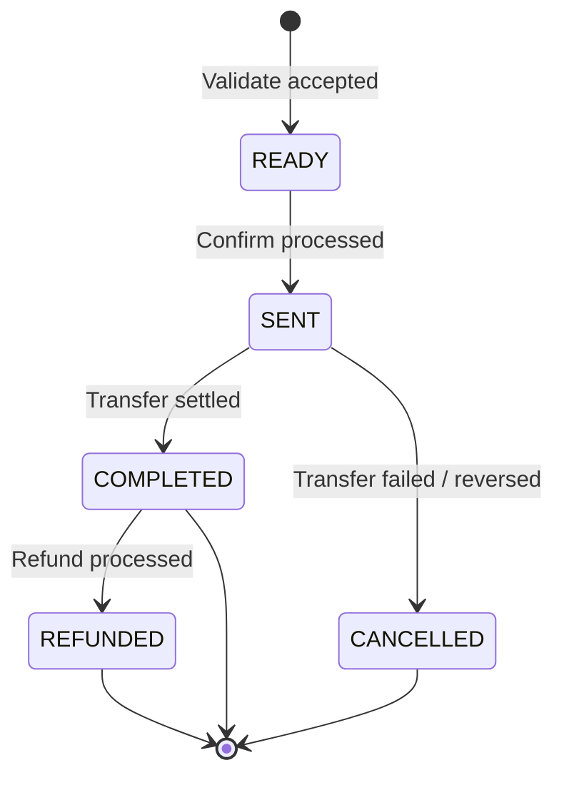

# Transaction Object

The **Transaction Object** is the common response model returned by all P2P card transfer endpoints (validate, confirm, query).

## Amount Model & FX Flow

The system processes amount conversions in four distinct scenarios, depending on whether you provide an exact destination `amount` or a local `sendingAmount`, and whether the `feeIncluded` flag is `true` or `false`.

### 1. Exact Amount (Fee Not Included)
You want to send exactly 100 USD to the transfer issuer. The fee is charged **on top**.

```text
Input: amount=100, currency=USD, feeIncluded=false
Fee: 5 USD

Sender Wallet (TRY)
   │
   ├─ debits: TRY equivalent of 100 USD (amount)
   ├─ debits: TRY equivalent of 5 USD (fee)
   ▼
Total Wallet Debit = TRY equivalent of 105 USD

Transfer Issuer
   │
   └─ receives exact 100 USD
```

### 2. Exact Amount (Fee Included)
You want to spend exactly 100 USD total. The fee is deducted **from** the amount before reaching the issuer.

```text
Input: amount=100, currency=USD, feeIncluded=true
Fee: 5 USD

Sender Wallet (TRY)
   │
   ├─ debits: TRY equivalent of 100 USD (total)
   ▼
Total Wallet Debit = TRY equivalent of 100 USD

Transfer Issuer
   │
   └─ receives 95 USD (100 USD - 5 USD fee)
```

### 3. Sending Amount (Fee Not Included)
You want to convert exactly 1,000 TRY to the destination currency. The fee is charged **on top**.

```text
Input: sendingAmount=1000, sendingCurrency=TRY, feeIncluded=false
Fee: 25 TRY

Sender Wallet (TRY)
   │
   ├─ debits: 1000 TRY (sendingAmount)
   ├─ debits: 25 TRY (fee)
   ▼
Total Wallet Debit = 1025 TRY

Transfer Issuer (Destination: EUR)
   │
   ├─ FX: 1000 TRY ➔ 40 EUR
   ▼
   └─ receives exact 40 EUR
```

### 4. Sending Amount (Fee Included)
You want exactly 1,000 TRY debited from your wallet, including all fees.

```text
Input: sendingAmount=1000, sendingCurrency=TRY, feeIncluded=true
Fee: 25 TRY

Sender Wallet (TRY)
   │
   ├─ debits: 1000 TRY (total sendingAmount)
   ▼
Total Wallet Debit = 1000 TRY

Transfer Issuer (Destination: USD)
   │
   ├─ Net Principal: 1000 TRY - 25 TRY (fee) = 975 TRY
   ├─ FX: 975 TRY ➔ 48 USD
   ▼
   └─ receives 48 USD
```

## Response Fields

| Field                   | Type          | Presence        | Description                                                                   |
|:------------------------|:--------------|:----------------|:------------------------------------------------------------------------------|
| `transactionId`         | String        | Always          | Unique transaction ID assigned by PayPorter. Used for confirm and query.      |
| `status`                | String        | Always          | Current transaction status. See [Status Values](#status-values) below.        |
| `tenantReferenceId`     | String        | Always          | Tenant's unique reference ID, echoed from the validate request.               |
| `amount`                | String        | Always          | Sending amount (echoed from input).                                           |
| `currency`              | String        | Always          | Sending currency (ISO 4217).                                                  |
| `fee`                   | String        | Always          | Fee charged for this transaction.                                             |
| `feeCurrency`           | String        | Always          | Currency of the fee (e.g. `TRY`).                                             |
| `total`                 | String        | Always          | Total debited: `amount + fee`.                                                |
| `sourceAmount`          | String        | Always          | TRY equivalent debited from the wallet.                                       |
| `sourceCurrency`        | String        | Always          | Wallet debit currency. Currently always `TRY`.                                |
| `sendingExchangeRate`   | String        | When applicable | Exchange rate applied (sending currency → TRY).                               |
| `payoutAmount`          | String        | After validate  | Final payout amount in the destination currency. Determined by the 3rd party. |
| `payoutCurrency`        | String        | After validate  | Payout currency code (ISO 4217).                                              |
| `payoutExchangeRate`    | String        | When applicable | Exchange rate applied for payout currency conversion.                         |
| `processRefNo`          | String        | After confirm   | Internal process reference number.                                            |
| `externalTransactionId` | String        | After confirm   | Reference number assigned by the external remittance firm.                    |
| `destinationCountry`    | String        | When applicable | Destination country code (ISO 3166-1 alpha-3).                                |
| `cardNumber`            | String        | Always          | Destination card number.                                                      |
| `receiver`              | Object        | Always          | Receiver identity and contact info. See [ReceiverInfo](#receiverinfo-object). |
| `comment`               | String        | Optional        | Free-text comment.                                                            |
| `purpose`               | Enum          | When provided   | Transfer purpose. Valid values: `SAVING_INVESTMENT`, `DEPT_LOAN`, `SALE_BUY`, `COMMERCE_PAYMENTS`, `RENTALS`, `OTHER`, `FAMILY`, `EDUCATION`. |
| `sourceOfIncome`        | Enum          | When provided   | Source of income. Valid values: `SALARY`, `BUSINESS_INCOME`, `SAVINGS`, `GIFT`, `BANK_LOAN`, `OTHER`, `SALE_OF_PROPERTY`. |
| `relationshipWithSender`| Enum          | When provided   | Relationship with receiver. Valid values: `CHILD`, `SPOUSE`, `PARENT`, `FRIEND`, `WORK_FRIEND`, `BROTHER`. |

---

## Status Values

| Status | Description | Terminal? |
|---|---|---|
| `READY` | Transaction validated and ready for confirm. No funds have moved. | No |
| `SENT` | Transaction confirmed and submitted to the card network. Funds debited from wallet. | No |
| `COMPLETED` | Transaction successfully settled at the destination. | Yes |
| `CANCELLED` | Transaction failed or was reversed before completion. Funds returned to wallet. | Yes |
| `REFUNDED` | A completed transaction was refunded. Funds returned to wallet. | Yes |

### State Machine



:::note
The transition from `READY` to `SENT` happens asynchronously after confirm. The confirm response may still show `status: READY` — use the Query endpoint to poll for the `SENT` or terminal status.
:::

---

## ReceiverInfo Object

:::note Allowed Characters
Text fields in `ReceiverInfo` (such as `firstName`, `lastName`, `fatherName`, `address`, `province`, `district`) must contain only Latin characters, numbers, and common punctuation.
:::

| Field                  | Type   | Constraints             | Description                          |
|:-----------------------|:-------|:------------------------|:-------------------------------------|
| `firstName`            | String | Max: 50                 | Receiver's first name.               |
| `lastName`             | String | Max: 50                 | Receiver's last name.                |
| `receiverType`         | Enum   | `CUSTOMER`, `BUSINESS`  | Receiver type.                       |
| `nationality`          | String | ISO 3166-1 alpha-3      | Nationality code (e.g., `TUR`).      |
| `phoneCountryCode`     | String | ISO 3166-1 alpha-3      | Phone country code (e.g., `TUR`).    |
| `phoneNumber`          | String | Max: 20                 | Phone number without country prefix. |
| `fatherName`           | String | Max: 50                 | Father's name.                       |
| `birthDate`            | String | Format: YYYY-MM-DD      | ISO 8601 date (e.g., `1990-01-15`).  |
| `birthPlace`           | String | Max: 100                | Place of birth.                      |
| `birthCountry`         | String | ISO 3166-1 alpha-3      | Country of birth.                    |
| `identityNo`           | String | Max: 25                 | Identity document number.            |
| `identityIssueCountry` | String | ISO 3166-1 alpha-3      | Identity document issue country.     |
| `identityValidThru`    | String | Format: YYYY-MM-DD      | Identity document expiry date.       |
| `identityIssueDate`    | String | Format: YYYY-MM-DD      | Identity document issue date.        |
| `addressCountry`       | String | ISO 3166-1 alpha-3      | Address country code.                |
| `address`              | String | Max: 250                | Street address.                      |
| `province`             | String | Max: 50                 | Province / state.                    |
| `district`             | String | Max: 50                 | District.                            |
| `zipCode`              | String | Max: 20                 | Postal code.                         |
| `job`                  | String | Max: 100                | Occupation.                          |
| `email`                | String | Max: 100, Format: Email | Email address.                       |
| `identityType`         | Enum   | -                       | Identity document type. Valid values: `PASSPORT`, `DRIVING_LICENCE`, `IDENTITY`, `FOREIGN_IDENTITY_CARD`, `NEW_IDENTITY_CARD`, `TEMPORARY_PROTECTION_DOCUMENT`, `TRNC_IDENTITY_CARD`, `BLUE_IDENTITY_CARD`, `SEAMAN_CERTIFICATE`. See [Identity Types](#identity-types). |

:::note Dynamic Required Fields
The required status of `ReceiverInfo` fields is evaluated dynamically based on the destination country, transfer type, and partner routing rules. If a required field is missing, the validate endpoint will return a field-specific error (e.g., `WL_P2P_RECEIVER_FIRST_NAME_MISSING`). You can also retrieve the mandatory fields dynamically via the [Mandatory Fields](./mandatory-fields) endpoint.
:::

---

## Identity Types

| Enum Value | ID | Description |
| :--- | :--- | :--- |
| `PASSPORT` | 1 | Passport |
| `DRIVING_LICENCE` | 2 | Driving Licence |
| `IDENTITY` | 3 | Identity |
| `FOREIGN_IDENTITY_CARD` | 4 | Foreign Identity Card |
| `NEW_IDENTITY_CARD` | 5 | New Identity Card |
| `TEMPORARY_PROTECTION_DOCUMENT` | 62 | Temporary Protection Document (Geçici Koruma Belgesi) |
| `TRNC_IDENTITY_CARD` | 61 | TRNC Identity Card (KKTC Kimlik Kartı) |
| `BLUE_IDENTITY_CARD` | 33 | Blue Identity Card (Mavi Kimlik Kartı) |
| `SEAMAN_CERTIFICATE` | 63 | Seaman Certificate (Gemi Adamı Belgesi) |

---

## Example Response

```json
{
  "transactionId": "d8c8ba37-c434-4f5a-bda6-9129d6294f8b",
  "status": "SENT",
  "tenantReferenceId": "test-happy-path-001",
  "amount": 150.00,
  "fee": 4.00,
  "total": 154.00,
  "sourceAmount": 8215.53,
  "sourceCurrency": "TRY",
  "sendingExchangeRate": 1.0000,
  "payoutAmount": 2851428.57,
  "currency": "EUR",
  "payoutCurrency": "IDR",
  "processRefNo": "47005005788",
  "externalTransactionId": "47005005788"
}
```
