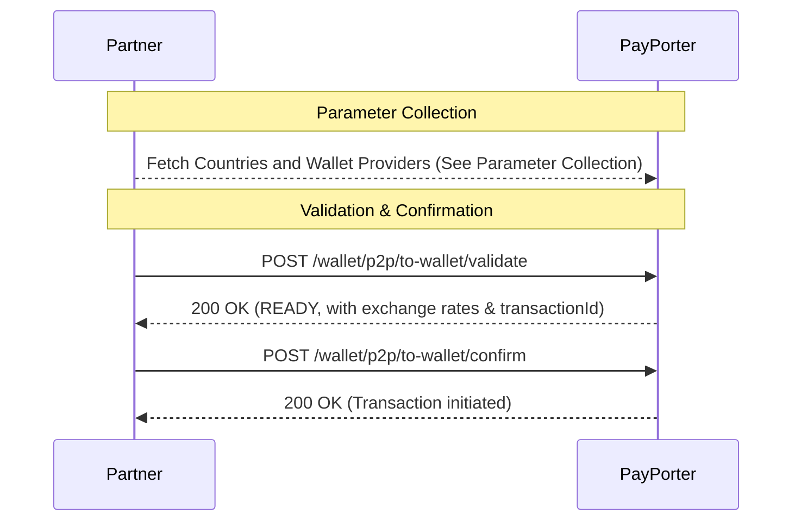

# Wallet Transfer — Overview

This section explains the end-to-end flow for completing a **Wallet Transfer** (sending money directly to a partner digital wallet). Unlike account transfers, sending money to a wallet requires selecting a specific digital wallet (`provider`) and providing the receiver's mobile number.

## General Flow

> **Prerequisite:** Before validating a wallet transfer, you must collect the required destination parameters (e.g., country, wallet provider). See the [Parameter Collection](./parameter-collection) guide for details on how to fetch these dynamically.

To execute a successful wallet transfer, follow this standard sequence:



1. **Parameter Collection:** Obtain the necessary wallet `provider` ID and destination country code dynamically.
2. **Validate:** Use the collected `provider` and the recipient's mobile number (`phoneNumber`) along with their details to call `/wallet/p2p/to-wallet/validate`.
3. **[Confirm](./confirm):** Finally, confirm the transaction using the `transactionId` provided in the validate step, then track it with [Query](./query).

## Example Validate Request

Here is a complete example of a validate request payload for a Wallet Transfer:

```json
{
  "tenantReferenceId": "P2P_WALLET_{{$randomInt}}",
  "amount": 100.0,
  "currency": "TRY",
  "destinationCountry": "TUR",
  "provider": "KUIKPARA",
  "receiver": {
    "firstName": "OSMAN",
    "lastName": "SAVCI",
    "birthDate": "1990-01-01",
    "birthCountry": "BLR",
    "receiverType": "CUSTOMER",
    "nationality": "BLR",
    "phoneCountryCode": "TUR",
    "phoneNumber": "5382776269"
  },
  "comment": "Taxree refund.",
  "purpose": "OTHER",
  "sourceOfIncome": "OTHER"
}
```
