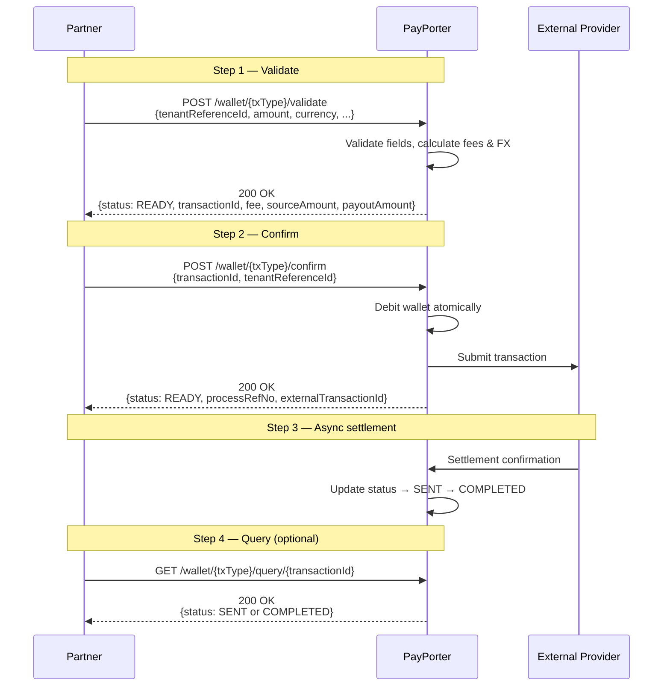
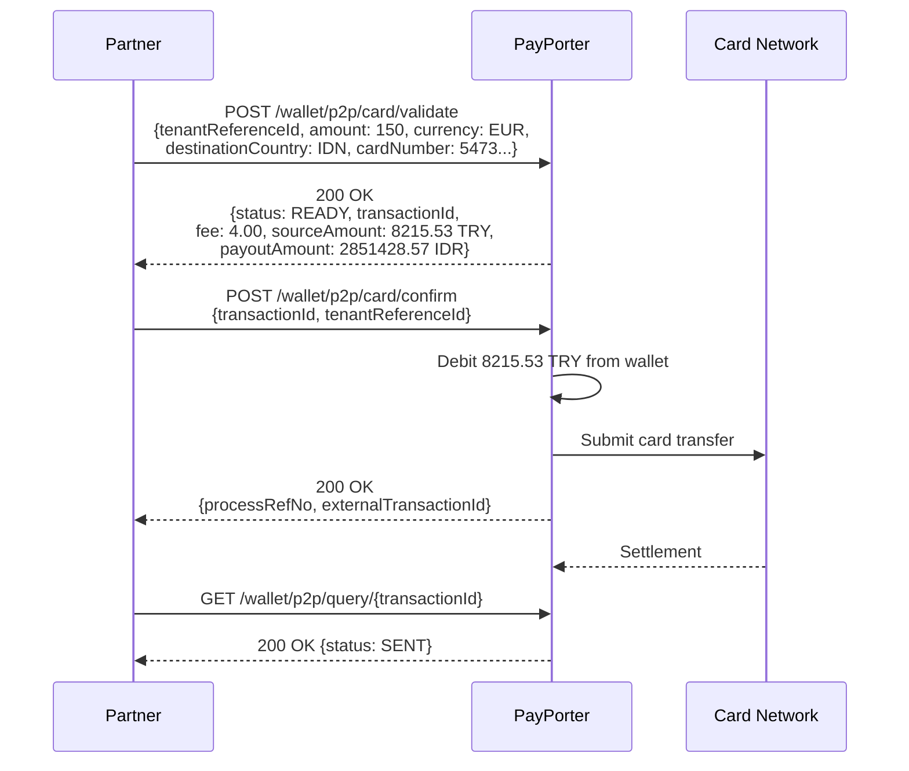
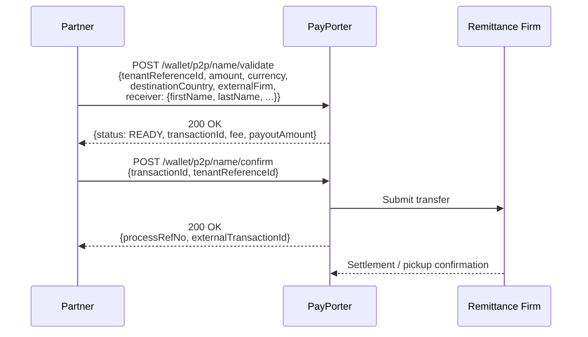
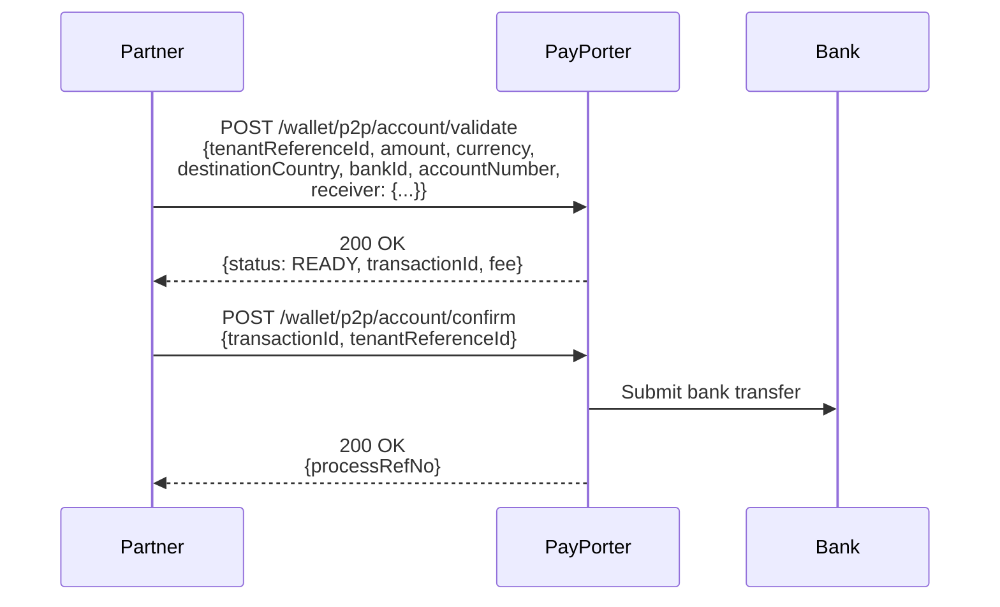
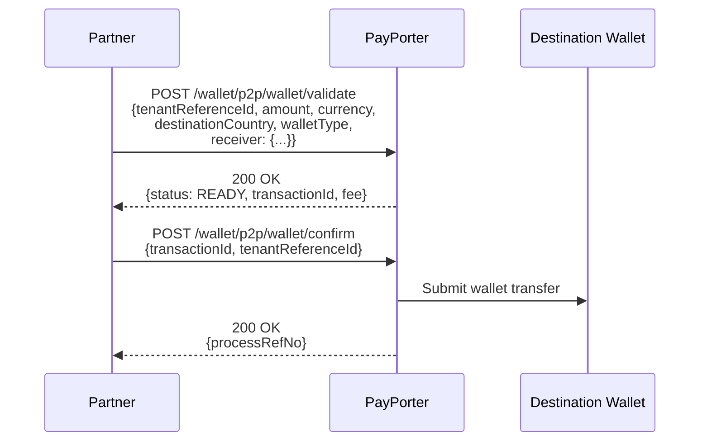
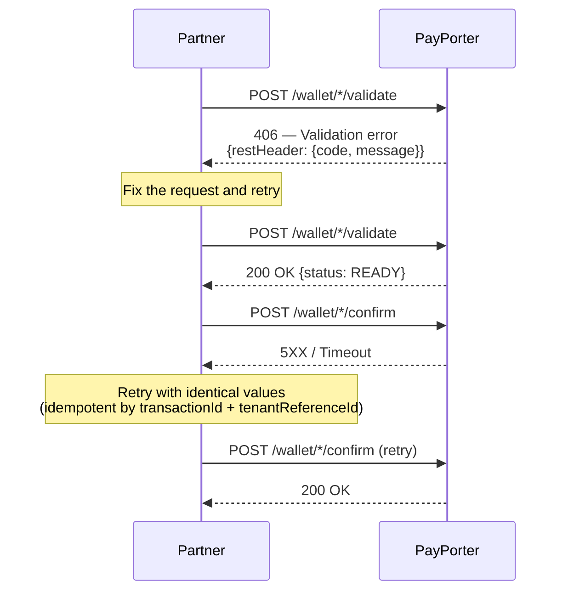

# Flow Diagrams

## Transaction Flow (All Types)

The following sequence diagram shows the generic flow for all individual wallet transactions. Replace `{txType}` with the specific endpoint path (e.g., `p2p/card`, `p2p/name`, `eft`, etc.).

---

## P2P To Card Flow

---

## P2P To Name (Cash Pickup) Flow

---

## P2P To Account (Bank Transfer) Flow

---

## P2P To Wallet Flow

---

## Error Flow

