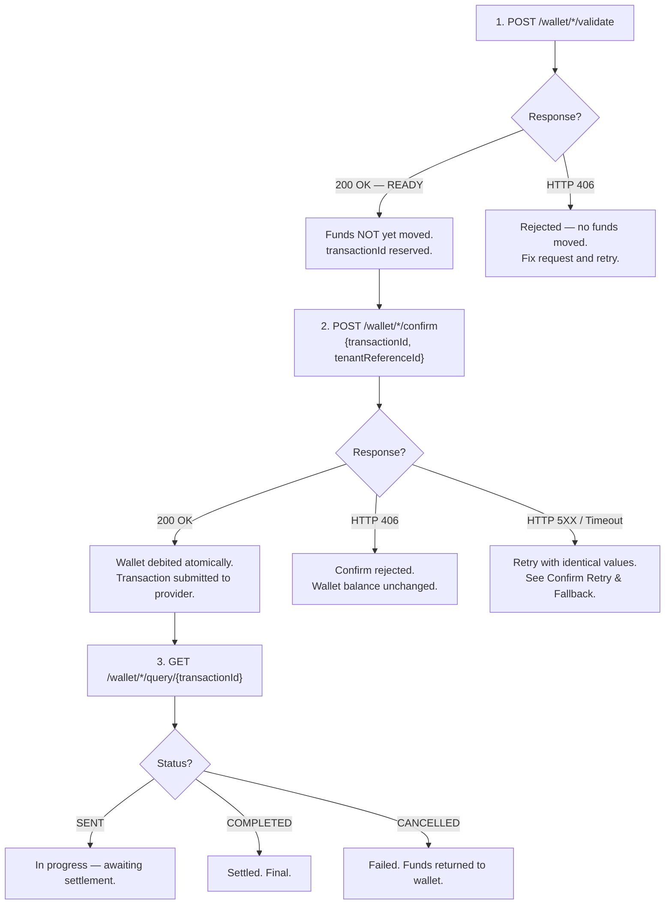

# Partner Fund Safety Model

This section describes the fund safety guarantees for individual wallet transactions. **Understanding this model is critical to avoid fund risk.**

## Key Principle

Unlike QR payments where the partner debits the customer before calling Confirm, individual wallet transactions are **wallet-funded**. PayPorter debits the wallet atomically during the Confirm step. The partner does not need to manage separate fund reservations.

---

## Transaction Safety Flow

---

## When Are Funds Debited?

| Step | Funds Status |
|---|---|
| **Validate** | No funds moved. The `transactionId` and fees are reserved but the wallet balance is not affected. |
| **Confirm — 200 OK** | Wallet debited atomically (amount + fee). The `sourceAmount` (TRY) is deducted. |
| **Confirm — HTTP 4XX** | No funds moved. The wallet balance is unchanged. |
| **Confirm — HTTP 5XX / Timeout** | Unknown. Retry with identical values — confirm is idempotent by `transactionId` + `tenantReferenceId`. |

---

## Validate Expiry

A validated transaction (`status: READY`) has a limited lifetime. If the partner does not confirm within this window, the transaction expires and cannot be confirmed. The partner must re-validate.

:::note
The exact expiry duration is configured server-side. Partners should confirm promptly after a successful validate.
:::

---

## Idempotency Guarantees

### Validate

Each call to validate with a unique `tenantReferenceId` creates a new transaction. Calling validate with a `tenantReferenceId` that was already used returns an error.

### Confirm

Confirm is **idempotent** by `transactionId` + `tenantReferenceId`:

| Scenario | Behaviour |
|---|---|
| First Confirm | Debits wallet, submits transaction, returns current state. |
| Retry — same `transactionId` + `tenantReferenceId` | Returns current state. No duplicate debit. |
| Retry — `tenantReferenceId` mismatch | Returns error (409). |

### Query

Query is always safe to call. It returns the current state of the transaction without side effects.
