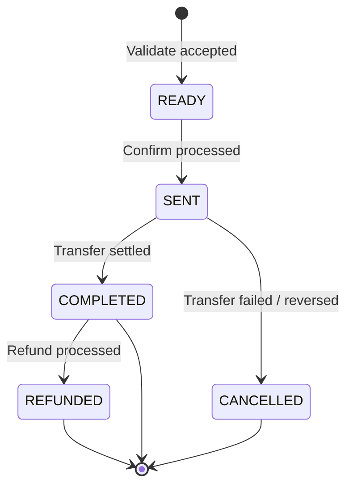

# Transaction Object

The **Transaction Object** (internally `WalletP2PPayment`) is the common response model returned by all individual wallet transaction endpoints (validate, confirm, query).

## Response Fields

| Field | Type | Presence | Description |
| :--- | :--- | :--- | :--- |
| `transactionId` | String | Always | Unique transaction ID assigned by PayPorter. Used for confirm and query. |
| `status` | String | Always | Current transaction status. See [Status Values](#status-values) below. |
| `tenantReferenceId` | String | Always | Tenant's unique reference ID, echoed from the validate request. |
| `transactionType` | String | Always | Transfer type: `TO_NAME`, `TO_ACCOUNT`, `TO_CARD`, or `TO_WALLET`. |
| `amount` | Number | Always | Sending amount (echoed from input). |
| `currency` | String | Always | Sending currency (ISO 4217). |
| `fee` | Number | Always | Fee charged for this transaction. |
| `total` | Number | Always | Total debited: `amount + fee`. |
| `sourceAmount` | Number | Always | TRY equivalent debited from the wallet. |
| `sourceCurrency` | String | Always | Wallet debit currency. Currently always `TRY`. |
| `sendingExchangeRate` | Number | When applicable | Exchange rate applied (sending currency → TRY). |
| `payoutAmount` | Number | After validate | Final payout amount in the destination currency. Determined by the 3rd party. |
| `payoutCurrency` | String | After validate | Payout currency code (ISO 4217). |
| `processRefNo` | String | After confirm | Internal process reference number. |
| `externalTransactionId` | String | After confirm | Reference number assigned by the external remittance firm. |
| `destinationCountry` | String | When applicable | Destination country code. |
| `externalFirm` | String | TO_NAME only | External remittance firm code. |
| `city` | String | TO_NAME only | Cash pickup city. |
| `office` | String | TO_NAME only | Cash pickup office/branch. |
| `bankId` | String | TO_ACCOUNT only | Destination bank code. |
| `accountNumber` | String | TO_ACCOUNT only | Destination bank account number or IBAN. |
| `cardNumber` | String | TO_CARD only | Destination card number. |
| `walletType` | String | TO_WALLET only | Destination wallet type identifier. |
| `receiver` | Object | Always | Receiver identity and contact info. See [ReceiverInfo](#receiverinfo-object). |
| `comment` | String | Optional | Free-text comment. |
| `purpose` | Enum | When provided | Transfer purpose. Valid values: `SAVING_INVESTMENT`, `DEPT_LOAN`, `SALE_BUY`, `COMMERCE_PAYMENTS`, `RENTALS`, `OTHER`, `FAMILY`, `EDUCATION`. |
| `sourceOfIncome` | Enum | When provided | Source of income. Valid values: `SALARY`, `BUSINESS_INCOME`, `SAVINGS`, `GIFT`, `BANK_LOAN`, `OTHER`, `SALE_OF_PROPERTY`. |
| `relationshipWithSender` | Enum | When provided | Relationship with receiver. Valid values: `CHILD`, `SPOUSE`, `PARENT`, `FRIEND`, `WORK_FRIEND`, `BROTHER`. |

---

## Status Values

| Status | Description | Terminal? |
|---|---|---|
| `READY` | Transaction validated and ready for confirm. No funds have moved. | No |
| `SENT` | Transaction confirmed and submitted to the external provider. Funds debited from wallet. | No |
| `COMPLETED` | Transaction successfully settled at the destination. | Yes |
| `CANCELLED` | Transaction failed or was reversed before completion. Funds returned to wallet. | Yes |
| `REFUNDED` | A completed transaction was refunded. Funds returned to wallet. | Yes |

### State Machine



:::note
The transition from `READY` to `SENT` happens asynchronously after confirm. The confirm response may still show `status: READY` — use the Query endpoint to poll for the `SENT` or terminal status.
:::

---

## ReceiverInfo Object

| Field | Type | Required | Description |
| :--- | :--- | :--- | :--- |
| `firstName` | String | Yes | Receiver's first name. |
| `lastName` | String | Yes | Receiver's last name. |
| `receiverType` | String | Yes | `CUSTOMER` or `BUSINESS`. |
| `nationality` | String | Conditional | ISO 3166-1 alpha-3 nationality code (e.g., `TUR`). |
| `phoneCountryCode` | String | Conditional | Phone country code (e.g., `TUR`). |
| `phoneNumber` | String | Conditional | Phone number without country prefix. |
| `fatherName` | String | No | Father's name. |
| `birthDate` | String | No | ISO 8601 date (e.g., `1990-01-15`). |
| `birthPlace` | String | No | Place of birth. |
| `birthCountry` | String | No | Country of birth (ISO 3166-1 alpha-3). |
| `identityNo` | String | No | Identity document number. |
| `identityType` | String | No | Identity document type. |
| `identityIssueCountry` | String | No | Identity document issue country. |
| `identityValidThru` | String | No | Identity document expiry date. |
| `identityIssueDate` | String | No | Identity document issue date. |
| `addressCountry` | String | No | Address country code. |
| `address` | String | No | Street address. |
| `province` | String | No | Province / state. |
| `district` | String | No | District. |
| `zipCode` | String | No | Postal code. |
| `job` | String | No | Occupation. |
| `email` | String | No | Email address. |

---

## Example Response

```json
{
  "transactionId": "d8c8ba37-c434-4f5a-bda6-9129d6294f8b",
  "status": "SENT",
  "tenantReferenceId": "test-happy-path-001",
  "amount": 150.00,
  "fee": 4.00,
  "total": 154.00,
  "sourceAmount": 8215.53,
  "sourceCurrency": "TRY",
  "sendingExchangeRate": 1.0000,
  "payoutAmount": 2851428.57,
  "currency": "EUR",
  "payoutCurrency": "IDR",
  "processRefNo": "47005005788",
  "externalTransactionId": "47005005788"
}
```
