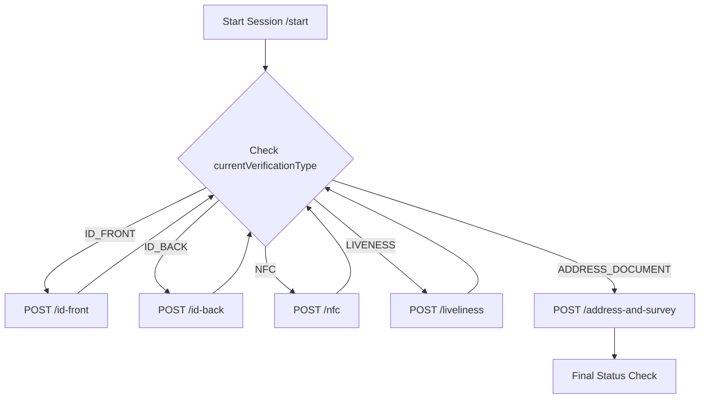

import ApiEndpoint from '@site/src/components/ApiEndpoint';
import ApiResponseSelector from '@site/src/components/ApiResponseSelector';
import Tabs from '@theme/Tabs';
import TabItem from '@theme/TabItem';

# Digital KYC (SDK-Based)

Automated verification using mobile SDK integration for real-time ID capture, NFC reading, and liveness detection.

:::important
The client must check `status` and `currentVerificationType` fields in each response to determine the next step. Continue submitting verifications until `status` is no longer `IN_PROGRESS`.
:::

## Digital KYC Flow



---

## SDK Configuration

### iOS
- **SPM**: `https://github.com/Techsign/TechsignKYC` (version `2.9.0-wrapper`)
- Components: `RKYC_iOS` (liveness), `passport_reader` (NFC), `id_card_detection_ios_wrapper` (ID capture)

### Android
```gradle
implementation 'com.techsign:id-card-detection-cnn:2.0.0'
implementation 'com.techsign:rkyc-cnn:2.1.9'
implementation 'com.techsign:passport-reader-cnn:1.1.5'
```

---

## Endpoints

### Start Session
<ApiEndpoint method="POST" url="/wallet/kyc/start" />

### Submit Media
- **Front Side**: `POST /wallet/kyc/{kycId}/id-front`
- **Back Side**: `POST /wallet/kyc/{kycId}/id-back`
- **Hologram Video**: `POST /wallet/kyc/{kycId}/holo`
- **NFC Data**: `POST /wallet/kyc/{kycId}/nfc`
- **Liveness Video**: `POST /wallet/kyc/{kycId}/liveliness`
- **Final Survey**: `POST /wallet/kyc/{kycId}/address-and-survey`

### NFC Error Handling
<ApiEndpoint method="POST" url="/wallet/kyc/{kycId}/nfc/error" />

---

## Response Reference

<Tabs>
  <TabItem value="status" label="Digital KYC Status" default>

| Code | Description |
|------|-------------|
| `IN_PROGRESS` | Verification steps ongoing |
| `FAILED` | Process failed (requires restart) |
| `WAITING_FOR_BANK_TRANSFER` | Requires bank transfer verification |
| `WAITING_APPROVAL` | Under manual compliance review |
| `APPROVED` | Verification successful |

  </TabItem>
  <TabItem value="errors" label="Failure Codes">

| Code | Reason |
|------|--------|
| `THRESHOLDS_NOT_MET` | Image quality/match too low |
| `ID_EXPIRED` | Document is not valid |
| `NFC_NO_CONNECTION` | Chip could not be read |
| `RETRY_COUNT_EXCEEDED` | Too many failed attempts |

  </TabItem>
</Tabs>
