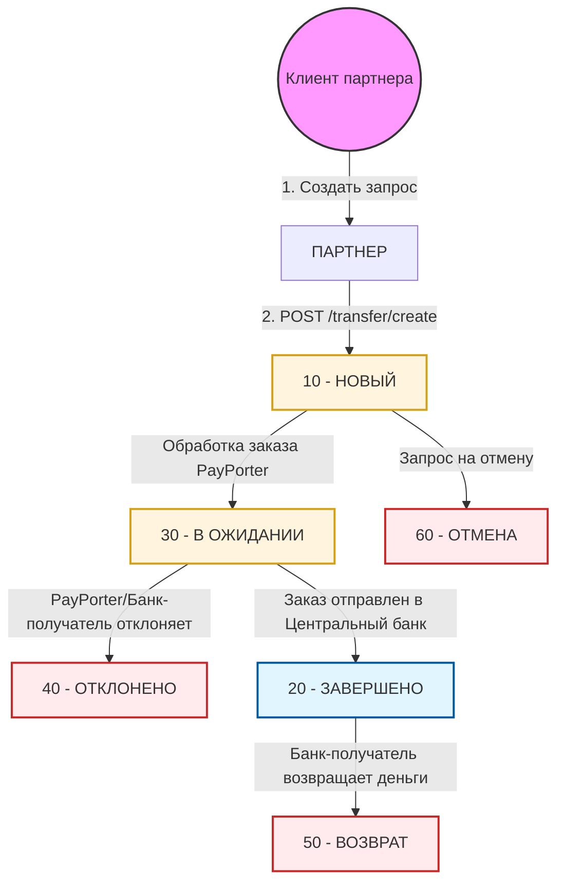

# Поток статусов EFT

Понимание жизненного цикла перевода EFT имеет решающее значение для правильной интеграции. На этой странице подробно описаны различные статусы, через которые может проходить запрос EFT, и способы их отслеживания.

## Схема жизненного цикла статусов

Следующая диаграмма иллюстрирует переходы между различными статусами EFT:

:::info
**Красные блоки** представляют конечные статусы (отклонено, отменено, возвращено). Хотя статус **ЗАВЕРШЕНО** является успешным состоянием, **ВОЗВРАТ** все еще может произойти позже, если банк-получатель вернет средства.
:::

## Коды статусов EFT

| Код статуса | Название статуса | Описание |
| :--- | :--- | :--- |
| **10** | `NEW` | Перевод успешно создан в системе PayPorter. |
| **20** | `COMPLETE` | Перевод успешно отправлен в банк получателя. |
| **30** | `PENDING` | Перевод ожидает обработки или находится в очереди. |
| **40** | `REJECTED` | Перевод отклонен PayPorter или банком-получателем. |
| **50** | `REFUND` | Перевод возвращен банком получателя. |
| **60** | `CANCEL` | Перевод успешно отменен до начала обработки. |

## Отслеживание переводов

Чтобы отслеживать статус перевода EFT, вам следует периодически запрашивать статус транзакции до тех пор, пока она не достигнет **конечного статуса** (ЗАВЕРШЕНО, ОТКЛОНЕНО, ВОЗВРАТ или ОТМЕНА).

### Методы проверки статуса

Существует два основных метода проверки статуса перевода:

1.  **Запрос списка**: Используйте эндпоинт `POST /eft-api/V2/transfer/get-transfer-list` с диапазоном дат заказа, чтобы получить список всех ваших заказов.
2.  **Конкретный запрос**: Запросите статус конкретного перевода, используя:
    *   `GET /eft-api/V2/transfer/check-status-by-ext-firm-id/{extFirmRefId}`
    *   `GET /eft-api/V2/transfer/check-status-by-transfer-order-ref/{transferOrderRefId}`

:::warning Ограничение частоты запросов
Обратите внимание, что если вы решите запрашивать статус каждого перевода индивидуально, действует ограничение частоты запросов, предотвращающее выполнение более **60 запросов в минуту**.
:::

### Лучшие практики

*   **Используйте вебхуки (рекомендуется)**: Для получения максимально эффективных и мгновенных обновлений мы настоятельно рекомендуем использовать нашу [систему вебхуков](./webhooks). Она избавляет от необходимости периодического опроса и гарантирует, что вы будете уведомлены в момент изменения статуса.
*   **Прекращение запросов**: Как только перевод достигнет конечного статуса, прекратите запрашивать его статус (если только вы не используете методы на основе списков).
*   **Мониторинг возвратов**: Поскольку **ВОЗВРАТ** может произойти в любое время после того, как перевод помечен как **ЗАВЕРШЕНО**, рекомендуется вызывать эндпоинт «Получить список возвратов» несколько раз в день.
*   **Эффективные запросы**: Используйте эндпоинт «Получить список возвратов» с параметром `SYSDATE` (сегодня), чтобы эффективно получать информацию о сегодняшних возвращенных транзакциях.
