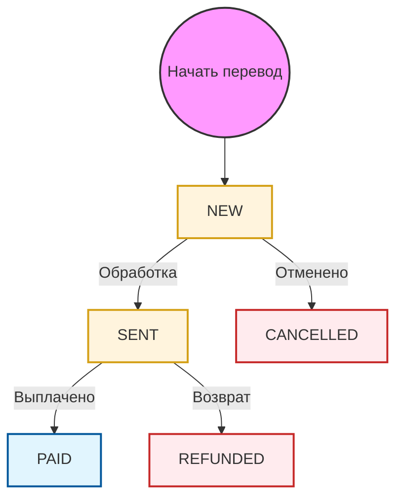

# API денежных переводов

Сервис денежных переводов позволяет отправлять средства частным лицам по всему миру с использованием различных методов выплаты, включая получение наличными (по имени), банковские счета, электронные кошельки и карты.

## Процесс перевода

Все денежные переводы проходят обязательный процесс **двухэтапной верификации** для обеспечения точности и соответствия требованиям.

### 1. Этап валидации
Сначала необходимо вызвать конечную точку валидации для вашего типа перевода:
- `POST /mt-api/V2/moneysend/to-name/validate`
- `POST /mt-api/V2/moneysend/to-account/validate`
- `POST /mt-api/V2/moneysend/to-wallet/validate`
- `POST /mt-api/V2/moneysend/to-card/validate`

**Результат**: В случае успеха API возвращает `operation-id` в заголовке ответа.

### 2. Этап подтверждения
Используйте `operation-id` из этапа валидации для завершения перевода.
- `POST /mt-api/V2/moneysend/confirm` (Заголовок: `operation-id: {id}`)

---

## Типы переводов

- **[По имени (наличными)](./to-name/validate)**: Отправка денег, которые можно получить наличными в офисах PayPorter или точках партнеров.
- **[На банковский счет](./to-account/validate)**: Прямой перевод на банковский счет или IBAN.
- **[На кошелек](./to-wallet/validate)**: Отправка средств на электронный кошелек получателя.
- **[На карту](./to-card/validate)**: Перевод непосредственно на дебетовую или кредитную карту.

---

## Жизненный цикл статуса

Следующая диаграмма иллюстрирует жизненный цикл денежного перевода:

## Статусы перевода

| Статус | Описание |
| :--- | :--- |
| **NEW** | Запрос на перевод успешно получен и проверен. |
| **SENT** | Перевод был отправлен выплачивающему партнеру или в систему. |
| **PAID** | Средства были успешно получены получателем. |
| **CANCELLED** | Перевод был отменен до его обработки. |
| **REFUNDED** | Перевод был возвращен, и средства были зачислены обратно отправителю. |
