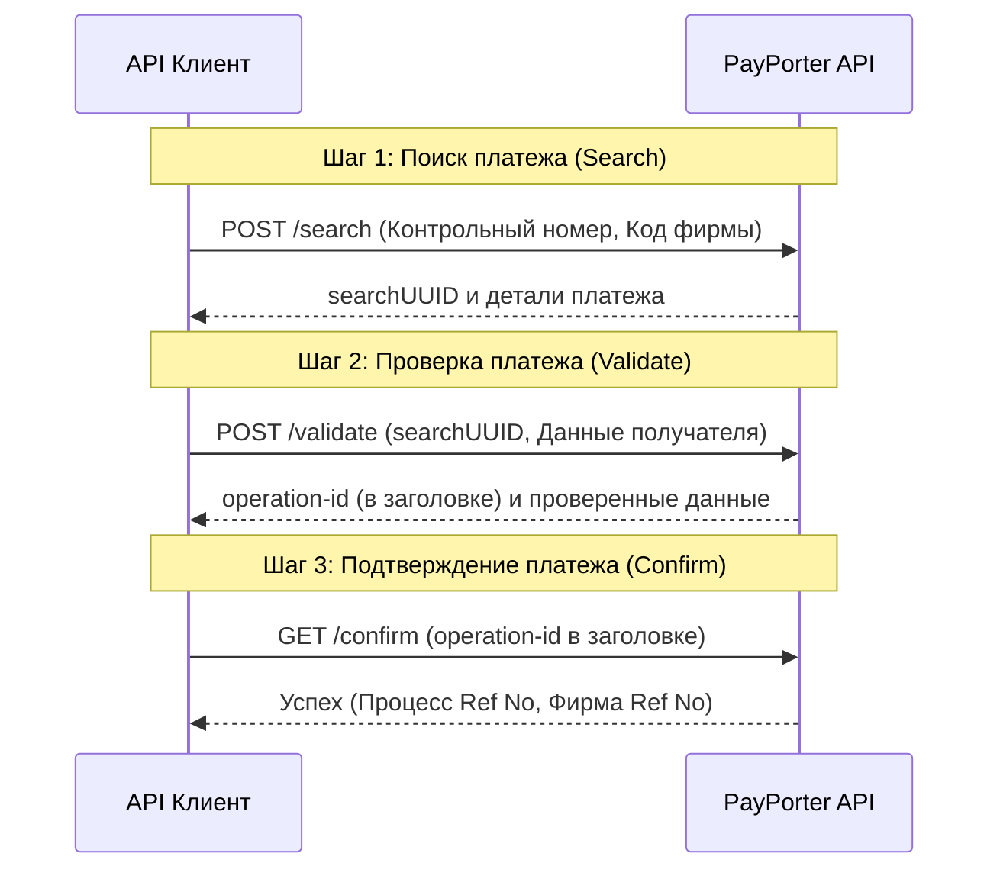

import ApiEndpoint from '@site/src/components/ApiEndpoint';
import TabItem from '@theme/TabItem';
import Tabs from '@theme/Tabs';

# Обзор платежей

Платеж — это процесс выплаты входящего перевода получателю с использованием контрольного номера. Обычно это используется для переводов с выплатой наличными (Cash Pick Up).

Процесс платежа состоит из трех основных этапов:
1.  **Поиск (Search)**: Найдите детали платежа, используя контрольный номер, предоставленный отправителем.
2.  **Проверка (Validate)**: Проверьте информацию о получателе и подготовьтесь к выплате.
3.  **Подтверждение (Confirm)**: Завершите платеж.

### Ключевые моменты
- Платеж обрабатывается с использованием контрольного номера от внешней фирмы.
- Метод `validate` должен быть вызван перед `confirm`.
- В заголовке ответа метода **Проверка (Validate)** вы получите `operation-id`. Этот ID необходим для запроса **Подтверждение (Confirm)**.
- Используйте **Список платежных фирм**, чтобы получить список поддерживаемых фирм для выплаты.

:::info
Платеж — это «входящая» операция (выплата), тогда как общие конечные точки денежных переводов предназначены для «исходящих» операций (отправка).
:::