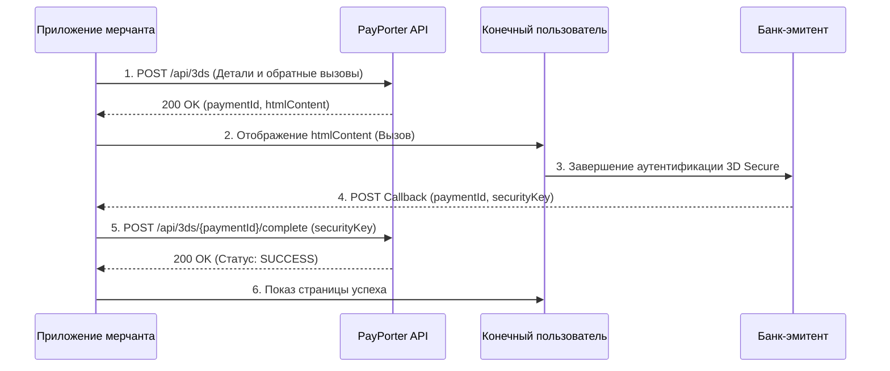

import ApiEndpoint from '@site/src/components/ApiEndpoint';
import ApiResponseSelector from '@site/src/components/ApiResponseSelector';
import Tabs from '@theme/Tabs';
import TabItem from '@theme/TabItem';

# Платеж 3D Secure

3D Secure обеспечивает дополнительный уровень безопасности путем перенаправления пользователя на страницу аутентификации его банка. Этот поток включает регистрацию, аутентификацию клиента и окончательное завершение.

## 1. Инициализация регистрации 3D Secure (Initiate Enrollment)

Начните процесс 3D Secure, предоставив данные платежа и URL-адреса обратного вызова.

<ApiEndpoint method="POST" url="/api/3ds" />

### Параметры запроса (Request Parameters)

<Tabs>
  <TabItem value="table" label="Параметры" default>

| Параметр | Обязателен | Тип | Описание |
| :--- | :--- | :--- | :--- |
| orderId | Да | string | Номер заказа клиента для отслеживания (например, ORD-12345). |
| amount | Да | number | Сумма транзакции (например, 100.50). |
| currency | Да | string | Код валюты ISO (например, TRY). |
| installmentCount | Нет | number | Количество рассрочек (по умолчанию: 1). Перед установкой проверьте доступные варианты через **Installment Options API**. |
| interestPaidByCustomer | Нет | boolean | Оплачиваются ли проценты клиентом. |
| cardHolderName | Да | string | Имя держателя карты. |
| pan | Да | string | Полный номер карты (16 цифр). |
| expiryMonth | Да | string | Месяц истечения срока действия (формат MM, например, 04). |
| expiryYear | Да | string | Год истечения срока действия (формат YY, например, 28). |
| cvv | Да | string | Код CVV/CVC (3 или 4 цифры). |
| successUrl | Да | string | URL для перенаправления после успешной аутентификации в банке. |
| failureUrl | Да | string | URL для перенаправления после неудачной аутентификации в банке. |
| requestIp | Да | string | IP-адрес клиента. |
| requestPort | Да | number | Номер порта клиентского запроса. |
| customerId | Нет | string | Необязательный уникальный идентификатор клиента. |

  </TabItem>
  <TabItem value="example" label="Пример запроса">

```json
{
  "orderId": "ORD-12345",
  "amount": 100.50,
  "currency": "TRY",
  "installmentCount": 3,
  "interestPaidByCustomer": true,
  "cardHolderName": "John Doe",
  "pan": "5421190122090656",
  "expiryMonth": "04",
  "expiryYear": "28",
  "cvv": "916",
  "successUrl": "https://example.com/3ds/success",
  "failureUrl": "https://example.com/3ds/failure",
  "requestIp": "192.168.1.1",
  "requestPort": 8080,
  "customerId": "CUST-12345"
}
```

  </TabItem>
</Tabs>

### Ответ (Response)

<Tabs>
  <TabItem value="fields" label="Поля ответа" default>

| Поле | Тип | Описание |
| :--- | :--- | :--- |
| paymentId | string | Уникальный идентификатор платежа (UUID). |
| success | boolean | Указывает, была ли регистрация успешной. |
| resultCode | string | Код результата регистрации (например, SUCCESS). |
| resultMessage | string | Описательное сообщение о результате. |
| htmlContent | string | HTML-контент, который должен быть представлен конечному пользователю для аутентификации 3D Secure. |

  </TabItem>
  <TabItem value="example" label="Пример ответа">

<ApiResponseSelector>

```json status="200" title="Успех"
{
  "paymentId": "123e4567-e89b-12d3-a456-426614174000",
  "success": true,
  "resultCode": "SUCCESS",
  "resultMessage": "Successful",
  "htmlContent": "<form action=\"https://3ds.example.com\" method=\"POST\">...</form>"
}
```

</ApiResponseSelector>

  </TabItem>
</Tabs>

## 2. Представление аутентификации 3D Secure

Представьте возвращенный `htmlContent` конечному пользователю. Обычно это включает в себя рендеринг во iframe или перенаправление пользователя для завершения аутентификации 3D Secure на странице банка.

## 3. Обработка обратного вызова 3D Secure (Callback)

После процесса аутентификации платежный провайдер вызовет предоставленные URL-адреса обратного вызова (`successUrl` или `failureUrl`) с соответствующими параметрами, переданными как данные формы.

### Параметры данных формы обратного вызова (Callback Form Data)

| Поле | Описание | Пример |
| :--- | :--- | :--- |
| paymentId | Уникальный идентификатор платежа. | 123e4567-e89b-12d3-a456-426614174000 |
| securityKey | Ключ безопасности, полученный в процессе аутентификации 3D Secure. | 3DS_AUTH_KEY_123456 |

## 4. Завершение платежа 3D Secure

Завершите транзакцию, используя ключ безопасности, полученный в обратном вызове.

<ApiEndpoint method="POST" url="/api/3ds/{paymentId}/complete" />

### Параметры пути (Path Parameters)

| Параметр | Тип | Описание |
| :--- | :--- | :--- |
| paymentId | string | UUID, полученный в обратном вызове. |

### Параметры запроса (Request Parameters)

```json
{
  "securityKey": "3DS_AUTH_KEY_123456"
}
```

### Ответ (Response)

Возвращает объект `ApiPaymentResponse` с деталями завершенного платежа (идентичен ответу **Direct Payment**).

---

## Поток платежа 3D Secure



1.  **Инициализация регистрации**: Вызовите эндпоинт `/api/3ds` с деталями платежа и URL-адресами обратного вызова.
2.  **Отображение вызова**: Представьте возвращенный `htmlContent` пользователю.
3.  **Аутентификация**: Пользователь завершает процесс 3D Secure банка.
4.  **Получение обратного вызова**: Провайдер отправляет POST-запрос на ваш callback URL с `paymentId` и `securityKey`.
5.  **Финализация**: Извлеките параметры и вызовите эндпоинт `/api/3ds/{paymentId}/complete`.
6.  **Проверка статуса**: Считайте платеж успешным только если `status` в ответе — `SUCCESS`.

---

## Варианты рассрочки (Installment Options)

Получите доступные планы рассрочки для конкретной карты перед обработкой платежа.

<ApiEndpoint method="POST" url="/api/installment-options" />

### Тело запроса (Request Body)

<Tabs>
  <TabItem value="table" label="Параметры" default>

| Параметр | Обязателен | Тип | Описание |
| :--- | :--- | :--- | :--- |
| amount | Да | number | Общая сумма транзакции (например, 1000.00). |
| currency | Да | string | Код валюты ISO (например, TRY). |
| pan | Да | string | Первые 6 цифр (BIN) или полный номер карты. |
| maxInstallmentCount | Нет | number | Максимальное количество рассрочек для получения (по умолчанию: 12). |
| interestPaidByCustomer | Нет | boolean | Оплачиваются ли проценты клиентом. |

  </TabItem>
  <TabItem value="example" label="Пример запроса">

```json
{
  "amount": 1000.00,
  "currency": "TRY",
  "pan": "5421190122090656",
  "maxInstallmentCount": 12,
  "interestPaidByCustomer": true
}
```

  </TabItem>
</Tabs>

### Ответ (Response)

<Tabs>
  <TabItem value="fields" label="Поля ответа" default>

| Поле | Тип | Описание |
| :--- | :--- | :--- |
| installmentCount | number | Количество рассрочек. |
| installmentAmount | number | Сумма ежемесячного платежа. |
| currency | string | Код валюты ISO. |
| interestAmount | number | Общая сумма начисленных процентов (добавляется к основной сумме). |
| totalAmount | number | Общая сумма к оплате (Основная сумма + Проценты). |

  </TabItem>
  <TabItem value="example" label="Пример ответа">

<ApiResponseSelector>

```json status="200" title="Успех"
{
  "options": [
    {
      "installmentCount": 2,
      "installmentAmount": 510.00,
      "currency": "TRY",
      "interestAmount": 20.00,
      "totalAmount": 1020.00
    },
    {
      "installmentCount": 3,
      "installmentAmount": 345.00,
      "currency": "TRY",
      "interestAmount": 35.00,
      "totalAmount": 1035.00
    }
  ]
}
```

</ApiResponseSelector>

  </TabItem>
</Tabs>
