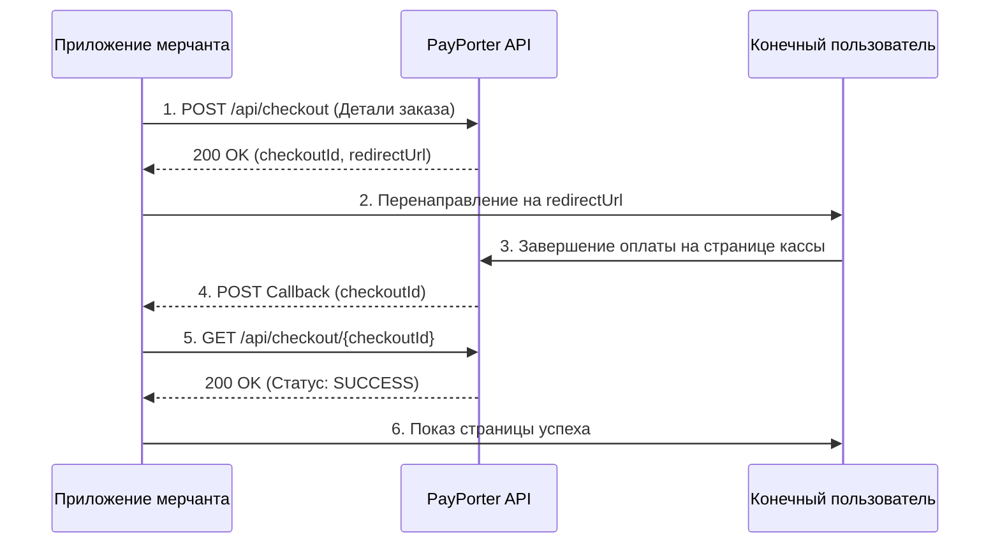

import ApiEndpoint from '@site/src/components/ApiEndpoint';
import ApiResponseSelector from '@site/src/components/ApiResponseSelector';
import Tabs from '@theme/Tabs';
import TabItem from '@theme/TabItem';

# Касса (Checkout)

Создайте безопасную ссылку для оплаты на размещенной странице. Это снижает вашу нагрузку по соблюдению требований PCI, так как PayPorter обрабатывает данные карт.

## 1. Создание ссылки на оплату (Create Checkout Link)

Сгенерируйте уникальный URL кассы для перенаправления вашего клиента.

<ApiEndpoint method="POST" url="/api/checkout" />

### Параметры запроса (Request Parameters)

<Tabs>
  <TabItem value="table" label="Параметры" default>

| Параметр | Обязателен | Тип | Описание |
| :--- | :--- | :--- | :--- |
| orderId | Да | string | Номер заказа клиента для отслеживания (например, ORD-12345). |
| amount | Да | number | Сумма транзакции (например, 100.50). |
| currency | Да | string | Код валюты ISO (например, TRY). |
| description | Нет | string | Краткое описание покупки. |
| callback | Да | string | URL, который будет вызван после обработки платежа. |
| customerId | Нет | string | Необязательный уникальный идентификатор клиента. |
| maxInstallmentCount | Нет | number | Максимальное количество разрешенных рассрочек (по умолчанию: 1). |
| interestPaidByCustomer | Нет | boolean | Оплачиваются ли проценты за рассрочку клиентом (по умолчанию: false). |

  </TabItem>
  <TabItem value="example" label="Пример запроса">

```json
{
  "orderId": "ORD-12345",
  "amount": 100.50,
  "currency": "TRY",
  "description": "Покупка товара",
  "callback": "https://example.com/payment-callback",
  "maxInstallmentCount": 6,
  "interestPaidByCustomer": true
}
```

  </TabItem>
</Tabs>

### Ответ (Response)

<Tabs>
  <TabItem value="fields" label="Поля ответа" default>

| Поле | Тип | Описание |
| :--- | :--- | :--- |
| checkoutId | string | Уникальный идентификатор кассы (UUID). |
| redirectUrl | string | URL для перенаправления пользователя для завершения оплаты. |

  </TabItem>
  <TabItem value="example" label="Пример ответа">

<ApiResponseSelector>

```json status="200" title="Успех"
{
  "checkoutId": "123e4567-e89b-12d3-a456-426614174000",
  "redirectUrl": "https://api.example.com/checkout-link/123e4567-e89b-12d3-a456-426614174000"
}
```

</ApiResponseSelector>

  </TabItem>
</Tabs>

## 2. Перенаправление пользователя

После получения `redirectUrl` перенаправьте пользователя для безопасного завершения оплаты на размещенной странице PayPorter.

## 3. Обработка обратного вызова (Callback Processing)

После обработки платежа (успешной или нет) PayPorter отправит POST-запрос на ваш `callback` URL с `checkoutId` в качестве данных формы.

## 4. Получение статуса кассы

Получите окончательный статус транзакции, используя `checkoutId`.

<ApiEndpoint method="GET" url="/api/checkout/{checkoutId}" />

### Параметры пути (Path Parameters)

| Параметр | Тип | Описание |
| :--- | :--- | :--- |
| checkoutId | string | UUID, полученный в обратном вызове. |

### Ответ (Response)

Возвращает объект `ApiPaymentResponse` с деталями платежа (идентичен ответу **Direct Payment**).

---

## Поток оплаты через кассу (Checkout Flow)



1.  **Генерация ссылки**: Вызовите эндпоинт `/api/checkout`.
2.  **Перенаправление**: Отправьте пользователя на `redirectUrl`.
3.  **Ожидание**: Слушайте POST-запрос на вашем `callback` URL.
4.  **Извлечение**: Получите `checkoutId` из данных формы обратного вызова.
5.  **Проверка**: Вызовите эндпоинт `/api/checkout/{checkoutId}`, чтобы получить окончательный статус.
6.  **Подтверждение**: Считайте платеж успешным только если статус — `SUCCESS`.

---

## Пример реализации (JavaScript)

```javascript
// 1. Создание ссылки на оплату
const createCheckout = async (orderDetails) => {
  const response = await fetch('https://api.example.com/api/checkout', {
    method: 'POST',
    headers: {
      'Content-Type': 'application/json',
      'X-API-KEY': 'your_api_key_here',
      'X-API-SECRET': 'your_api_secret_here'
    },
    body: JSON.stringify(orderDetails)
  });
  const data = await response.json();
  return data.redirectUrl;
};

// 2. Обработчик обратного вызова (пример на Express)
app.post('/payment-callback', async (req, res) => {
  const checkoutId = req.body.checkoutId;
  const checkoutStatus = await getCheckoutStatus(checkoutId);
  
  if (checkoutStatus.status === 'SUCCESS') {
    // Обработка успешного платежа
    console.log('Платеж успешен');
  } else {
    // Обработка неудачного платежа
    console.log('Платеж не удался');
  }
  
  res.sendStatus(200);
});

// 3. Получение статуса кассы
const getCheckoutStatus = async (checkoutId) => {
  const response = await fetch(`https://api.example.com/api/checkout/${checkoutId}`, {
    method: 'GET',
    headers: {
      'X-API-KEY': 'your_api_key_here',
      'X-API-SECRET': 'your_api_secret_here'
    }
  });
  return await response.json();
};
```
