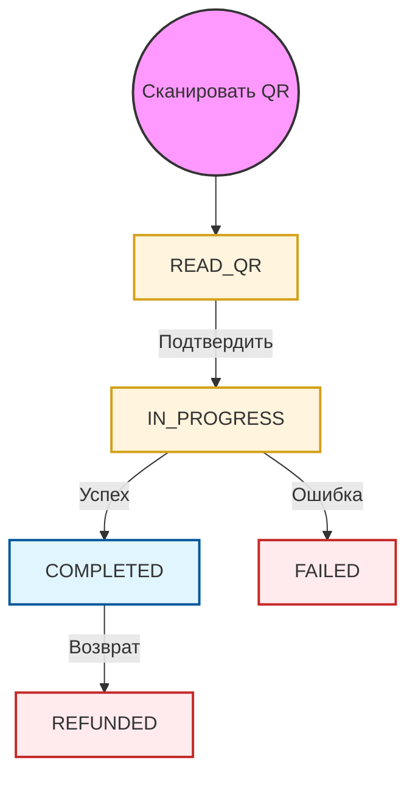

# QR Code API

Сервис QR-платежей позволяет пользователям совершать платежи и возвраты путем сканирования QR-кодов. Этот сервис разработан для розничной торговли и POS-терминалов, обеспечивая удобный и безопасный способ оплаты.

## Процесс оплаты

Стандартный процесс QR-платежа включает следующие шаги:

1.  **Считать QR**: Пользователь сканирует QR-код продавца. Необработанная строка QR-кода отправляется в конечную точку `/read`.
2.  **Показать детали**: API возвращает детали транзакции (имя продавца, сумму и т.д.) в приложение пользователя.
3.  **Подтвердить платеж**: Пользователь подтверждает транзакцию (и дополнительно вводит сумму, если она не фиксирована). Вызывается конечная точка `/confirm`.
4.  **Асинхронная обработка**: PayPorter обрабатывает транзакцию. Окончательный результат отправляется партнеру через **Вебхук**.

## Жизненный цикл статуса

Следующая диаграмма иллюстрирует жизненный цикл транзакции QR-кода:

## Статусы QR-кода

| Статус | Описание |
| :--- | :--- |
| **READ_QR** | Вызван API информации о платеже; данные QR-кода успешно получены. |
| **IN_PROGRESS** | QR-код подтвержден; транзакция ожидает результата перевода средств. |
| **FAILED** | Транзакция не удалась; средства не были переведены. |
| **COMPLETED** | Транзакция успешно завершена. |

:::info Окончательный статус
Транзакция считается завершенной, когда она достигает статуса **COMPLETED** или **FAILED**. Партнерам следует использовать вебхуки для получения этих обновлений.
:::
