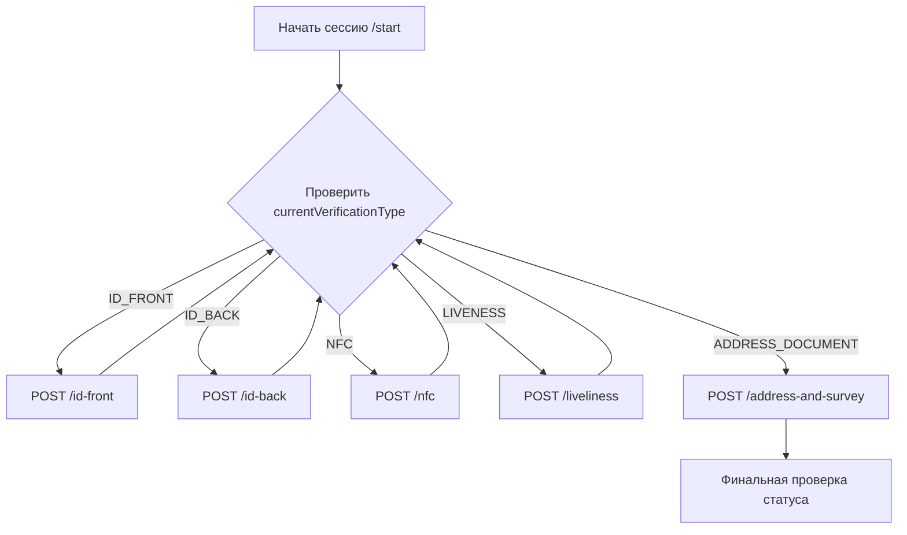

import ApiEndpoint from '@site/src/components/ApiEndpoint';
import ApiResponseSelector from '@site/src/components/ApiResponseSelector';
import TabItem from '@theme/TabItem';
import Tabs from '@theme/Tabs';

# Цифровой KYC (на базе SDK)

Автоматизированная верификация с использованием интеграции мобильного SDK для захвата удостоверения личности в реальном времени, чтения NFC и определения "живости" (liveness detection).

:::important
Клиент должен проверять поля `status` и `currentVerificationType` в каждом ответе, чтобы определить следующий шаг. Продолжайте отправку данных верификации до тех пор, пока `status` не перестанет быть `IN_PROGRESS`.
:::

## Процесс цифрового KYC



---

## Конфигурация SDK

### iOS
- **SPM**: `https://github.com/Techsign/TechsignKYC` (версия `2.9.0-wrapper`)
- Компоненты: `RKYC_iOS` (liveness), `passport_reader` (NFC), `id_card_detection_ios_wrapper` (захват ID)

### Android
```gradle
implementation 'com.techsign:id-card-detection-cnn:2.0.0'
implementation 'com.techsign:rkyc-cnn:2.1.9'
implementation 'com.techsign:passport-reader-cnn:1.1.5'
```

---

## Конечные точки (Endpoints)

### Начать сессию
<ApiEndpoint method="POST" url="/wallet/kyc/start" />

### Отправка медиаданных
- **Лицевая сторона**: `POST /wallet/kyc/{kycId}/id-front`
- **Оборотная сторона**: `POST /wallet/kyc/{kycId}/id-back`
- **Видео с голограммой**: `POST /wallet/kyc/{kycId}/holo`
- **Данные NFC**: `POST /wallet/kyc/{kycId}/nfc`
- **Видео Liveness**: `POST /wallet/kyc/{kycId}/liveliness`
- **Финальный опрос**: `POST /wallet/kyc/{kycId}/address-and-survey`

### Обработка ошибок NFC
<ApiEndpoint method="POST" url="/wallet/kyc/{kycId}/nfc/error" />

---

## Справочник ответов

<Tabs>
  <TabItem value="status" label="Статус цифрового KYC" default>

| Код | Описание |
|------|-------------|
| `IN_PROGRESS` | Шаги верификации продолжаются |
| `FAILED` | Процесс завершился сбоем (требуется перезапуск) |
| `WAITING_FOR_BANK_TRANSFER` | Требуется подтверждение через банковский перевод |
| `WAITING_APPROVAL` | На рассмотрении отдела комплаенса |
| `APPROVED` | Верификация прошла успешно |

  </TabItem>
  <TabItem value="errors" label="Коды ошибок">

| Код | Причина |
|------|--------|
| `THRESHOLDS_NOT_MET` | Качество изображения/совпадение слишком низкое |
| `ID_EXPIRED` | Документ недействителен |
| `NFC_NO_CONNECTION` | Не удалось прочитать чип |
| `RETRY_COUNT_EXCEEDED` | Превышено количество попыток |

  </TabItem>

</Tabs>