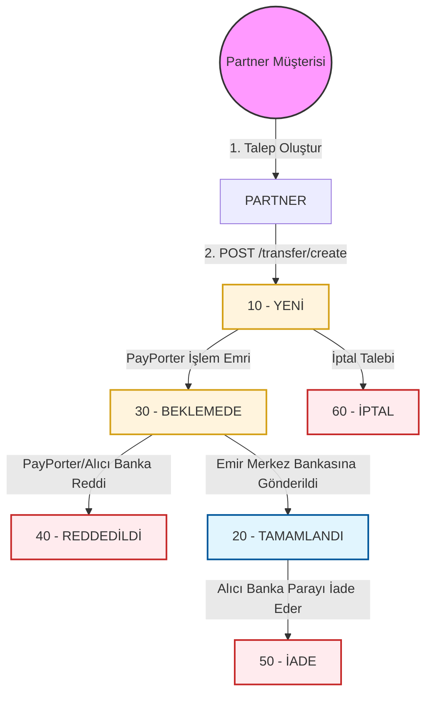

# EFT Durum Akışı

EFT transferinin yaşam döngüsünü anlamak, doğru entegrasyon için çok önemlidir. Bu sayfa, bir EFT talebinin geçebileceği çeşitli durumları ve bunların nasıl takip edileceğini detaylandırmaktadır.

## Durum Yaşam Döngüsü Akışı

Aşağıdaki diyagram, farklı EFT durumları arasındaki geçişleri göstermektedir:

:::info
**Kırmızı Bloklar** Nihai Durumları (Reddedildi, İptal Edildi, İade Edildi) temsil eder. **TAMAMLANDI** başarılı bir durum olsa da, alıcı banka parayı iade ederse daha sonra bir **İADE** gerçekleşebilir.
:::

## EFT Durum Kodları

| Durum Kodu | Durum Adı | Açıklama |
| :--- | :--- | :--- |
| **10** | `NEW` | Transfer, PayPorter sisteminde başarıyla oluşturuldu. |
| **20** | `COMPLETE` | Transfer, alıcı bankaya başarıyla gönderildi. |
| **30** | `PENDING` | Transfer işlem bekliyor veya kuyrukta. |
| **40** | `REJECTED` | Transfer, PayPorter veya alıcı banka tarafından reddedildi. |
| **50** | `REFUND` | Transfer, alıcı banka tarafından iade edildi. |
| **60** | `CANCEL` | Transfer, işleme alınmadan önce başarıyla iptal edildi. |

## Transferleri Takip Etme

Bir EFT transferinin durumunu takip etmek için, işlem **Nihai Duruma** (TAMAMLANDI, REDDEDİLDİ, İADE veya İPTAL) ulaşana kadar işlemin durumunu periyodik olarak sorgulamalısınız.

### Durum Kontrol Yöntemleri

Bir transferin durumunu kontrol etmek için iki ana yöntem vardır:

1.  **Liste Sorgulama**: Tüm emirlerinizin listesini almak için bir emir tarih aralığı ile `POST /eft-api/V2/transfer/get-transfer-list` uç noktasını kullanın.
2.  **Özel Sorgulama**: Belirli bir transferin durumunu şunları kullanarak sorgulayın:
    *   `GET /eft-api/V2/transfer/check-status-by-ext-firm-id/{extFirmRefId}`
    *   `GET /eft-api/V2/transfer/check-status-by-transfer-order-ref/{transferOrderRefId}`

:::warning Hız Sınırlayıcı
Her bir transferin durumunu ayrı ayrı sorgulamayı seçerseniz, dakikada **60 sorguyu** aşmamak için bir hız sınırlayıcı olduğunu lütfen unutmayın.
:::

### En İyi Uygulamalar

*   **Webook Kullanın (Önerilen)**: En verimli ve anlık güncellemeler için [Webhook sistemimizi](./webhooks) kullanmanızı şiddetle tavsiye ederiz. Sorgulama (polling) ihtiyacını ortadan kaldırır ve bir durum değişikliği olduğu anda bilgilendirilmenizi sağlar.
*   **Sorgulamayı Durdur**: Bir transfer nihai duruma ulaştığında, durumunu sorgulamayı bırakın (liste tabanlı yöntemler kullanmıyorsanız).
*   **İade İzleme**: Bir transfer **TAMAMLANDI** olduktan sonra herhangi bir zamanda **İADE** gerçekleşebileceğinden, "İade Listesini Al" uç noktasını günde birkaç kez çağırmanız önerilir.
*   **Verimli Sorgulama**: Bugün iade edilen işlemleri verimli bir şekilde almak için "İade Listesini Al" uç noktasını `SYSDATE` (bugün) parametresiyle kullanın.
