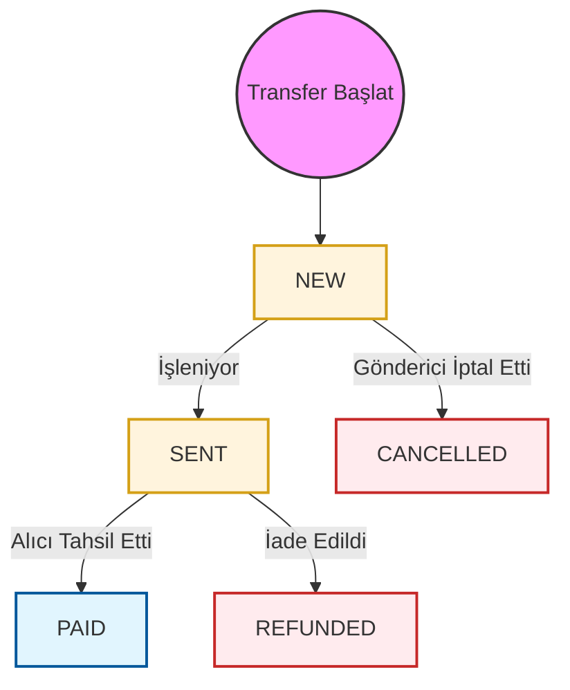

# Para Transferi API'si

Para Transferi hizmeti, dünya genelindeki bireylere nakit çekim (isme), banka hesabı, elektronik cüzdan ve kart dahil olmak üzere çeşitli ödeme yöntemleriyle fon göndermenize olanak tanır.

## Transfer Süreci

Tüm para transferleri, doğruluk ve uyumluluk sağlamak için zorunlu bir **İki Adımlı Doğrulama** sürecini takip eder.

### 1. Doğrulama Adımı
Öncelikle, transfer türünüz için ilgili doğrulama uç noktasını çağırmalısınız:
- `POST /mt-api/V2/moneysend/to-name/validate`
- `POST /mt-api/V2/moneysend/to-account/validate`
- `POST /mt-api/V2/moneysend/to-wallet/validate`
- `POST /mt-api/V2/moneysend/to-card/validate`

**Sonuç**: İşlem başarılı olursa, API yanıt başlığında (header) bir `operation-id` döndürür.

### 2. Onaylama Adımı
Doğrulama adımından alınan `operation-id`'yi transferi sonuçlandırmak için kullanın.
- `POST /mt-api/V2/moneysend/confirm` (Header: `operation-id: {id}`)

---

## Transfer Türleri

- **[İsme (Nakit Çekim)](./to-name/validate)**: PayPorter ofislerinden veya ortak lokasyonlardan nakit olarak çekilebilecek para gönderin.
- **[Banka Hesabına](./to-account/validate)**: Bir banka hesabına veya IBAN'a doğrudan transfer.
- **[Cüzdana](./to-wallet/validate)**: Alıcının elektronik cüzdanına fon gönderin.
- **[Karta](./to-card/validate)**: Doğrudan bir banka veya kredi kartına transfer.

---

## Durum Döngüsü

Aşağıdaki diyagram bir para transferinin yaşam döngüsünü göstermektedir:

## Transfer Durumları

| Durum | Açıklama |
| :--- | :--- |
| **NEW** | Transfer talebi başarıyla alındı ve doğrulandı. |
| **SENT** | Transfer, ödeme yapan ortağa veya sisteme gönderildi. |
| **PAID** | Fonlar alıcı tarafından başarıyla tahsil edildi/alındı. |
| **CANCELLED** | Transfer, işlenmeden önce iptal edildi. |
| **REFUNDED** | Transfer iade edildi ve fonlar göndericiye geri yüklendi. |
