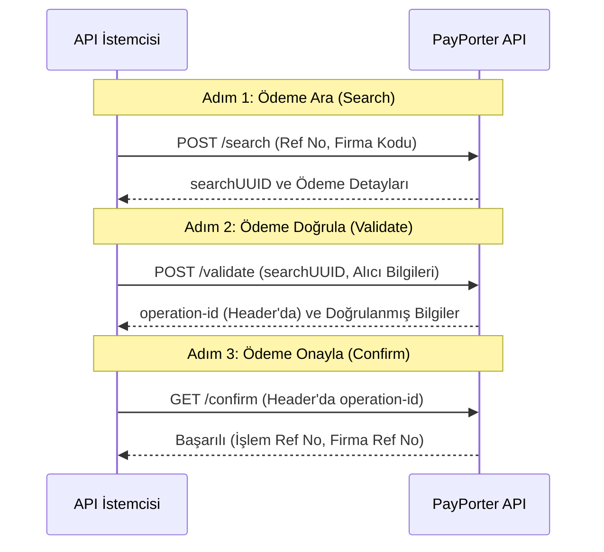

# Ödemeler Genel Bakış

Ödeme, bir referans numarası kullanarak alıcıya gelen bir transferin ödenmesi işlemidir. Bu genellikle nakit çekme (Cash Pick Up) transferleri için kullanılır.

Ödeme akışı üç ana adımdan oluşur:
1.  **Arama (Search)**: Gönderici tarafından sağlanan referans numarasını kullanarak ödeme ayrıntılarını bulun.
2.  **Doğrulama (Validate)**: Alıcı bilgilerini doğrulayın ve ödeme için hazırlanın.
3.  **Onaylama (Confirm)**: Ödemeyi kesinleştirin.

### Önemli Noktalar
- Ödeme, harici bir firmadan alınan referans numarası kullanılarak işlenir.
- `confirm` methodundan önce `validate` methodu çağrılmalıdır.
- **Doğrulama (Validate)** yönteminin yanıt başlığında (header) bir `operation-id` alacaksınız. Bu kimlik, **Onaylama (Confirm)** isteği için gereklidir.
- Tahsilat için desteklenen firmaların listesini almak için **Ödeme Firma Listesi**'ni kullanın.

:::info
Ödeme "gelen" bir işlemdir (ödeme), oysa ortak para transferi uç noktaları "giden" işlemler (gönderme) içindir.
:::
