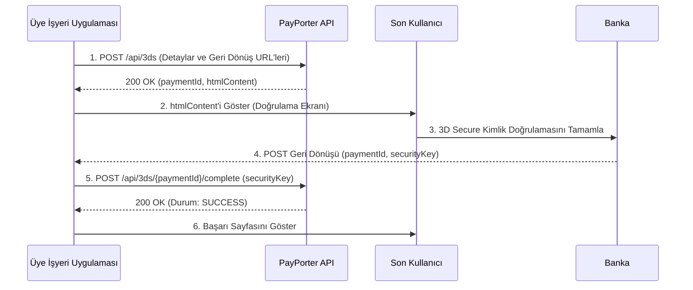

import ApiEndpoint from '@site/src/components/ApiEndpoint';
import ApiResponseSelector from '@site/src/components/ApiResponseSelector';
import Tabs from '@theme/Tabs';
import TabItem from '@theme/TabItem';

# 3D Secure Ödeme

3D Secure, kullanıcıyı bankasının kimlik doğrulama sayfasına yönlendirerek ek bir güvenlik katmanı sağlar. Bu akış; kayıt (enrollment), müşteri doğrulaması ve nihai tamamlamayı içerir.

## 1. 3D Secure Kaydını Başlatma (Initiate Enrollment)

Ödeme ayrıntılarını ve geri dönüş URL'lerini sağlayarak 3D Secure sürecini başlatın.

<ApiEndpoint method="POST" url="/api/3ds" />

### İstek Parametreleri (Request Parameters)

<Tabs>
  <TabItem value="table" label="Parametreler" default>

| Parametre | Zorunlu | Tip | Açıklama |
| :--- | :--- | :--- | :--- |
| orderId | Evet | string | Sipariş için benzersiz takip numaranız (örneğin, ORD-12345). |
| amount | Evet | number | İşlem tutarı (örneğin, 100.50). |
| currency | Evet | string | ISO para birimi kodu (örneğin, TRY). |
| installmentCount | Hayır | number | Taksit sayısı (varsayılan: 1). Bunu ayarlamadan önce **Taksit Seçenekleri API**'si üzerinden mevcut seçenekleri kontrol edin. |
| interestPaidByCustomer | Hayır | boolean | Faizin müşteri tarafından ödenip ödenmeyeceği. |
| cardHolderName | Evet | string | Kart sahibinin adı. |
| pan | Evet | string | Tam kart numarası (16 hane). |
| expiryMonth | Evet | string | Son kullanma ayı (MM formatı, örneğin, 04). |
| expiryYear | Evet | string | Son kullanma yılı (YY formatı, örneğin, 28). |
| cvv | Evet | string | CVV/CVC kodu (3 veya 4 hane). |
| successUrl | Evet | string | Başarılı banka kimlik doğrulamasından sonra gidilecek URL. |
| failureUrl | Evet | string | Başarısız banka kimlik doğrulamasından sonra gidilecek URL. |
| requestIp | Evet | string | Müşterinin IP adresi. |
| requestPort | Evet | number | Müşteri isteğinin port numarası. |
| customerId | Hayır | string | Müşteri için isteğe bağlı benzersiz tanımlayıcı. |

  </TabItem>
  <TabItem value="example" label="Örnek İstek">

```json
{
  "orderId": "ORD-12345",
  "amount": 100.50,
  "currency": "TRY",
  "installmentCount": 3,
  "interestPaidByCustomer": true,
  "cardHolderName": "John Doe",
  "pan": "5421190122090656",
  "expiryMonth": "04",
  "expiryYear": "28",
  "cvv": "916",
  "successUrl": "https://example.com/3ds/success",
  "failureUrl": "https://example.com/3ds/failure",
  "requestIp": "192.168.1.1",
  "requestPort": 8080,
  "customerId": "CUST-12345"
}
```

  </TabItem>
</Tabs>

### Yanıt (Response)

<Tabs>
  <TabItem value="fields" label="Yanıt Alanları" default>

| Alan | Tip | Açıklama |
| :--- | :--- | :--- |
| paymentId | string | Ödeme için benzersiz tanımlayıcı (UUID). |
| success | boolean | Kaydın başarılı olup olmadığını gösterir. |
| resultCode | string | Kayıt işleminin sonuç kodu (örneğin, SUCCESS). |
| resultMessage | string | Açıklayıcı sonuç mesajı. |
| htmlContent | string | 3D Secure doğrulaması için son kullanıcıya sunulacak HTML içeriği. |

  </TabItem>
  <TabItem value="example" label="Örnek Yanıt">

<ApiResponseSelector>

```json status="200" title="Başarılı"
{
  "paymentId": "123e4567-e89b-12d3-a456-426614174000",
  "success": true,
  "resultCode": "SUCCESS",
  "resultMessage": "Successful",
  "htmlContent": "<form action=\"https://3ds.example.com\" method=\"POST\">...</form>"
}
```

</ApiResponseSelector>

  </TabItem>
</Tabs>

## 2. 3D Secure Doğrulamasını Sunma

Dönen `htmlContent` içeriğini son kullanıcıya sunun. Bu genellikle içeriği bir iframe içinde oluşturmayı veya kullanıcıyı bankanın sayfasındaki 3D Secure doğrulamasını tamamlaması için yönlendirmeyi içerir.

## 3. 3D Secure Geri Dönüşünü (Callback) Karşılama

Kimlik doğrulama işleminden sonra ödeme sağlayıcısı, form verisi olarak gönderilen ilgili parametrelerle birlikte sağlanan geri dönüş URL'lerini (`successUrl` veya `failureUrl`) çağıracaktır.

### Geri Dönüş Form Verisi Parametreleri (Callback Form Data)

| Alan | Açıklama | Örnek |
| :--- | :--- | :--- |
| paymentId | Ödeme için benzersiz tanımlayıcı. | 123e4567-e89b-12d3-a456-426614174000 |
| securityKey | 3D Secure kimlik doğrulama işleminden alınan güvenlik anahtarı. | 3DS_AUTH_KEY_123456 |

## 4. 3D Secure Ödemeyi Tamamlama

Geri dönüş URL'sinde alınan güvenlik anahtarını kullanarak işlemi sonlandırın.

<ApiEndpoint method="POST" url="/api/3ds/{paymentId}/complete" />

### Yol Parametreleri (Path Parameters)

| Parametre | Tip | Açıklama |
| :--- | :--- | :--- |
| paymentId | string | Geri dönüş URL'sinde alınan UUID. |

### İstek Parametreleri (Request Parameters)

```json
{
  "securityKey": "3DS_AUTH_KEY_123456"
}
```

### Yanıt (Response)

Tamamlanmış ödeme ayrıntılarını içeren bir `ApiPaymentResponse` nesnesi döner (**Doğrudan Ödeme** yanıtıyla aynıdır).

---

## 3D Secure Ödeme Akışı



1.  **Kaydı Başlat**: Ödeme ayrıntıları ve geri dönüş URL'leri ile `/api/3ds` uç noktasını çağırın.
2.  **Doğrulama Ekranını Göster**: Kullanıcıya dönen `htmlContent` içeriğini sunun.
3.  **Kimlik Doğrulama**: Kullanıcı, bankanın 3D Secure sürecini tamamlar.
4.  **Geri Dönüşü Al**: Sağlayıcı, `paymentId` ve `securityKey` parametrelerini içeren bir POST isteğini geri dönüş URL'nize gönderir.
5.  **Sonlandır**: Parametreleri ayıklayın ve `/api/3ds/{paymentId}/complete` uç noktasını çağırın.
6.  **Durumu Doğrula**: Yalnızca yanıtın `status` alanı `SUCCESS` ise ödemeyi başarılı kabul edin.

---

## Taksit Seçenekleri (Installment Options)

Ödeme yapmadan önce belirli bir kart için mevcut taksit planlarını alın.

<ApiEndpoint method="POST" url="/api/installment-options" />

### İstek Gövdesi (Request Body)

<Tabs>
  <TabItem value="table" label="Parametreler" default>

| Parametre | Zorunlu | Tip | Açıklama |
| :--- | :--- | :--- | :--- |
| amount | Evet | number | Toplam işlem tutarı (örneğin, 1000.00). |
| currency | Evet | string | ISO para birimi kodu (örneğin, TRY). |
| pan | Evet | string | Kartın ilk 6 hanesi (BIN) veya tam kart numarası. |
| maxInstallmentCount | Hayır | number | Alınacak maksimum taksit sayısı (varsayılan: 12). |
| interestPaidByCustomer | Hayır | boolean | Faizin müşteri tarafından ödenip ödenmeyeceği. |

  </TabItem>
  <TabItem value="example" label="Örnek İstek">

```json
{
  "amount": 1000.00,
  "currency": "TRY",
  "pan": "5421190122090656",
  "maxInstallmentCount": 12,
  "interestPaidByCustomer": true
}
```

  </TabItem>
</Tabs>

### Yanıt (Response)

<Tabs>
  <TabItem value="fields" label="Yanıt Alanları" default>

| Alan | Tip | Açıklama |
| :--- | :--- | :--- |
| installmentCount | number | Taksit sayısı. |
| installmentAmount | number | Ay başına taksit tutarı. |
| currency | string | ISO para birimi kodu. |
| interestAmount | number | Oluşan toplam faiz (ana paraya eklenir). |
| totalAmount | number | Ödenecek toplam tutar (Ana Para + Faiz). |

  </TabItem>
  <TabItem value="example" label="Örnek Yanıt">

<ApiResponseSelector>

```json status="200" title="Başarılı"
{
  "options": [
    {
      "installmentCount": 2,
      "installmentAmount": 510.00,
      "currency": "TRY",
      "interestAmount": 20.00,
      "totalAmount": 1020.00
    },
    {
      "installmentCount": 3,
      "installmentAmount": 345.00,
      "currency": "TRY",
      "interestAmount": 35.00,
      "totalAmount": 1035.00
    }
  ]
}
```

</ApiResponseSelector>

  </TabItem>
</Tabs>
