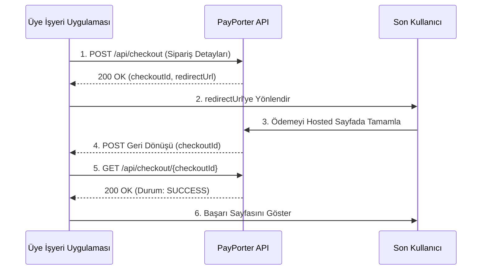

import ApiEndpoint from '@site/src/components/ApiEndpoint';
import ApiResponseSelector from '@site/src/components/ApiResponseSelector';
import Tabs from '@theme/Tabs';
import TabItem from '@theme/TabItem';

# Checkout

Güvenli bir ödeme sayfasında işlemleri gerçekleştirmek için bir checkout bağlantısı oluşturun. Bu, kart verilerinin PayPorter tarafından işlenmesi sayesinde PCI uyumluluk yükünüzü azaltır.

## 1. Checkout Bağlantısı Oluşturma (Create Checkout Link)

Müşterinizi yönlendirmek için benzersiz bir checkout URL'si oluşturun.

<ApiEndpoint method="POST" url="/api/checkout" />

### İstek Parametreleri (Request Parameters)

<Tabs>
  <TabItem value="table" label="Parametreler" default>

| Parametre | Zorunlu | Tip | Açıklama |
| :--- | :--- | :--- | :--- |
| orderId | Evet | string | Sipariş için benzersiz takip numaranız (örneğin, ORD-12345). |
| amount | Evet | number | İşlem tutarı (örneğin, 100.50). |
| currency | Evet | string | ISO para birimi kodu (örneğin, TRY). |
| description | Hayır | string | Satın alma işleminin kısa özeti. |
| callback | Evet | string | Ödeme işlendikten sonra çağrılacak URL. |
| customerId | Hayır | string | Müşteri için isteğe bağlı benzersiz tanımlayıcı. |
| maxInstallmentCount | Hayır | number | İzin verilen maksimum taksit sayısı (varsayılan: 1). |
| interestPaidByCustomer | Hayır | boolean | Taksit faizinin müşteri tarafından ödenip ödenmeyeceği (varsayılan: false). |

  </TabItem>
  <TabItem value="example" label="Örnek İstek">

```json
{
  "orderId": "ORD-12345",
  "amount": 100.50,
  "currency": "TRY",
  "description": "Ürün satın alma",
  "callback": "https://example.com/payment-callback",
  "maxInstallmentCount": 6,
  "interestPaidByCustomer": true
}
```

  </TabItem>
</Tabs>

### Yanıt (Response)

<Tabs>
  <TabItem value="fields" label="Yanıt Alanları" default>

| Alan | Tip | Açıklama |
| :--- | :--- | :--- |
| checkoutId | string | Checkout işlemi için benzersiz tanımlayıcı (UUID). |
| redirectUrl | string | Kullanıcıyı ödemeyi tamamlaması için yönlendireceğiniz URL. |

  </TabItem>
  <TabItem value="example" label="Örnek Yanıt">

<ApiResponseSelector>

```json status="200" title="Başarılı"
{
  "checkoutId": "123e4567-e89b-12d3-a456-426614174000",
  "redirectUrl": "https://api.example.com/checkout-link/123e4567-e89b-12d3-a456-426614174000"
}
```

</ApiResponseSelector>

  </TabItem>
</Tabs>

## 2. Kullanıcıyı Yönlendirme

`redirectUrl` parametresini aldıktan sonra, kullanıcının ödemesini PayPorter tarafından barındırılan güvenli sayfada tamamlaması için bu URL'ye yönlendirin.

## 3. Geri Dönüşün (Callback) İşlenmesi

Ödeme işlendikten sonra (başarılı veya başarısız), PayPorter form verisi olarak `checkoutId` parametresini içeren bir POST isteğini `callback` URL'nize gönderecektir.

## 4. Checkout Durumunu Sorgulama

Geri dönüş URL'sinde alınan `checkoutId` parametresini kullanarak işlemin nihai durumunu alın.

<ApiEndpoint method="GET" url="/api/checkout/{checkoutId}" />

### Yol Parametreleri (Path Parameters)

| Parametre | Tip | Açıklama |
| :--- | :--- | :--- |
| checkoutId | string | Geri dönüş URL'sinde alınan UUID. |

### Yanıt (Response)

Tamamlanmış ödeme ayrıntılarını içeren bir `ApiPaymentResponse` nesnesi döner (**Doğrudan Ödeme** yanıtıyla aynıdır).

---

## Checkout Akışı



1.  **Bağlantı Oluştur**: `/api/checkout` uç noktasını çağırın.
2.  **Yönlendir**: Kullanıcıyı `redirectUrl` adresine gönderin.
3.  **Bekle**: `callback` URL'nize gelen POST isteğini dinleyin.
4.  **Ayıkla**: Geri dönüş form verisinden `checkoutId` bilgisini alın.
5.  **Doğrula**: Nihai durumu almak için `/api/checkout/{checkoutId}` uç noktasını çağırın.
6.  **Onayla**: Yalnızca yanıtın `status` alanı `SUCCESS` ise ödemeyi başarılı kabul edin.

---

## Örnek Uygulama (JavaScript)

```javascript
// 1. Checkout bağlantısı oluşturma
const createCheckout = async (orderDetails) => {
  const response = await fetch('https://api.example.com/api/checkout', {
    method: 'POST',
    headers: {
      'Content-Type': 'application/json',
      'X-API-KEY': 'your_api_key_here',
      'X-API-SECRET': 'your_api_secret_here'
    },
    body: JSON.stringify(orderDetails)
  });
  const data = await response.json();
  return data.redirectUrl;
};

// 2. Geri dönüş işleyici (Express örneği)
app.post('/payment-callback', async (req, res) => {
  const checkoutId = req.body.checkoutId;
  const checkoutStatus = await getCheckoutStatus(checkoutId);
  
  if (checkoutStatus.status === 'SUCCESS') {
    // Başarılı ödemeyi işle
    console.log('Ödeme başarılı');
  } else {
    // Başarısız ödemeyi yönet
    console.log('Ödeme başarısız');
  }
  
  res.sendStatus(200);
});

// 3. Checkout durumunu sorgulama
const getCheckoutStatus = async (checkoutId) => {
  const response = await fetch(`https://api.example.com/api/checkout/${checkoutId}`, {
    method: 'GET',
    headers: {
      'X-API-KEY': 'your_api_key_here',
      'X-API-SECRET': 'your_api_secret_here'
    }
  });
  return await response.json();
};
```
