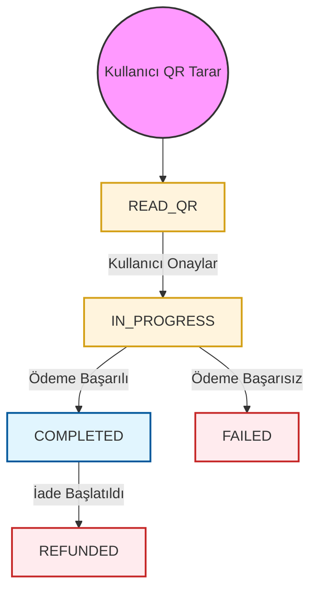

# QR Ödeme API'si

QR Ödeme hizmeti, kullanıcıların QR kodlarını tarayarak ödeme ve iade işlemlerini gerçekleştirmelerine olanak tanır. Bu hizmet, perakende ve POS ortamları için tasarlanmış olup kesintisiz ve güvenli bir ödeme deneyimi sunar.

## Ödeme Akışı

Standart QR ödeme süreci aşağıdaki adımları içerir:

1.  **QR Oku**: Kullanıcı satıcının QR kodunu tarar. Ham QR dizesi `/read` uç noktasına gönderilir.
2.  **Detayları Göster**: API, işlem detaylarını (satıcı adı, tutar vb.) kullanıcının uygulamasına döndürür.
3.  **Ödemeyi Onayla**: Kullanıcı işlemi onaylar (ve tutar sabit değilse isteğe bağlı olarak bir tutar girer). `/confirm` uç noktası çağrılır.
4.  **Asenkron İşleme**: PayPorter işlemi gerçekleştirir. Nihai sonuç, bir **Webhook** aracılığıyla ortağa iletilir.

## İşlem Durum Döngüsü

Aşağıdaki diyagram bir QR işleminin yaşam döngüsünü göstermektedir:

## QR Kod Durumları

| Durum Adı | Açıklama |
| :--- | :--- |
| **READ_QR** | Ödeme bilgisi API'si çağrıldı; QR verisi başarıyla alındı. |
| **IN_PROGRESS** | QR kodu onaylandı; işlem fon transferi sonucunu bekliyor. |
| **FAILED** | İşlem başarısız oldu; herhangi bir fon hareketi gerçekleşmedi. |
| **COMPLETED** | İşlem başarıyla tamamlandı. |

:::info Nihai Durum
Bir işlem **COMPLETED** veya **FAILED** durumuna ulaştığında nihai kabul edilir. Ortaklar, bu durum güncellemelerini almak için webhook'lara güvenmelidir.
:::
