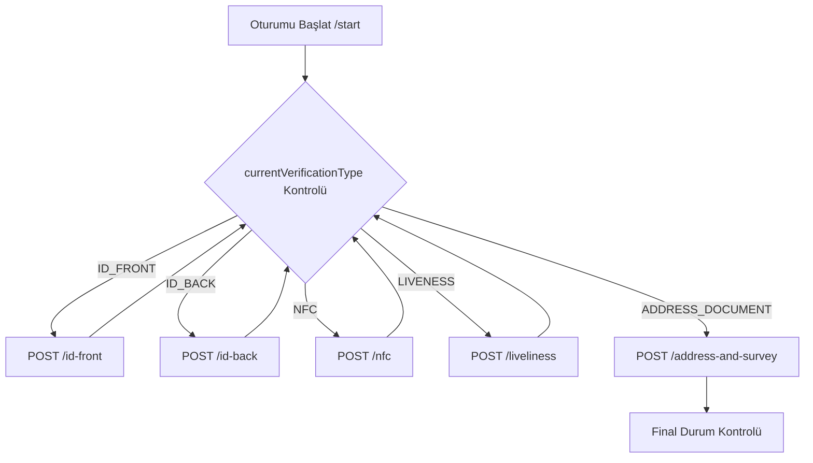

import ApiEndpoint from '@site/src/components/ApiEndpoint';
import ApiResponseSelector from '@site/src/components/ApiResponseSelector';
import TabItem from '@theme/TabItem';
import Tabs from '@theme/Tabs';

# Dijital KYC (SDK Tabanlı)

Gerçek zamanlı kimlik yakalama, NFC okuma ve canlılık tespiti (liveness) için mobil SDK entegrasyonu kullanan otomatik doğrulama.

:::important
İstemci, bir sonraki adımı belirlemek için her yanıttaki `status` ve `currentVerificationType` alanlarını kontrol etmelidir. `status` artık `IN_PROGRESS` olmayana kadar doğrulamaları göndermeye devam edin.
:::

## Dijital KYC Akışı



---

## SDK Yapılandırması

### iOS
- **SPM**: `https://github.com/Techsign/TechsignKYC` (versiyon `2.9.0-wrapper`)
- Bileşenler: `RKYC_iOS` (liveness), `passport_reader` (NFC), `id_card_detection_ios_wrapper` (kimlik yakalama)

### Android
```gradle
implementation 'com.techsign:id-card-detection-cnn:2.0.0'
implementation 'com.techsign:rkyc-cnn:2.1.9'
implementation 'com.techsign:passport-reader-cnn:1.1.5'
```

---

## Uç Noktalar

### Oturumu Başlat
<ApiEndpoint method="POST" url="/wallet/kyc/start" />

### Medya Gönder
- **Ön Yüz**: `POST /wallet/kyc/{kycId}/id-front`
- **Arka Yüz**: `POST /wallet/kyc/{kycId}/id-back`
- **Hologram Videosu**: `POST /wallet/kyc/{kycId}/holo`
- **NFC Verisi**: `POST /wallet/kyc/{kycId}/nfc`
- **Canlılık Videosu**: `POST /wallet/kyc/{kycId}/liveliness`
- **Final Anketi**: `POST /wallet/kyc/{kycId}/address-and-survey`

### NFC Hata Yönetimi
<ApiEndpoint method="POST" url="/wallet/kyc/{kycId}/nfc/error" />

---

## Yanıt Referansı

<Tabs>
  <TabItem value="status" label="Dijital KYC Durumu" default>

| Kod | Açıklama |
|------|-------------|
| `IN_PROGRESS` | Doğrulama adımları devam ediyor |
| `FAILED` | İşlem başarısız oldu (yeniden başlatma gerektirir) |
| `WAITING_FOR_BANK_TRANSFER` | Banka transferi doğrulaması gerekiyor |
| `WAITING_APPROVAL` | Manuel uyum incelemesinde |
| `APPROVED` | Doğrulama başarılı |

  </TabItem>
  <TabItem value="errors" label="Hata Kodları">

| Kod | Neden |
|------|--------|
| `THRESHOLDS_NOT_MET` | Görüntü kalitesi/eşleşme çok düşük |
| `ID_EXPIRED` | Belge geçerli değil |
| `NFC_NO_CONNECTION` | Çip okunamadı |
| `RETRY_COUNT_EXCEEDED` | Çok fazla başarısız deneme |

  </TabItem>

</Tabs>