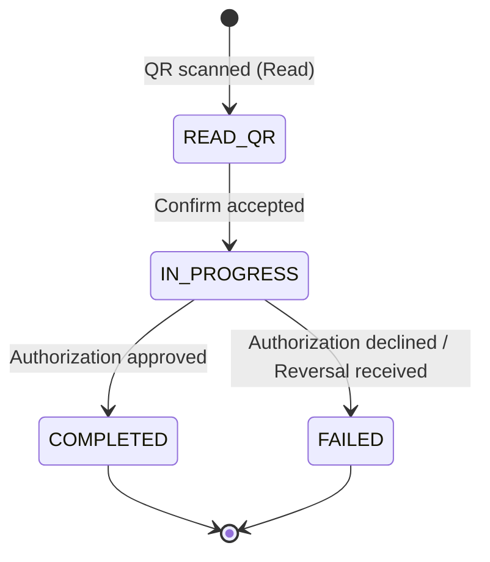
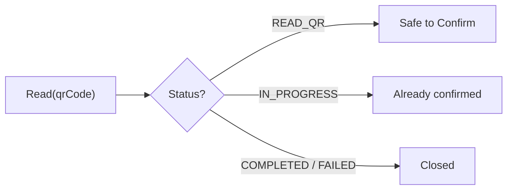
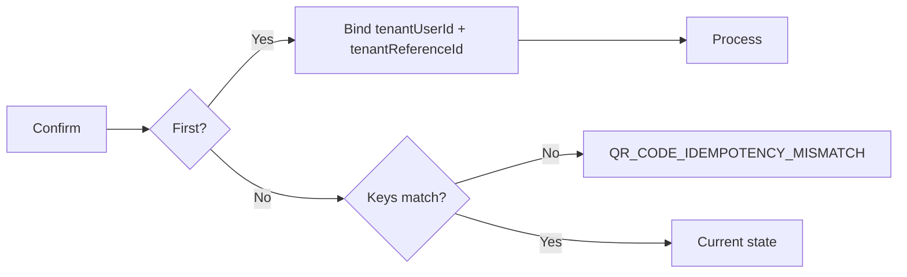

# QR Code API Documentation

## Version History

| Version | Date | Changes |
| :--- | :--- | :--- |
| 1.2.0 | 2026-04-28 | Added Idempotency & Deduplication section. Added Transaction State Machine with finality rules. Added Error Codes table. Documented amount format conventions. Documented partial/multiple refund and cancellation equivalence. Added `tenantReferenceId` uniqueness constraint. |
| 1.1.0 | 2026-04-28 | Added `transactionSource`, `acquirerId` fields. Added Balance Inquiry endpoint. Added response field tables. Updated webhook signing to RSA-SHA256. Documented refund 180s webhook delay. |
| 1.0.1 | 2026-04-08 | Updated field requirements and refined length constraints for Read and Confirm APIs. |
| 1.0.0 | 2026-03-20 | Initial version. |


## Table of Contents

- [Version History](#version-history)
- [Authentication](#authentication)
- [Amount Format](#amount-format)
- [QR Code Payment Object](#qr-code-payment-object)
- [QR Code Transaction Types](#qr-code-transaction-types)
- [QR Code Statuses & State Machine](#qr-code-statuses--state-machine)
- [Transaction Source Types](#transaction-source-types)
- [Terminal Types](#terminal-types)
- [Idempotency, Safe Retries & Deduplication](#idempotency-safe-retries--deduplication)
- [Error Response Format](#error-response-format)
- [QR Code Flow Diagrams](#qr-code-flow-diagrams)
- [QR Code Info (READ)](#qr-code-info-read)
- [Confirm QR Payment](#confirm-qr-payment)
- [QR Code Query Transaction](#qr-code-query-transaction)
- [QR Transaction Webhook](#qr-transaction-webhook)
- [Reconciliation Search](#reconciliation-search)
- [Balance Inquiry](#balance-inquiry)
- [Mock APIs](#mock-apis-sandbox-only)


---

## Authentication

All API requests require authentication via API key/secret and a security key.
Security key is constructed from walletId and public RSA key provided by us.


### API Key Authentication (Server-to-Server)

Include these headers in every request:

| Header | Description                | Example                                |
|--------|----------------------------|----------------------------------------|
| `X-Api-Key` | Provided api key           | `a208c005-17a2-441a-b3e9-58b6e0d6c082` |
| `X-Api-Secret` | Provided api secret       | `3208c005-17a6-441a-b3e9-58b6e0d6c082` |
| `X-Wallet-Id` | Target wallet identifier   | `1234567890`                           |
| `X-Security-Key` | Encrypted secure data token | Base64 string                          |

### Authentication Errors

| HTTP Status | Condition | Description |
|-------------|-----------|-------------|
| `401 Unauthorized` | Invalid `X-Api-Key` or `X-Api-Secret` | The API credentials are missing, expired, or incorrect. |
| `403 Forbidden` | Invalid `X-Security-Key` for the given `X-Wallet-Id` | The security key could not be decrypted or does not match the target wallet. |

---

### X-Security-Key Header Generation

You need to have a `walletId` and its corresponding RSA public key (`accessKey`) stored in previous step to generate the `X-Security-Key` header for authenticated requests.
The `X-Security-Key` header contains encrypted wallet authentication data.

#### 1. Data Structure

Create a JSON payload with the following fields:

| Field | Type | Description |
|-------|------|-------------|
| `walletId` | String | The wallet ID |
| `timestamp` | String | ISO 8601 format: `yyyy-MM-dd'T'HH:mm:ss.SSS'Z'` |

**Example:**

```json
{
  "walletId": "16250953",
  "timestamp": "2023-10-27T10:00:00.123Z"
}
```

#### 2. Encryption

Encrypt the JSON string using RSA:

| Parameter | Value |
|-----------|-------|
| Algorithm | RSA |
| Mode | ECB |
| Padding | PKCS1Padding (PKCS#1 v1.5) |
| Key | Wallet's RSA Public Key (X.509 encoded) |

#### 3. Encoding

Base64 encode the encrypted byte array.

#### Example (JavaScript)

```javascript
const publicKeyPEM = "RSA PUBLIC KEY of walletId 1234567890";
const payload = {
  walletId: "1234567890",
  timestamp: "2026-01-07T09:40:16.524Z"
};
const secureData = await RSA.encrypt(JSON.stringify(payload), publicKeyPEM);
```

#### Reference Implementations

Complete examples are available in the `secure-data-generation/` folder:

- [Java](./example.java)
- [Go](./example.go)
- [PHP](./example.php)


---

### Amount Format

All monetary values are represented as **strings** with a fixed decimal pattern.

| Rule | Detail |
|------|--------|
| Currency | TRY (Turkish Lira) |
| Type | `String` |
| Pattern | `999999999.99` — up to 9 integer digits, dot, exactly 2 decimal digits |
| Examples | `"11.50"`, `"84.00"`, `"0.01"` |
| Sign | Always positive. The direction (debit/credit) is determined by `transactionType`. |

> All amounts are denominated in TRY. No FX conversion is applied.

---


### QR Code Payment Object

The QR Code Payment Object is the common response model returned by Read, Confirm, Query, and Webhook endpoints.

| Field | Type | Presence | Length | Description |
| :--- | :--- | :--- | :--- | :--- |
| `transactionId` | String | Always | 11 | Unique transaction identifier (11-digit numeric). |
| `tenantReferenceId` | String | After Confirm | 100 | Partner's unique reference ID. `null` before Confirm and for externally triggered refunds. |
| `tenantUserId` | String | After Confirm | 50 | The tenant's user identifier. `null` before Confirm. |
| `parentTransactionId` | String | Refund only | 11 | Original payment transaction ID. Only present for REFUND transactions. |
| `transactionType` | String | Always | 10 | `PAYMENT` or `REFUND`. See [QR Code Transaction Types](#qr-code-transaction-types). |
| `transactionSource` | String | Always | 30 | Source of the transaction. See [Transaction Source Types](#transaction-source-types). |
| `status` | String | Always | 20 | Transaction status. See [QR Code Statuses](#qr-code-statuses--state-machine). |
| `amount` | String | Always | 12 | Transaction amount (pattern `999999999.99`). `null` for static QR at Read phase. |
| `qrGenerationDate` | String | Always | 24 | QR generation timestamp (RFC 3339, e.g. `2024-05-15T14:30:00Z`). |
| `qrExpireDate` | String | Always | 24 | QR expiration timestamp (RFC 3339). |
| `currency` | String | Always | 3 | Currency code (e.g., `TRY`). |
| `merchantId` | String | Always | 20 | Merchant's unique BKM identifier. |
| `acquirerId` | String | Always | 20 | Acquirer identifier (BKM acquirer ID). |
| `mcc` | String | Always | 4 | Merchant Category Code. |
| `merchantName` | String | Always | 100 | Merchant name. |
| `countryCode` | String | Always | 2 | Country code (ISO 3166-1 alpha-2). |
| `merchantCity` | String | Always | 50 | Merchant city. |
| `terminalType` | String | Always | 30 | Terminal type. See [Terminal Types](#terminal-types). |
| `terminalId` | String | Always | 50 | Terminal identifier. |

---


### QR Code Transaction Types
| Code           | Description |
|----------------|-------------|
| PAYMENT        | PAYMENT     |
| REFUND         | REFUND      |


### QR Code Statuses & State Machine
| Code        | Type | Description |
|-------------|------|-------------|
| `READ_QR`     | Intermediate | QR code has been read; transaction is awaiting Confirm. |
| `IN_PROGRESS` | Intermediate | Confirm accepted; awaiting asynchronous authorization result. |
| `COMPLETED`   | **Final** | Transaction completed successfully. |
| `FAILED`      | **Final** | Transaction failed (authorization declined or reversal received). |

> **Finality guarantee:** `COMPLETED` and `FAILED` are **irreversible terminal states**. Once a transaction reaches either status, it will never change. Refunds or reversals of a completed payment are represented as separate `REFUND` transactions linked via `parentTransactionId`.

#### State Transitions



- A transaction can only move forward; backward transitions are not possible.
- `Query` and `Reconciliation` use the same status definitions.


### Transaction Source Types
| Code                     | Description                                          |
|--------------------------|------------------------------------------------------|
| `MERCHANT_QR_SCAN`       | User scanned merchant QR code (online transaction)   |
| `DISPUTE`                | User's complaint succeeded                           |
| `LATE_REVERSAL`          | Technical reversal                                   |
| `USER_NOT_PRESENT_REFUND`| Merchant reversed while customer is not present      |


### Terminal Types
| Code                       | Description                  |
|----------------------------|------------------------------|
| `POS`                      | Physical POS terminal        |
| `STATIC_QRCODE`            | Static QR code on merchant display |
| `MERCHANT_MOBILE_APP`      | Merchant mobile application  |
| `WEB`                      | Web terminal                 |
| `ATM`                      | ATM terminal                 |
| `PAYMENT_SERVICE_PROVIDER` | Payment service provider     |


### Idempotency, Safe Retries & Deduplication

PayPorter enforces safe retry behavior at every stage to prevent duplicate debits and ensure reliable integrations.

#### Read Retry Behaviour

Repeated `Read` calls on the same QR code return the **current state** of the transaction:

| Scenario | `transactionId` across repeated Reads | Behaviour |
|----------|---------------------------------------|----------|
| Payment — dynamic QR (amount in QR) | Same `transactionId` returned | Only one Confirm can succeed |
| Payment — static QR (user enters amount) | New `transactionId` per Read | Multiple Confirms may succeed (each is a distinct transaction) |
| Refund | Same `transactionId` returned | Only one Confirm can succeed |



#### Confirm Idempotency

The first successful Confirm binds the transaction to the caller's identity. Subsequent retries are validated against the bound values.

**Idempotency keys** (checked on retry):

| Transaction Type | Key fields |
|-----------------|------------|
| **Payment** | `transactionId` + `tenantUserId` + `tenantReferenceId` |
| **Refund** | `transactionId` + `tenantUserId` |

If any key field does not match the original Confirm, the request is rejected with `QR_CODE_IDEMPOTENCY_MISMATCH`.

**Uniqueness constraint** (checked on first Confirm):

`tenantReferenceId` must be unique across all payment transactions. Reusing a previously consumed `tenantReferenceId` on a *different* transaction returns `TENANT_REFERENCE_ID_ALREADY_USED`. This is independent of idempotency — it prevents duplicate payment references.

| Scenario | Behaviour |
|----------|----------|
| First Confirm | Binds `tenantUserId` and `tenantReferenceId` (if payment) to the transaction. Processes and returns `IN_PROGRESS`. |
| Retry — all key fields match | Returns the **current transaction state** (which may now be `COMPLETED` or `FAILED`). No duplicate financial record is created. |
| Retry — `tenantUserId` differs | Returns `QR_CODE_IDEMPOTENCY_MISMATCH` (HTTP 409) |
| Retry — `tenantReferenceId` differs (payment only) | Returns `QR_CODE_IDEMPOTENCY_MISMATCH` (HTTP 409) |
| New transaction — `tenantReferenceId` already used by another payment | Returns `TENANT_REFERENCE_ID_ALREADY_USED` (HTTP 409) |



#### Query Idempotency

Repeated queries with the same identifier always return consistent, up-to-date results.

---

### Error Response Format

All errors use the same JSON envelope. The HTTP status code indicates the error category:

| HTTP Status | Category | When |
|-------------|----------|------|
| `422 Unprocessable Entity` | Validation | Missing or invalid request fields |
| `409 Conflict` | Idempotency / Uniqueness | Key mismatch or duplicate reference |
| `500 Internal Server Error` | System | Unexpected internal failure |

```json
{
  "status": "error",
  "code": "<ERROR_CODE>",
  "message": "<Human-readable description>"
}
```

Endpoint-specific error codes are listed in each API section below.

---

### QR Code Flow Diagrams

#### Payment Flow (Dynamic QR)

```mermaid
sequenceDiagram
    participant User
    participant Partner
    participant PayPorter
    participant BKM_Switch as BKM Switch

    rect rgb(40, 40, 60)
    Note over User, PayPorter: Synchronous – Read & Confirm
    User->>Partner: Scans merchant QR code
    Partner->>PayPorter: POST /qrcode/payment/read<br/>{qrCode}
    PayPorter->>BKM_Switch: Parse & validate QR
    BKM_Switch-->>PayPorter: Transaction info
    PayPorter-->>Partner: 200 OK<br/>{status: READ_QR}

    alt amount is null (Static QR)
        Partner->>User: Show amount input UI
        User->>Partner: Enters amount
    end

    Partner->>Partner: Debit customer account
    Partner->>PayPorter: POST /qrcode/payment/confirm<br/>{transactionId, tenantReferenceId, tenantUserId, amount}
    PayPorter->>BKM_Switch: Initiate transaction
    BKM_Switch-->>PayPorter: Accepted
    PayPorter-->>Partner: 200 OK<br/>{status: IN_PROGRESS}
    end

    rect rgb(50, 40, 40)
    Note over Partner, BKM_Switch: Asynchronous – Authorization & Webhook
    BKM_Switch->>PayPorter: Authorization request
    PayPorter-->>BKM_Switch: Approved
    PayPorter-->>Partner: Webhook POST<br/>{status: COMPLETED}
    Partner-->>PayPorter: 200 OK
    end
```



#### Refund Flow (QR Scan – 180s Window)

```mermaid
sequenceDiagram
    participant User
    participant Partner
    participant PayPorter
    participant BKM_Switch as BKM Switch

    rect rgb(40, 40, 60)
    Note over User, PayPorter: Synchronous – Read & Confirm
    User->>Partner: Scans refund QR at merchant
    Partner->>PayPorter: POST /qrcode/payment/read<br/>{qrCode}
    PayPorter-->>Partner: 200 OK<br/>{transactionType: REFUND, status: READ_QR,<br/>parentTransactionId}

    Partner->>PayPorter: POST /qrcode/payment/confirm<br/>{transactionId, amount, tenantUserId}
    PayPorter->>BKM_Switch: Initiate refund transaction
    BKM_Switch-->>PayPorter: Accepted
    PayPorter-->>Partner: 200 OK<br/>{status: IN_PROGRESS}
    end

    rect rgb(50, 40, 40)
    Note over Partner, BKM_Switch: Asynchronous – Authorization & 180s Window
    BKM_Switch->>PayPorter: Refund authorization request
    PayPorter-->>BKM_Switch: Approved
    PayPorter->>PayPorter: Credits settlement account

    Note over PayPorter: 180-second window<br/>(POS technical cancel window)

    alt No REVERSAL received within 180s
        PayPorter-->>Partner: Webhook POST<br/>{status: COMPLETED}
        Partner->>Partner: Credits user account
    else REVERSAL OF REFUND received within 180s
        BKM_Switch->>PayPorter: REVERSAL OF REFUND
        PayPorter->>PayPorter: Cancels settlement credit
        PayPorter-->>Partner: Webhook POST<br/>{status: FAILED}
        Note over Partner: DO NOT credit user
    end
    end
```



#### Late Reversal / Dispute / User-Not-Present Refund Flow

```mermaid
sequenceDiagram
    participant BKM_Switch as BKM Switch/Dispute
    participant PayPorter
    participant Partner

    rect rgb(50, 40, 40)
    Note over BKM_Switch, Partner: Asynchronous – Externally triggered
    Note over BKM_Switch, PayPorter: Triggered externally<br/>(dispute, late reversal,<br/>merchant-initiated refund)

    BKM_Switch->>PayPorter: Refund/reversal message
    PayPorter->>PayPorter: Creates REFUND transaction<br/>linked to parentTransactionId

    PayPorter-->>Partner: Webhook POST<br/>{status: COMPLETED,<br/>tenantReferenceId: null,<br/>transactionSource: DISPUTE |<br/>LATE_REVERSAL | USER_NOT_PRESENT_REFUND}
    Partner->>Partner: Credits user account
    end
```




## QR Code Info (READ)
`POST /wallet/qrcode/payment/read`

Returns transaction details for a scanned QR code. The `transactionType` field indicates whether this is a `PAYMENT` or `REFUND`.

### Read Request Body
| Field | Type | Required | Length | Description |
| :--- | :--- | :--- | :--- | :--- |
| `qrCode` | String | Yes | 500 | The QR code string scanned by the camera. |

Example:
```json
{
  "qrCode": "999998261035605117b00490089854ce1ed71c8898da336966E827"
}
```

### Read Error Codes
See [Error Response Format](#error-response-format).

| Code | Description |
|------|-------------|
| `QR_CODE_EMPTY` | The `qrCode` field is missing or blank. |
| `QR_CODE_NOT_FOUND` | No transaction found for the given QR code. |
| `QR_CODE_EXPIRED` | The QR code has expired. |
| `QR_CODE_TRANSACTION_ERROR` | A processing error occurred while reading the QR code. |

### Read Response - Payment
> [!WARNING]
> If the returned `amount` is `null`, the partner presents an amount entry UI to the user before proceeding.

| Field | Type | Required | Length | Description |
| :--- | :--- | :--- | :--- | :--- |
| `transactionId` | String | Yes | 11 | Unique transaction identifier. |
| `transactionType` | String | Yes | 10 | `PAYMENT` or `REFUND`. |
| `transactionSource` | String | Yes | 30 | Source of the transaction. See [Transaction Source Types](#transaction-source-types). |
| `status` | String | Yes | 20 | Transaction status. See [QR Code Statuses](#qr-code-statuses--state-machine). |
| `amount` | String | No | 9, 2 | Transaction amount. `null` for static QR (user enters amount). |
| `qrGenerationDate` | String | Yes | 24 | QR generation timestamp (ISO 8601). |
| `qrExpireDate` | String | Yes | 24 | QR expiration timestamp (ISO 8601). |
| `currency` | String | Yes | 3 | Currency code (e.g., `TRY`). |
| `merchantId` | String | Yes | 20 | Merchant's unique BKM identifier. |
| `acquirerId` | String | Yes | 20 | Acquirer identifier (BKM acquirer ID). |
| `mcc` | String | Yes | 4 | Merchant Category Code. |
| `merchantName` | String | Yes | 100 | Merchant name. |
| `countryCode` | String | Yes | 2 | Country code (ISO 3166-1 alpha-2). |
| `merchantCity` | String | Yes | 50 | Merchant city. |
| `terminalType` | String | Yes | 30 | Terminal type. See [Terminal Types](#terminal-types). |
| `terminalId` | String | Yes | 50 | Terminal identifier. |

```json
{
  "transactionId": "47002323201",
  "transactionType": "PAYMENT",
  "transactionSource": "MERCHANT_QR_SCAN",
  "status": "READ_QR",
  "amount": "11.50",
  "qrGenerationDate": "2025-07-14T15:53:21Z",
  "qrExpireDate": "2026-07-14T15:53:21Z",
  "currency": "TRY",
  "merchantId": "98765433210",
  "acquirerId": "0010",
  "mcc": "5411",
  "merchantName": "Lezzet Lokantası",
  "countryCode": "TR",
  "merchantCity": "ANTALYA",
  "terminalType": "STATIC_QRCODE",
  "terminalId": "12345678901234567890ABC"
}
```

### Read Response - Refund

> **Cancellation equivalence:** BKM `transactionType = 3` (Cancellation) is treated identically to `transactionType = 4` (Refund). Both are returned as `transactionType: REFUND` in the API response.

> **Partial & multiple refunds:** Partial refund amounts are supported. The same original payment may be refunded multiple times, each producing a separate REFUND transaction linked via `parentTransactionId`. The refund amount in the QR code is fixed by the merchant POS and cannot be modified during Confirm.

| Field | Type | Required | Length | Description |
| :--- | :--- | :--- | :--- | :--- |
| `transactionId` | String | Yes | 11 | Unique transaction identifier. |
| `parentTransactionId` | String | Yes | 11 | Original payment transaction ID. |
| `transactionType` | String | Yes | 10 | `REFUND`. |
| `transactionSource` | String | Yes | 30 | Source of the transaction. See [Transaction Source Types](#transaction-source-types). |
| `status` | String | Yes | 20 | Transaction status. See [QR Code Statuses](#qr-code-statuses--state-machine). |
| `amount` | String | Yes | 9, 2 | Refund amount. |
| `qrGenerationDate` | String | Yes | 24 | QR generation timestamp (ISO 8601). |
| `qrExpireDate` | String | Yes | 24 | QR expiration timestamp (ISO 8601). |
| `currency` | String | Yes | 3 | Currency code (e.g., `TRY`). |
| `merchantId` | String | Yes | 20 | Merchant's unique BKM identifier. |
| `acquirerId` | String | Yes | 20 | Acquirer identifier (BKM acquirer ID). |
| `mcc` | String | Yes | 4 | Merchant Category Code. |
| `merchantName` | String | Yes | 100 | Merchant name. |
| `countryCode` | String | Yes | 2 | Country code (ISO 3166-1 alpha-2). |
| `merchantCity` | String | Yes | 50 | Merchant city. |
| `terminalType` | String | Yes | 30 | Terminal type. See [Terminal Types](#terminal-types). |
| `terminalId` | String | Yes | 50 | Terminal identifier. |

```json
{
  "transactionId": "47002323302",
  "parentTransactionId": "47002323201",
  "transactionType": "REFUND",
  "transactionSource": "MERCHANT_QR_SCAN",
  "status": "READ_QR",
  "amount": "11.50",
  "qrGenerationDate": "2025-07-14T15:53:21Z",
  "qrExpireDate": "2026-07-14T15:53:21Z",
  "currency": "TRY",
  "merchantId": "98765433210",
  "acquirerId": "0010",
  "mcc": "5411",
  "merchantName": "Lezzet Lokantası",
  "countryCode": "TR",
  "merchantCity": "ANTALYA",
  "terminalType": "STATIC_QRCODE",
  "terminalId": "12345678901234567890ABC"
}
```

## Confirm QR Payment
`POST /wallet/qrcode/payment/confirm`

- For payments, the partner debits the resolved amount from the customer's account **before** calling Confirm.
- For refunds, the partner must **wait for the webhook** to credit the amount to the customer's account.
- When the returned status is `IN_PROGRESS`, the final result will be notified asynchronously via the [Webhook](#qr-transaction-webhook).

> [!IMPORTANT]
> **Failure handling:** If Confirm returns a synchronous error or the webhook delivers `status: FAILED`, the partner must **reverse the debit** and credit the amount back to the customer's account. Always treat `IN_PROGRESS` as pending — do not finalise until a `COMPLETED` or `FAILED` webhook is received.

### Confirm Request Body
| Field | Type | Required | Length | Description |
| :--- | :--- | :--- | :--- | :--- |
| `transactionId` | String | Yes | 11 | The unique identifier of the transaction. |
| `tenantReferenceId` | String | Conditional | 100 | Required for PAYMENT. Optional for REFUND. **Must be unique per payment** — reuse across different transactions returns `TENANT_REFERENCE_ID_ALREADY_USED`. |
| `amount` | String | Yes | 12 | The transaction amount (pattern `999999999.99`). |
| `tenantUserId` | String | Yes | 50 | The unique identifier of the tenant's user/customer. |
| `tenantName` | String | No | 50 | The name of the tenant user. |
| `tenantSurname` | String | No | 50 | The surname of the tenant user. |
| `tenantNationality` | String | No | 3 | Nationality of the tenant user (ISO 3166-1 alpha-3, e.g. `TUR`). |
| `tenantBirthDate` | String | No | 10 | Birth date of the tenant user (ISO 8601 date, e.g. `1996-12-28`). |

Example:
```json
{
  "transactionId": "47002323201",
  "tenantReferenceId": "08e6e4d3-7031-4f0a-bc90-3235aaa2600c",
  "amount": "11.50",
  "tenantUserId": "364",
  "tenantName": "Tahir",
  "tenantSurname": "incedere",
  "tenantNationality": "TUR",
  "tenantBirthDate": "1996-12-28"
}
```

### Confirm Error Codes
See [Error Response Format](#error-response-format).

| Code | Description |
|------|-------------|
| `QR_CODE_TRANSACTION_ID_EMPTY` | The `transactionId` field is missing or blank. |
| `QR_CODE_TENANT_USER_ID_EMPTY` | The `tenantUserId` field is missing. |
| `QR_CODE_TENANT_REFERENCE_ID_EMPTY` | The `tenantReferenceId` field is missing (required for payments). |
| `QR_CODE_AMOUNT_EMPTY` | The `amount` field is missing. |
| `QR_CODE_AMOUNT_INVALID` | The `amount` field is invalid (for example, it is 0 or negative). |
| `QR_CODE_TRANSACTION_NOT_FOUND` | No transaction found for the given identifier. |
| `QR_CODE_AMOUNT_MISMATCH` | The provided amount does not match the amount in the QR code (dynamic QR). |
| `QR_CODE_EXPIRED` | The QR code has expired. |
| `QR_CODE_TRANSACTION_ERROR` | A processing error occurred during BKM authorization. |
| `QR_CODE_IDEMPOTENCY_MISMATCH` | The `tenantUserId` or `tenantReferenceId` (if payment) does not match the values from the original Confirm. |
| `TENANT_REFERENCE_ID_ALREADY_USED` | The `tenantReferenceId` has already been used by a different transaction. |

### Confirm Response - Payment

| Field | Type | Required | Length | Description |
| :--- | :--- | :--- | :--- | :--- |
| `transactionId` | String | Yes | 11 | Unique transaction identifier. |
| `tenantReferenceId` | String | Yes | 100 | Partner's unique reference ID. |
| `tenantUserId` | String | Yes | 50 | The tenant's user identifier. |
| `transactionType` | String | Yes | 10 | `PAYMENT` or `REFUND`. |
| `transactionSource` | String | Yes | 30 | Source of the transaction. See [Transaction Source Types](#transaction-source-types). |
| `status` | String | Yes | 20 | Transaction status. See [QR Code Statuses](#qr-code-statuses--state-machine). |
| `amount` | String | Yes | 9, 2 | Transaction amount. |
| `qrGenerationDate` | String | Yes | 24 | QR generation timestamp (ISO 8601). |
| `qrExpireDate` | String | Yes | 24 | QR expiration timestamp (ISO 8601). |
| `currency` | String | Yes | 3 | Currency code (e.g., `TRY`). |
| `merchantId` | String | Yes | 20 | Merchant's unique BKM identifier. |
| `acquirerId` | String | Yes | 20 | Acquirer identifier (BKM acquirer ID). |
| `mcc` | String | Yes | 4 | Merchant Category Code. |
| `merchantName` | String | Yes | 100 | Merchant name. |
| `countryCode` | String | Yes | 2 | Country code (ISO 3166-1 alpha-2). |
| `merchantCity` | String | Yes | 50 | Merchant city. |
| `terminalType` | String | Yes | 30 | Terminal type. See [Terminal Types](#terminal-types). |
| `terminalId` | String | Yes | 50 | Terminal identifier. |

```json
{
  "transactionId": "47002323201",
  "tenantReferenceId": "08e6e4d3-7031-4f0a-bc90-3235aaa2600c",
  "tenantUserId": "364",
  "transactionType": "PAYMENT",
  "transactionSource": "MERCHANT_QR_SCAN",
  "status": "IN_PROGRESS",
  "amount": "11.50",
  "qrGenerationDate": "2025-07-14T15:53:21Z",
  "qrExpireDate": "2026-07-14T15:53:21Z",
  "currency": "TRY",
  "merchantId": "98765433210",
  "acquirerId": "0010",
  "mcc": "5411",
  "merchantName": "Lezzet Lokantası",
  "countryCode": "TR",
  "merchantCity": "ANTALYA",
  "terminalType": "STATIC_QRCODE",
  "terminalId": "12345678901234567890ABC"
}
```

### Confirm Response - Refund

| Field | Type | Required | Length | Description |
| :--- | :--- | :--- | :--- | :--- |
| `transactionId` | String | Yes | 11 | Unique transaction identifier. |
| `parentTransactionId` | String | Yes | 11 | Original payment transaction ID. |
| `tenantReferenceId` | String | No | 100 | Partner's unique reference ID (optional for refunds). |
| `tenantUserId` | String | Yes | 50 | The tenant's user identifier. |
| `transactionType` | String | Yes | 10 | `REFUND`. |
| `transactionSource` | String | Yes | 30 | Source of the transaction. See [Transaction Source Types](#transaction-source-types). |
| `status` | String | Yes | 20 | Transaction status. See [QR Code Statuses](#qr-code-statuses--state-machine). |
| `amount` | String | Yes | 9, 2 | Refund amount. |
| `qrGenerationDate` | String | Yes | 24 | QR generation timestamp (ISO 8601). |
| `qrExpireDate` | String | Yes | 24 | QR expiration timestamp (ISO 8601). |
| `currency` | String | Yes | 3 | Currency code (e.g., `TRY`). |
| `merchantId` | String | Yes | 20 | Merchant's unique BKM identifier. |
| `acquirerId` | String | Yes | 20 | Acquirer identifier (BKM acquirer ID). |
| `mcc` | String | Yes | 4 | Merchant Category Code. |
| `merchantName` | String | Yes | 100 | Merchant name. |
| `countryCode` | String | Yes | 2 | Country code (ISO 3166-1 alpha-2). |
| `merchantCity` | String | Yes | 50 | Merchant city. |
| `terminalType` | String | Yes | 30 | Terminal type. See [Terminal Types](#terminal-types). |
| `terminalId` | String | Yes | 50 | Terminal identifier. |

```json
{
  "transactionId": "47002323302",
  "parentTransactionId": "47002323201",
  "tenantReferenceId": "18f7e5d4-8142-5g1b-cd01-4346bbb3701d",
  "tenantUserId": "364",
  "transactionType": "REFUND",
  "transactionSource": "MERCHANT_QR_SCAN",
  "status": "IN_PROGRESS",
  "amount": "11.50",
  "qrGenerationDate": "2025-07-14T15:53:21Z",
  "qrExpireDate": "2026-07-14T15:53:21Z",
  "currency": "TRY",
  "merchantId": "98765433210",
  "acquirerId": "0010",
  "mcc": "5411",
  "merchantName": "Lezzet Lokantası",
  "countryCode": "TR",
  "merchantCity": "ANTALYA",
  "terminalType": "STATIC_QRCODE",
  "terminalId": "12345678901234567890ABC"
}
```


## QR Code Query Transaction
`GET /wallet/qrcode/transactions`

- Finds and returns the details of a QR transaction by either `transactionId` or `tenantReferenceId` (exactly one must be provided).
- This endpoint can also be used to query externally triggered refunds (disputes, late reversals) using the `transactionId` received via webhook.

Query Parameters:
| Parameter | Type | Required | Length | Description |
| :--- | :--- | :--- | :--- | :--- |
| `transactionId` | String | If `tenantReferenceId` empty | 11 | PayPorter transaction ID. |
| `tenantReferenceId` | String | If `transactionId` empty | 100 | Partner's unique reference ID. |

### Query Error Codes
See [Error Response Format](#error-response-format).

| Code | Description |
|------|-------------|
| `QR_CODE_TRANSACTION_NOT_FOUND` | No transaction found for the given identifier. |
| `QR_CODE_QUERY_IDENTIFIER_EMPTY` | The `transactionId` and `tenantReferenceId` fields are both missing or blank. |

Response:

| Field | Type | Required | Length | Description |
| :--- | :--- | :--- | :--- | :--- |
| `transactionId` | String | Yes | 11 | Unique transaction identifier. |
| `tenantReferenceId` | String | No | 100 | Partner's unique reference ID. `null` for externally triggered refunds. |
| `tenantUserId` | String | No | 50 | The tenant's user identifier. `null` for externally triggered refunds. |
| `parentTransactionId` | String | No | 11 | Original payment transaction ID (for refunds). |
| `transactionType` | String | Yes | 10 | `PAYMENT` or `REFUND`. |
| `transactionSource` | String | Yes | 30 | Source of the transaction. See [Transaction Source Types](#transaction-source-types). |
| `status` | String | Yes | 20 | Transaction status. See [QR Code Statuses](#qr-code-statuses--state-machine). |
| `amount` | String | Yes | 9, 2 | Transaction amount. |
| `qrGenerationDate` | String | Yes | 24 | QR generation timestamp (ISO 8601). |
| `qrExpireDate` | String | Yes | 24 | QR expiration timestamp (ISO 8601). |
| `currency` | String | Yes | 3 | Currency code (e.g., `TRY`). |
| `merchantId` | String | Yes | 20 | Merchant's unique BKM identifier. |
| `acquirerId` | String | Yes | 20 | Acquirer identifier (BKM acquirer ID). |
| `mcc` | String | Yes | 4 | Merchant Category Code. |
| `merchantName` | String | Yes | 100 | Merchant name. |
| `countryCode` | String | Yes | 2 | Country code (ISO 3166-1 alpha-2). |
| `merchantCity` | String | Yes | 50 | Merchant city. |
| `terminalType` | String | Yes | 30 | Terminal type. See [Terminal Types](#terminal-types). |
| `terminalId` | String | Yes | 50 | Terminal identifier. |

```json
{
  "transactionId": "47002323201",
  "tenantReferenceId": "08e6e4d3-7031-4f0a-bc90-3235aaa2600c",
  "tenantUserId": "364",
  "transactionType": "PAYMENT",
  "transactionSource": "MERCHANT_QR_SCAN",
  "status": "IN_PROGRESS",
  "amount": "84.00",
  "qrGenerationDate": "2025-07-14T15:53:21Z",
  "qrExpireDate": "2026-07-14T15:53:21Z",
  "currency": "TRY",
  "merchantId": "98765433210",
  "acquirerId": "0010",
  "mcc": "5411",
  "merchantName": "Lezzet Lokantası",
  "countryCode": "TR",
  "merchantCity": "ANTALYA",
  "terminalType": "STATIC_QRCODE",
  "terminalId": "12345678901234567890ABC"
}
```


## QR Transaction Webhook


PayPorter sends a `POST` request to the Partner webhook at `/partner/qrcode/webhook` whenever a transaction occurs. Once finalized, the result of `IN_PROGRESS` operations will be sent as `COMPLETED` or `FAILED`.

> [!WARNING]
> **Refund webhook delay**: For credit-direction transactions (REFUND), the webhook with `COMPLETED` status is sent at minimum **180 seconds** after the authorization is approved. This allows the POS terminal's technical cancel window to close. If PayPorter receives a `REVERSAL OF REFUND` during this window, the webhook will be sent with `REFUND` / `FAILED` status and the settlement credit will be cancelled. Partners must **not** credit the end user until the `REFUND` / `COMPLETED` webhook is received.


**Retry Policy:**
- Any **HTTP 2xx** response is accepted as acknowledgement
- Non-2xx or timeout → retry up to 3 times with 10-second delay
- Then retry every hour for up to 48 hours

### Headers

| Header | Description | Example |
|--------|-------------|---------|
| `request-sign` | RSA-SHA256 signature of request body (verify with PayPorter public key) | `Base64-encoded signature` |
| `request-timestamp` | Unix epoch ms; reject if > 5 minutes from server time | `1714291200000` |


### Webhook Signature Verification

To ensure the security and integrity of the webhook, PayPorter signs the request body using RSA-SHA256.

**Signing Algorithm**
RSA-SHA256 (2048-bit). PayPorter signs the request body with its RSA private key. Partners verify using the RSA public key provided during onboarding.

**Request Headers**
The resulting signature is included in the request under the `request-sign` header. The `request-timestamp` header contains the Unix epoch timestamp in milliseconds. Reject any webhook where `request-timestamp` differs from server time by more than 5 minutes.


### Webhook Body Fields

| Field | Type | Required | Length | Description |
| :--- | :--- | :--- | :--- | :--- |
| `transactionId` | String | Yes | 11 | Unique transaction identifier. |
| `tenantReferenceId` | String | No | 100 | Partner's unique reference ID. `null` for externally triggered refunds. |
| `tenantUserId` | String | No | 50 | The tenant's user identifier. `null` for externally triggered refunds. |
| `parentTransactionId` | String | No | 11 | Original payment transaction ID (for refunds). |
| `transactionType` | String | Yes | 10 | `PAYMENT` or `REFUND`. |
| `transactionSource` | String | Yes | 30 | Source of the transaction. See [Transaction Source Types](#transaction-source-types). |
| `status` | String | Yes | 20 | `COMPLETED` or `FAILED`. |
| `amount` | String | Yes | 9, 2 | Transaction amount. |
| `qrGenerationDate` | String | Yes | 24 | QR generation timestamp (ISO 8601). |
| `qrExpireDate` | String | Yes | 24 | QR expiration timestamp (ISO 8601). |
| `currency` | String | Yes | 3 | Currency code (e.g., `TRY`). |
| `merchantId` | String | Yes | 20 | Merchant's unique BKM identifier. |
| `acquirerId` | String | Yes | 20 | Acquirer identifier (BKM acquirer ID). |
| `mcc` | String | Yes | 4 | Merchant Category Code. |
| `merchantName` | String | Yes | 100 | Merchant name. |
| `countryCode` | String | Yes | 2 | Country code (ISO 3166-1 alpha-2). |
| `merchantCity` | String | Yes | 50 | Merchant city. |
| `terminalType` | String | Yes | 30 | Terminal type. See [Terminal Types](#terminal-types). |
| `terminalId` | String | Yes | 50 | Terminal identifier. |

### Example — Payment Webhook
```json
{
  "transactionId": "47002323201",
  "tenantReferenceId": "08e6e4d3-7031-4f0a-bc90-3235aaa2600c",
  "tenantUserId": "364",
  "transactionType": "PAYMENT",
  "transactionSource": "MERCHANT_QR_SCAN",
  "status": "COMPLETED",
  "amount": "11.50",
  "qrGenerationDate": "2025-07-14T15:53:21Z",
  "qrExpireDate": "2026-07-14T15:53:21Z",
  "currency": "TRY",
  "merchantId": "98765433210",
  "acquirerId": "0010",
  "mcc": "5411",
  "merchantName": "Lezzet Lokantası",
  "countryCode": "TR",
  "merchantCity": "ANTALYA",
  "terminalType": "STATIC_QRCODE",
  "terminalId": "12345678901234567890ABC"
}
```
### Example — Refund Webhook
```json
{
  "transactionId": "47002323302",
  "parentTransactionId": "47002323201",
  "tenantReferenceId": "29a8f6e5-9253-6h2c-de12-5457ccc4812e",
  "tenantUserId": "364",
  "transactionType": "REFUND",
  "transactionSource": "MERCHANT_QR_SCAN",
  "status": "COMPLETED",
  "amount": "11.50",
  "qrGenerationDate": "2025-07-14T15:53:21Z",
  "qrExpireDate": "2026-07-14T15:53:21Z",
  "currency": "TRY",
  "merchantId": "98765433210",
  "acquirerId": "0010",
  "mcc": "5411",
  "merchantName": "Lezzet Lokantası",
  "countryCode": "TR",
  "merchantCity": "ANTALYA",
  "terminalType": "STATIC_QRCODE",
  "terminalId": "12345678901234567890ABC"
}
```


**Expected Partner Response:**

Return any **HTTP 2xx** status code to acknowledge receipt. The response body is ignored.


## Reconciliation Search
`GET /wallet/qrcode/reconciliation`

- Returns only COMPLETED transaction records within the given UTC date range for reconciliation purposes.

Query Parameters:
| Parameter | Type | Required | Length | Description |
| :--- | :--- | :--- | :--- | :--- |
| `startDate` | String | Yes | - | UTC starting date (ISO 8601). |
| `endDate` | String | Yes | - | UTC ending date (ISO 8601). |

Response Summary Fields:
| Field | Type | Required | Length | Description |
| :--- | :--- | :--- | :--- | :--- |
| `count` | Integer | Yes | - | Total number of records. |
| `paymentCount` | Integer | Yes | - | Number of payment records. |
| `paymentTotalAmount` | String | Yes | 12 | Total payment amount. |
| `refundCount` | Integer | Yes | - | Number of refund records. |
| `refundTotalAmount` | String | Yes | 12 | Total refund amount. |
| `data` | Array | Yes | - | List of reconciliation records. |

Reconciliation Record Fields:
| Field | Type | Required | Length | Description |
| :--- | :--- | :--- | :--- | :--- |
| `transactionId` | String | Yes | 11 | Unique transaction identifier. |
| `tenantReferenceId` | String | No | 100 | Partner's unique reference ID. |
| `tenantUserId` | String | Yes | 50 | The tenant's user identifier. |
| `parentTransactionId` | String | No | 11 | Original payment transaction ID (for refunds). |
| `transactionType` | String | Yes | 10 | `PAYMENT` or `REFUND`. |
| `transactionSource` | String | Yes | 30 | Source of the transaction. See [Transaction Source Types](#transaction-source-types). |
| `status` | String | Yes | 20 | `COMPLETED`. |
| `settlementAmount` | String | Yes | 12 | Settlement amount. |
| `settlementCurrency` | String | Yes | 3 | Settlement currency code. |
| `transactionDate` | String | Yes | 24 | Transaction date (ISO 8601 UTC). |

Response:
```json
{
  "count": 3,
  "paymentCount": 2,
  "paymentTotalAmount": "204.50",
  "refundCount": 1,
  "refundTotalAmount": "84.00",
  "data": [
    {
      "transactionId": "47002323201",
      "tenantReferenceId": "08e6e4d3-7031-4f0a-bc90-3235aaa2600c",
      "tenantUserId": "364",
      "transactionType": "PAYMENT",
      "transactionSource": "MERCHANT_QR_SCAN",
      "status": "COMPLETED",
      "settlementAmount": "84.00",
      "settlementCurrency": "TRY",
      "transactionDate": "2025-07-14T15:53:21Z"
    },
    {
      "transactionId": "47002323501",
      "tenantReferenceId": "a1b2c3d4-5678-9012-ef34-567890abcdef",
      "tenantUserId": "364",
      "transactionType": "PAYMENT",
      "transactionSource": "MERCHANT_QR_SCAN",
      "status": "COMPLETED",
      "settlementAmount": "120.50",
      "settlementCurrency": "TRY",
      "transactionDate": "2025-07-14T16:15:00Z"
    },
    {
      "transactionId": "47002325501",
      "tenantReferenceId": "29a8f6e5-9253-6h2c-de12-5457ccc4812e",
      "tenantUserId": "364",
      "parentTransactionId": "47002323201",
      "transactionType": "REFUND",
      "transactionSource": "MERCHANT_QR_SCAN",
      "status": "COMPLETED",
      "settlementAmount": "84.00",
      "settlementCurrency": "TRY",
      "transactionDate": "2025-07-15T10:11:00Z"
    }
  ]
}
```


## Balance Inquiry
`GET /wallet/qrcode/balance`

- Returns the current balance of the settlement wallet.

**Authentication**: Same headers as all other endpoints (X-Api-Key, X-Api-Secret, X-Wallet-Id, X-Security-Key).

Response:
| Field | Type | Required | Length | Description |
| :--- | :--- | :--- | :--- | :--- |
| `balance` | String | Yes | 12 | Current available balance. |
| `currency` | String | Yes | 3 | Currency code (e.g., `TRY`). |

```json
{
  "balance": "15420.75",
  "currency": "TRY"
}
```

> **Note:** This endpoint is for periodic balance monitoring. Rate limits may apply. It should not be called before every transaction.


## Mock APIs (Sandbox Only)

### Generate Mock QR Code
`GET /external/whitelabel/qrcode/generate-mock-qr-code`

- Generates a mock QR code string to be used in read/confirm flows.

Query Parameters:
| Parameter | Type | Required | Length | Description |
| :--- | :--- | :--- | :--- | :--- |
| `qrCodeTransactionType` | String | Yes | - | e.g., PAYMENT, REFUND. |
| `amount` | String | Yes | - | Transaction amount. |
| `parentTransactionId` | String | No | 255 | Original transaction ID (for refunds). |
| `errorCode` | String | No | - | e.g., QR_CODE_USED, etc. |

Response:
```text
"00020101021226800010TR.COM.BKM06011083219a632ee403e49b1c5505258311606280910TDVMAUJ0001001N110200491000234156725195000210020499980312843904678755040202052312345678901234567890ABC0612260225142423071226022514292352045661530394954120000000025005802TR5914Faruk Eczanesi6007ANTALYA6105070006304AA55"
```


### Start Mock Authorization
`GET /external/whitelabel/qrcode/start-mock-authorization`

- Starts authorization and pushes message to Queue for an IN_PROGRESS transaction.

Query Parameters:
- `transactionId` (String) - Required

Response:
`200 OK` (No Content)

